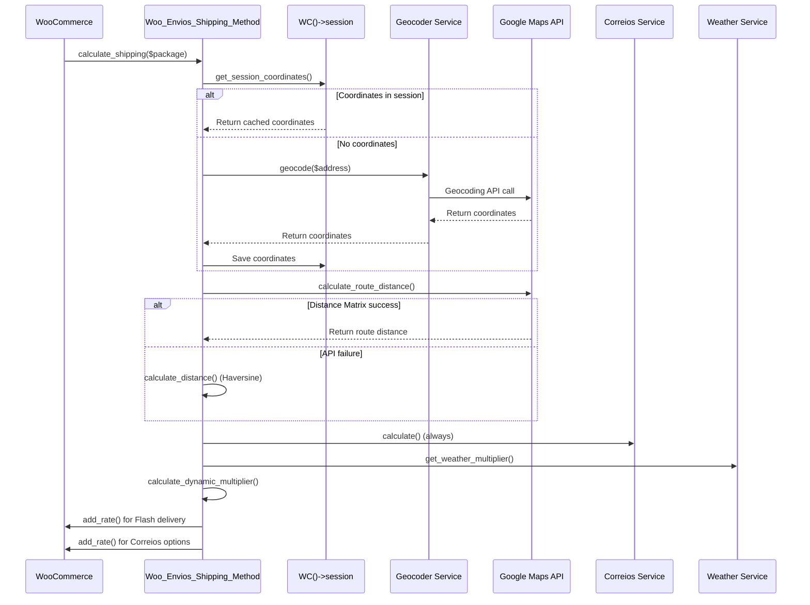

# TriqHub Shipping & Radius - API Reference

## Overview

This document provides comprehensive technical documentation for the TriqHub Shipping & Radius plugin (version 1.2.12). It covers all public APIs, WordPress hooks, internal classes, and integration points for developers extending or integrating with the shipping system.

## Table of Contents

1. [Core Plugin Architecture](#core-plugin-architecture)
2. [WordPress Hooks (Actions & Filters)](#wordpress-hooks-actions--filters)
3. [Shipping Method Classes](#shipping-method-classes)
4. [Service Classes](#service-classes)
5. [Utility Classes](#utility-classes)
6. [Database Schema](#database-schema)
7. [Session Management](#session-management)
8. [External API Integrations](#external-api-integrations)
9. [Error Handling & Logging](#error-handling--logging)

## Core Plugin Architecture

### Main Plugin Class: `TriqHub_Shipping_Plugin`

**Location:** `triqhub-shipping-radius.php`

**Singleton Pattern:** Yes

**Public Methods:**

| Method | Parameters | Return Type | Description |
|--------|------------|-------------|-------------|
| `instance()` | None | `TriqHub_Shipping_Plugin` | Returns singleton instance |
| `register_shipping_method($methods)` | `array $methods` | `array` | Registers shipping methods with WooCommerce |
| `sort_shipping_rates($rates, $package)` | `array $rates`, `array $package` | `array` | Sorts shipping rates (Flash delivery on top) |
| `enqueue_frontend_styles()` | None | `void` | Enqueues frontend CSS for checkout/cart |
| `activate()` | None | `void` | Plugin activation hook callback |

**Constants:**

| Constant | Value | Purpose |
|----------|-------|---------|
| `VERSION` | '1.2.12' | Plugin version |
| `WOO_ENVIOS_FILE` | `__FILE__` | Main plugin file path |
| `WOO_ENVIOS_PATH` | `plugin_dir_path(__FILE__)` | Plugin directory path |
| `WOO_ENVIOS_URL` | `plugin_dir_url(__FILE__)` | Plugin URL |
| `WOO_ENVIOS_ASSETS` | `WOO_ENVIOS_URL . 'assets/'` | Assets directory URL |
| `WOO_ENVIOS_DEFAULT_LAT` | -18.911 | Default latitude (fallback) |
| `WOO_ENVIOS_DEFAULT_LNG` | -48.262 | Default longitude (fallback) |

## WordPress Hooks (Actions & Filters)

### Actions

| Hook | Callback | Priority | Description |
|------|----------|----------|-------------|
| `plugins_loaded` | `woo_envios_bootstrap()` | 20 | Initializes plugin after WooCommerce loads |
| `wp_enqueue_scripts` | `TriqHub_Shipping_Plugin->enqueue_frontend_styles()` | 10 | Enqueues frontend CSS |
| `admin_enqueue_scripts` | `triqhub_enqueue_admin_Woo_envios()` | 10 | Enqueues admin CSS |
| `woocommerce_shipping_init` | `TriqHub_Shipping_Plugin->load_shipping_class()` | 10 | Loads shipping class when WooCommerce is ready |
| `admin_notices` | Anonymous function (in `woo_envios_bootstrap()`) | 10 | Shows WooCommerce missing/version warnings |
| `woocommerce_update_options_shipping_{$id}_{$instance_id}` | `Woo_Envios_Shipping_Method->process_admin_options()` | 10 | Saves shipping method settings |

### Filters

| Hook | Callback | Priority | Parameters | Description |
|------|----------|----------|------------|-------------|
| `woocommerce_shipping_methods` | `TriqHub_Shipping_Plugin->register_shipping_method()` | 10 | `array $methods` | Registers custom shipping methods |
| `woocommerce_package_rates` | `TriqHub_Shipping_Plugin->sort_shipping_rates()` | 10 | `array $rates`, `array $package` | Sorts shipping rates (Flash first) |
| `puc_request_info_query_args-{$slug}` | Anonymous function (in `init_updater()`) | 10 | `array $queryArgs` | Injects license key into update requests |

## Shipping Method Classes

### `Woo_Envios_Shipping_Method`

**Location:** `includes/class-woo-envios-shipping.php`

**Extends:** `WC_Shipping_Method`

**Shipping Method ID:** `woo_envios_radius`

**Supports:** Shipping zones, instance settings, instance settings modal

**Public Methods:**

| Method | Parameters | Return Type | Description |
|--------|------------|-------------|-------------|
| `__construct($instance_id)` | `int $instance_id = 0` | - | Constructor |
| `init()` | None | `void` | Initializes form fields and hooks |
| `calculate_shipping($package)` | `array $package` | `void` | Main shipping calculation logic |
| `init_form_fields()` | None | `void` | Defines settings fields |

**Instance Settings Fields:**

| Field | Type | Default | Description |
|-------|------|---------|-------------|
| `enabled` | Checkbox | 'yes' | Enable/disable method for zone |
| `title` | Text | 'Entrega Flash' | Display title shown to customers |

**Shipping Calculation Flow:**



### `Woo_Envios\Services\Woo_Envios_Superfrete_Shipping_Method`

**Location:** `includes/Services/class-woo-envios-superfrete-shipping-method.php`

**Shipping Method ID:** `woo_envios_superfrete`

**Purpose:** Provides Correios/PAC/SEDEX shipping options for customers outside local radius

## Service Classes

### `Woo_Envios\Services\Geocoder`

**Location:** `includes/Services/Geocoder.php`

**Purpose:** Converts addresses to geographic coordinates

**Public Methods:**

| Method | Parameters | Return Type | Description |
|--------|------------|-------------|-------------|
| `geocode($address)` | `string $address` | `array\|null` | Geocodes address to coordinates |
| `reverse_geocode($lat, $lng)` | `float $lat`, `float $lng` | `array\|null` | Reverse geocodes coordinates to address |
| `clear_cache()` | None | `void` | Clears geocoding cache |

### `Woo_Envios_Google_Maps`

**Location:** `includes/class-woo-envios-google-maps.php`

**Purpose:** Google Maps API integration layer

**Public Methods:**

| Method | Parameters | Return Type | Description |
|--------|------------|-------------|-------------|
| `is_configured()` | None | `bool` | Checks if API key is valid |
| `calculate_distance($origin, $destination)` | `string $origin`, `string $destination` | `array\|WP_Error` | Calculates route distance |
| `geocode($address)` | `string $address` | `array\|null` | Geocodes address (with caching) |
| `validate_api_key_format($api_key)` | `string $api_key` | `bool` | Validates API key format |

**Circuit Breaker Pattern:** Implements failure tracking with 5 consecutive failures threshold

### `Woo_Envios_Weather`

**Location:** `includes/class-woo-envios-weather.php`

**Purpose:** OpenWeather API integration for dynamic pricing

**Public Methods:**

| Method | Parameters | Return Type | Description |
|--------|------------|-------------|-------------|
| `get_weather_multiplier($lat, $lng)` | `float $lat`, `float $lng` | `float` | Returns price multiplier based on rain |
| `get_weather_description($weather_data)` | `array $weather_data` | `string` | Returns human-readable weather description |
| `clear_cache()` | None | `void` | Clears weather cache |

**Cache Duration:** 3600 seconds (1 hour)

**Multiplier Logic:**
- No rain: 1.0
- Light rain/drizzle: 1.2 (configurable via `woo_envios_rain_light_multiplier`)
- Heavy rain (>5mm/h) or thunderstorm: 1.5 (configurable via `woo_envios_rain_heavy_multiplier`)

### `Woo_Envios\Services\Woo_Envios_Correios`

**Location:** `includes/Services/class-woo-envios-correios.php`

**Purpose:** Correios/Postal service integration

**Public Methods:**

| Method | Parameters | Return Type | Description |
|--------|------------|-------------|-------------|
| `is_enabled()` | None | `bool` | Checks if Correios service is enabled |
| `calculate($package)` | `array $package` | `array\|null` | Calculates Correios shipping rates |
| `get_services()` | None | `array` | Returns available Correios services |

## Utility Classes

### `Woo_Envios_Logger`

**Location:** `includes/class-woo-envios-logger.php`

**Purpose:** Centralized logging system

**Public Static Methods:**

| Method | Parameters | Return Type | Description |
|--------|------------|-------------|-------------|
| `shipping_calculated($distance, $base_price, $final_price, $multipliers, $address, $store_coords, $customer_coords)` | `float $distance`, `float $base_price`, `float $final_price`, `array $multipliers`, `string $address`, `array $store_coords`, `array $customer_coords` | `void` | Logs shipping calculation details |
| `error($message)` | `string $message` | `void` | Logs error message |
| `info($message)` | `string $message` | `void` | Logs info message |
| `warning($message)` | `string $message` | `void` | Logs warning message |
| `api_failure($api_name, $error)` | `string $api_name`, `string $error` | `void` | Logs API failure |
| `circuit_breaker_opened($failures)` | `int $failures` | `void` | Logs circuit breaker activation |
| `distance_out_of_range($distance, $destination_data)` | `float $distance`, `array $destination_data` | `void` | Logs when distance is outside delivery range |
| `cleanup_old_logs()` | None | `void` | Cleans up log files older than 7 days |

**Log Location:** `wp-content/uploads/woo-envios-logs/YYYY-MM-DD.log`

**Log Rotation:** Automatic cleanup after 7 days

### `Woo_Envios_Admin`

**Location:** `includes/class-woo-envios-admin.php`

**Purpose:** Admin interface and configuration management

**Public Static Methods:**

| Method | Parameters | Return Type | Description |
|--------|------------|-------------|-------------|
| `get_store_coordinates()` | None | `array` | Returns store latitude/longitude |
| `match_tier_by_distance($distance)` | `float $distance` | `array\|null` | Matches distance to pricing tier |
| `get_delivery_tiers()` | None | `array` | Returns configured delivery tiers |

### `Woo_Envios_Checkout`

**Location:** `includes/class-woo-envios-checkout.php`

**Purpose:** Checkout integration and address handling

**Public Methods:**

| Method | Parameters | Return Type | Description |
|--------|------------|-------------|-------------|
| `__construct()` | None | - | Constructor, registers hooks |
| `enqueue_checkout_scripts()` | None | `void` | Enqueues checkout JavaScript |
| `save_coordinates_to_session($post_data)` | `array $post_data` | `void` | Saves coordinates to WC session |

## Database Schema

### Geocode Cache Table

**Table Name:** `{wp_prefix}woo_envios_geocode_cache`

**Purpose:** Caches Google Maps API responses to reduce API calls

**Schema:**
```sql
CREATE TABLE IF NOT EXISTS {wp_prefix}woo_envios_geocode_cache (
    id bigint(20) unsigned NOT NULL AUTO_INCREMENT,
    cache_key varchar(64) NOT NULL,
    result_data longtext NOT NULL,
    created_at datetime NOT NULL DEFAULT CURRENT_TIMESTAMP,
    expires_at datetime NOT NULL,
    PRIMARY KEY (id),
    UNIQUE KEY cache_key (cache_key),
    KEY expires_at (expires_at)
) CHARSET={charset};
```

**Indexes:**
- Primary key: `id`
- Unique: `cache_key` (MD5 hash of API request)
- Index: `expires_at` (for cache cleanup)

## Session Management

### Session Data Structure

**Key:** `woo_envios_coords`

**Structure:**
```php
array(
    'lat' => float,      // Latitude
    'lng' => float,      // Longitude
    'signature' => string // MD5 hash of address components
)
```

### Signature Generation

The signature is generated from normalized address components:
```php
$parts = array(
    sanitize_text_field($destination['city'] ?? ''),
    sanitize_text_field($destination['state'] ?? ''),
    preg_replace('/\D/', '', $destination['postcode'] ?? ''),
    sanitize_text_field($destination['country'] ?? ''),
);
$normalized = strtolower(implode('|', $parts));
$signature = md5($normalized);
```

## External API Integrations

### Google Maps API

**Endpoints Used:**
- Geocoding API: `https://maps.googleapis.com/maps/api/geocode/json`
- Distance Matrix API: `https://maps.googleapis.com/maps/api/distancematrix/json`
- Places Autocomplete API: `https://maps.googleapis.com/maps/api/place/autocomplete/json`
- Place Details API: `https://maps.googleapis.com/maps/api/place/details/json`

**Configuration Option:** `woo_envios_google_maps_api_key`

**Circuit Breaker:** 5 consecutive failures disable API calls temporarily

### OpenWeather API

**Endpoint:** `https://api.openweathermap.org/data/2.5/weather`

**Configuration Option:** `woo_envios_weather_api_key`

**Cache:** 1 hour (3600 seconds) via WordPress transients

### Correios API

**Service:** SuperFrete integration for Brazilian postal services

**Configuration:** Managed via Woo_Envios_Admin settings

### TriqHub License API

**Purpose:** License validation and update checking

**Integration:** Via GitHub Updater with license key injection

## Error Handling & Logging

### Error Types

1. **API Failures:** Google Maps, OpenWeather, Correios API errors
2. **Configuration Errors:** Missing API keys, invalid settings
3. **Geocoding Failures:** Address to coordinate conversion failures
4. **Distance Calculation Errors:** Route distance calculation failures

### Circuit Breaker Pattern

**Implementation:** In `Woo_Envios_Google_Maps` class

**Threshold:** 5 consecutive failures

**Behavior:** After threshold reached, API calls are disabled and fallback coordinates are used

**Recovery:** Manual reset via admin or automatic after timeout

### Fallback Mechanisms

1. **Geocoding Fallback:** Uses default coordinates (-18.911, -48.262)
2. **Distance Calculation Fallback:** Haversine formula when Distance Matrix API fails
3. **Weather Fallback:** Returns 1.0 multiplier when OpenWeather API fails
4. **Shipping Fallback:** Shows only Correios options when local delivery unavailable

### Notification System

**Admin Email Alerts:** Sent when circuit breaker opens (maximum 1 per hour)

**WordPress Admin Notices:** Displayed for configuration issues

**Log Files:** Detailed logging to `wp-content/uploads/woo-envios-logs/`

## Configuration Options

### WordPress Options Table

| Option Name | Type | Default | Description |
|-------------|------|---------|-------------|
| `woo_envios_google_maps_api_key` | string | '' | Google Maps API key |
| `woo_envios_weather_api_key` | string | '' | OpenWeather API key |
| `woo_envios_enable_logs` | bool | false | Enable/disable logging |
| `woo_envios_dynamic_pricing_enabled` | bool | false | Enable dynamic pricing |
| `woo_envios_rain_light_multiplier` | float | 1.2 | Light rain price multiplier |
| `woo_envios_rain_heavy_multiplier` | float | 1.5 | Heavy rain price multiplier |
| `woo_envios_weekend_multiplier` | float | 1.0 | Weekend price multiplier |
| `