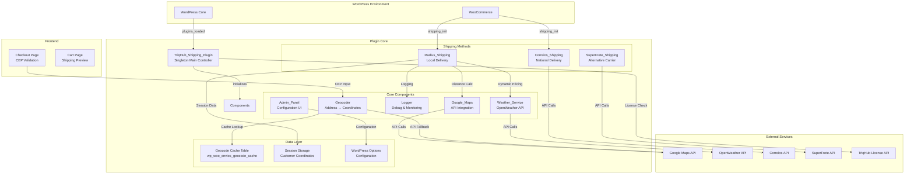
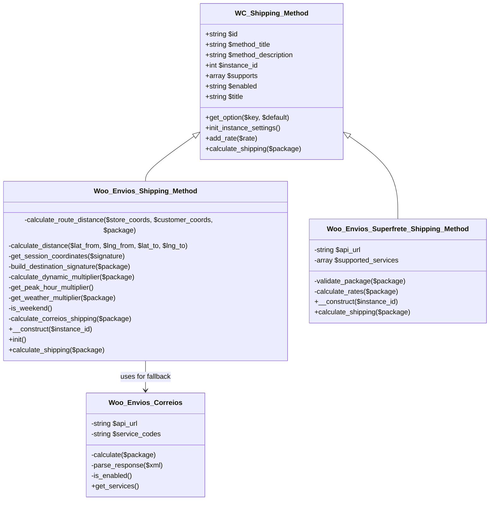
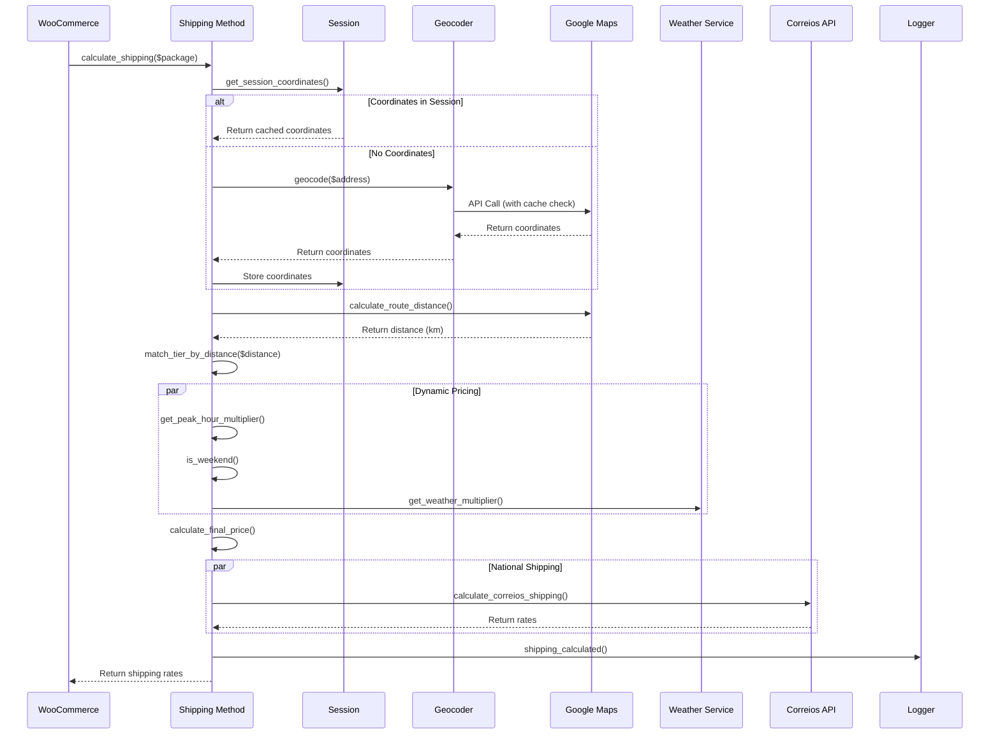

# TriqHub Shipping & Radius - Architecture Documentation

## 1. System Overview

TriqHub Shipping & Radius is a sophisticated WordPress/WooCommerce plugin that implements a multi-tiered shipping solution with dynamic pricing, geolocation services, and external API integrations. The system combines local radius-based delivery with national shipping options through Correios/SuperFrete, enhanced by real-time weather data and peak-hour pricing adjustments.

### 1.1 Core Architecture Principles

- **Modular Design**: Independent components with clear interfaces
- **Fail-Safe Operations**: Graceful degradation when external services fail
- **Caching Strategy**: Multi-layer caching for performance and cost optimization
- **Circuit Breaker Pattern**: Automatic API failure detection and recovery
- **Session-Based State Management**: Customer coordinates persisted across requests

## 2. System Architecture Diagram



## 3. Core Module Architecture

### 3.1 Main Plugin Controller (`TriqHub_Shipping_Plugin`)

**Responsibilities**:
- Singleton pattern enforcement
- Plugin lifecycle management
- Component initialization orchestration
- Hook registration and filter application

**Key Methods**:
```php
public static function instance(): TriqHub_Shipping_Plugin
private function define_constants(): void
private function include_files(): void
private function load_components(): void
private function register_hooks(): void
public function register_shipping_method(array $methods): array
public function sort_shipping_rates(array $rates, array $package): array
```

**Dependencies**:
- WooCommerce (must be loaded first)
- WordPress core functions
- All internal plugin classes

### 3.2 Shipping Method Hierarchy



### 3.3 Google Maps Integration Module

**Architecture**:
```
Google_Maps_Service
├── Geocoding API (Address → Coordinates)
├── Distance Matrix API (Route Distance)
├── Places API (Autocomplete)
├── Circuit Breaker (Failure Protection)
└── Cache Layer (Database + Transients)
```

**Key Components**:
- `Woo_Envios_Google_Maps`: Core API client with circuit breaker
- `Woo_Envios\Services\Geocoder`: Address geocoding service
- Cache Table: `wp_woo_envios_geocode_cache` with TTL management

**Circuit Breaker Implementation**:
```php
private function is_circuit_open(): bool {
    $failures = get_transient('woo_envios_api_failures');
    return $failures && $failures >= self::MAX_CONSECUTIVE_FAILURES;
}

private function record_failure(): void {
    $failures = get_transient('woo_envios_api_failures') ?: 0;
    $failures++;
    set_transient('woo_envios_api_failures', $failures, 3600);
}
```

### 3.4 Dynamic Pricing Engine

**Multiplier Sources**:
1. **Peak Hours**: Configurable time-based pricing
2. **Weekend Surcharge**: Saturday/Sunday adjustments
3. **Weather Conditions**: Rain detection via OpenWeather API
4. **Maximum Cap**: Configurable upper limit (default: 2.0x)

**Calculation Flow**:
```
Base Price
    ↓
Peak Hour Multiplier (if applicable)
    ↓
Weekend Multiplier (if applicable)
    ↓
Weather Multiplier (if raining)
    ↓
Apply Maximum Cap
    ↓
Final Price
```

## 4. Data Flow Architecture

### 4.1 Shipping Calculation Pipeline



### 4.2 Checkout Process Flow

```
Customer enters CEP
    ↓
JavaScript validates CEP format
    ↓
AJAX request to WordPress backend
    ↓
Geocoder service processes address
    ↓
Cache lookup (database table)
    ↓
If cache miss → Google Maps API call
    ↓
Store coordinates in session
    ↓
Update checkout UI with shipping options
    ↓
Customer selects shipping method
    ↓
Order placed with selected method
```

## 5. Database Schema

### 5.1 Core Tables

**Geocode Cache Table** (`wp_woo_envios_geocode_cache`):
```sql
CREATE TABLE wp_woo_envios_geocode_cache (
    id BIGINT UNSIGNED NOT NULL AUTO_INCREMENT,
    cache_key VARCHAR(64) NOT NULL,
    result_data LONGTEXT NOT NULL,
    created_at DATETIME NOT NULL DEFAULT CURRENT_TIMESTAMP,
    expires_at DATETIME NOT NULL,
    PRIMARY KEY (id),
    UNIQUE KEY cache_key (cache_key),
    KEY expires_at (expires_at)
) CHARSET=utf8mb4 COLLATE=utf8mb4_unicode_ci;
```

**Index Strategy**:
- `cache_key`: Unique index for fast lookups
- `expires_at`: Index for efficient cache cleanup
- Composite indexes considered for query patterns

### 5.2 WordPress Options (Configuration)

**Key Option Names**:
- `woo_envios_google_maps_api_key`: Google Maps API credentials
- `woo_envios_store_coordinates`: Base location (lat/lng)
- `woo_envios_shipping_tiers`: Distance-based pricing tiers
- `woo_envios_weather_api_key`: OpenWeather API key
- `woo_envios_dynamic_pricing_enabled`: Feature toggle
- `woo_envios_peak_hours`: Time-based pricing configuration
- `triqhub_license_key`: License validation

## 6. Cache Architecture

### 6.1 Multi-Layer Caching Strategy

```
Layer 1: Session Cache
    ↓ Customer coordinates per session
    ↓ TTL: Session lifetime
    
Layer 2: Database Cache
    ↓ Geocode results in custom table
    ↓ TTL: Configurable (default 30 days)
    
Layer 3: WordPress Transients
    ↓ Weather data and API failure counts
    ↓ TTL: 1 hour for failures, 1 hour for weather
    
Layer 4: External Service Limits
    ↓ Google Maps API quotas
    ↓ OpenWeather API call limits
```

### 6.2 Cache Invalidation Strategy

- **Time-based**: Automatic expiration via `expires_at` column
- **Event-based**: Manual cache clearing via admin actions
- **Version-based**: Cache key includes plugin version for breaking changes
- **Geographic-based**: Different cache for different regions

## 7. Error Handling & Resilience

### 7.1 Circuit Breaker Pattern

**States**:
1. **CLOSED**: Normal operation, API calls allowed
2. **OPEN**: Too many failures, API calls blocked
3. **HALF-OPEN**: Testing if service recovered

**Implementation**:
```php
class CircuitBreaker {
    private $failure_count = 0;
    private $state = 'CLOSED';
    private $last_failure_time = null;
    
    public function execute(callable $operation) {
        if ($this->state === 'OPEN') {
            if ($this->should_retry()) {
                $this->state = 'HALF_OPEN';
            } else {
                throw new CircuitOpenException();
            }
        }
        
        try {
            $result = $operation();
            $this->record_success();
            return $result;
        } catch (ApiException $e) {
            $this->record_failure();
            throw $e;
        }
    }
}
```

### 7.2 Fallback Mechanisms

1. **Geocoding Fallback**: Session → Cache → API → Default coordinates
2. **Distance Calculation**: Google Distance Matrix → Haversine formula
3. **Shipping Methods**: Radius delivery → Correios → SuperFrete
4. **Weather Data**: API → Cache → Default (no multiplier)

## 8. Security Architecture

### 8.1 API Key Management

- **Storage**: Encrypted in WordPress options
- **Validation**: Format validation before use
- **Rotation**: Manual rotation via admin panel
- **Scope**: Limited API scopes (Geocoding, Distance Matrix, Places)

### 8.2 Data Protection

- **Customer Coordinates**: Stored in session only, not database
- **Address Data**: Sanitized before API calls
- **Cache Data**: No PII in cache keys (MD5 hashes)
- **Log Files**: Protected by .htaccess, automatic cleanup

### 8.3 WordPress Security Integration

- **Nonce Verification**: All AJAX endpoints
- **Capability Checks**: Admin functions require `manage_woocommerce`
- **Data Sanitization**: Input validation on all forms
- **SQL Injection Protection**: Prepared statements via $wpdb

## 9. Performance Considerations

### 9.1 Optimizations Implemented

1. **Lazy Loading**: Components initialized only when needed
2. **Selective Caching**: Granular cache strategies per data type
3. **Batch Processing**: Multiple shipping methods calculated in parallel
4. **Database Indexing**: Optimized queries with proper indexes
5. **Frontend Optimization**: Minimal JavaScript, CSS compression

### 9.2 Scalability Features

- **Stateless Design**: Shipping calculations independent of user state
- **Horizontal Scaling**: Cache layer supports multiple application servers
- **Rate Limiting**: Built-in protection against API quota exhaustion
- **Queue Potential**: Background processing ready for high volume

## 10. Integration Points

### 10.1 WooCommerce Integration

**Hooks Registered**:
```php
add_filter('woocommerce_shipping_methods', [$this, 'register_shipping_method']);
add_filter('woocommerce_package_rates', [$this, 'sort_shipping_rates'], 10, 2);
add_action('woocommerce_shipping_init', [$this, 'load_shipping_class']);
```

**Shipping Zone Compatibility**:
- Supports WooCommerce shipping zones
- Instance settings per zone
- Modal configuration interface

### 10.2 External API Integrations

**Google Maps API**:
- Geocoding: Convert addresses to coordinates
- Distance Matrix: Calculate route distances
- Places: Address autocomplete (future enhancement)

**OpenWeather API**:
- Current weather conditions
- Rain detection for dynamic pricing
- Cache: 1-hour TTL for weather data

**Correios/SuperFrete API**:
- National shipping calculations
- Multiple service types (PAC, SEDEX, Mini)
- Fallback when local delivery not available

**TriqHub License API**:
- License validation for updates
- Usage statistics (optional)
- Feature unlocking

## 11. Deployment Architecture

### 11.1 Plugin Structure
```
triqhub-shipping-radius/
├── triqhub-shipping-radius.php      # Main plugin file
├── includes/                        # Core PHP classes
│   ├── class-woo-envios-shipping.php
│   ├── class-woo-envios-google-maps.php
│   ├── class-woo-envios-weather.php
│   ├── class-woo-envios-logger.php
│   ├── class-woo-envios-admin.php
│   └── Services/                    # External service integrations
├── assets/                          # Frontend resources
│   ├── css/
│   ├── js/
│   └── images/
├── vendor/                          # Composer dependencies
├── docs/                            # Documentation
└── tests/                           # Unit tests
```

### 11.2 Update Mechanism

**Dual Update Strategy**:
1. **GitHub Updater**: For beta/test environments
2. **WordPress.org**: For stable releases (future)
3. **Manual Updates**: Fallback via ZIP upload

**Update Flow**:
```
GitHub Release → plugin-update.json → PUC Library → 
WordPress Updates Screen → User Approval → 
Auto-update → Activation Hook → Schema Updates
```

## 12. Monitoring & Observability

### 12.1 Logging Infrastructure

**Log Levels**:
- `INFO`: Normal operations, shipping calculations
- `WARNING`: Non-critical issues, fallback activations
- `ERROR`: API failures, configuration problems
- `DEBUG`: Detailed tracing (enabled via setting)

**Log Rotation**:
- Daily log files
- 7-day retention policy
- Automatic cleanup cron job

### 12.2 Health Checks

**System Health Indicators**:
1. API connectivity (Google Maps, OpenWeather, Correios)
2. Cache hit rates
3. Error frequency and types
4. Circuit breaker status
5. License validity

**Admin Dashboard**:
- Status indicators for all external services
- Cache statistics and hit rates
- Recent errors and warnings
- Performance metrics

## 13. Future Architecture Considerations

### 13.1 Planned Enhancements

1. **Microservices Architecture**: Extract geocoding service to separate endpoint
2. **Webhook Support**: Real-time updates for order status changes
3. **Machine Learning**: Predictive pricing based on historical data
4. **Multi