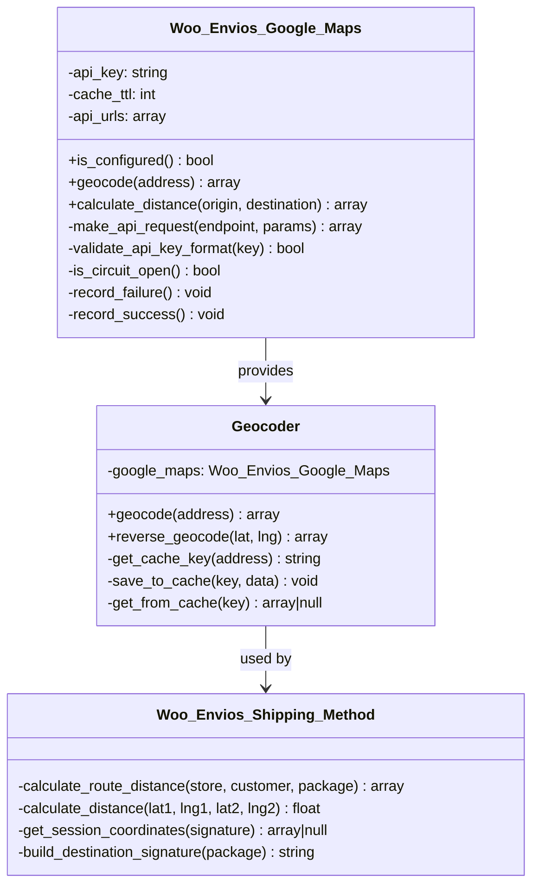
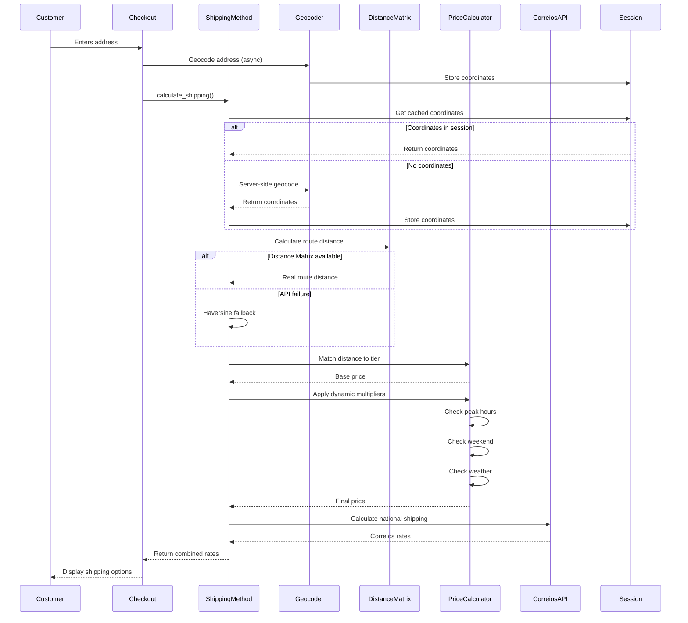
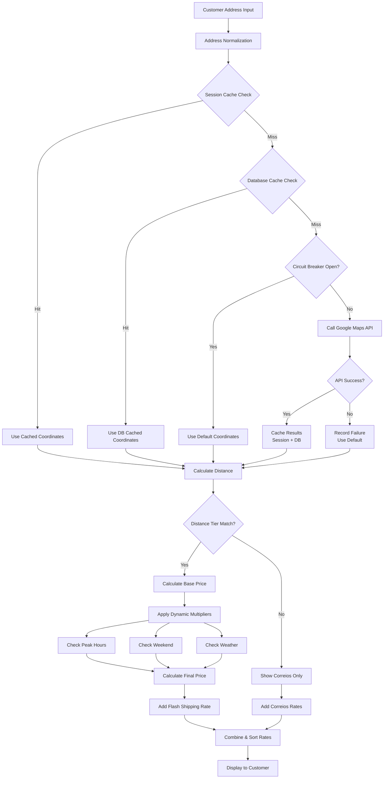
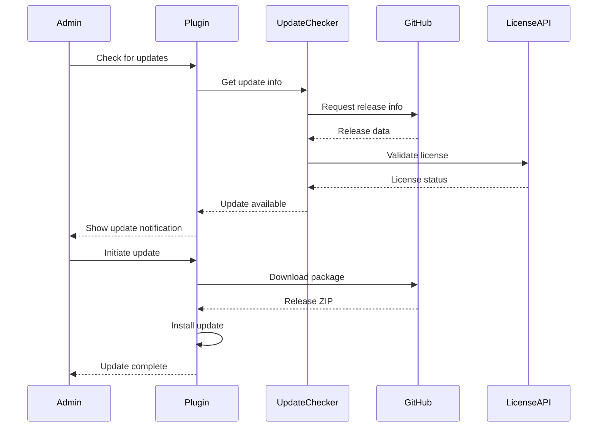

# TriqHub Shipping & Radius - Architecture Documentation

## System Overview

TriqHub Shipping & Radius is a sophisticated WooCommerce extension that provides intelligent, radius-based shipping calculations with dynamic pricing, real-time geocoding, and multi-carrier integration. The system combines local delivery calculations with national shipping services through a modular, fault-tolerant architecture.

## Core Architectural Principles

### 1. **Singleton Pattern with Dependency Injection**
The main plugin class follows a singleton pattern with lazy initialization, ensuring single instance management while maintaining testability through explicit dependency loading.

### 2. **Circuit Breaker Pattern**
External API calls (Google Maps, OpenWeather) implement circuit breakers to prevent cascading failures and ensure graceful degradation.

### 3. **Multi-Layer Caching Strategy**
- **Geocode Cache**: Database table for Google Maps API responses (30-day TTL)
- **Weather Cache**: WordPress transients (1-hour TTL)
- **Session Cache**: Customer coordinates stored in WooCommerce session

### 4. **Plugin Update System**
Dual-update mechanism supporting both GitHub-based updates (via Plugin Update Checker) and traditional WordPress update system.

## System Architecture Diagram

```mermaid
graph TB
    subgraph "WordPress/WooCommerce Layer"
        WP[WordPress Core]
        WC[WooCommerce]
        WC_Session[WooCommerce Session]
    end

    subgraph "TriqHub Shipping Plugin"
        Main[TriqHub_Shipping_Plugin<br/>Singleton Controller]
        
        subgraph "Core Services"
            Geo[Geocoder Service]
            GMaps[Google Maps API]
            Weather[Weather Service]
            Logger[Logger Service]
            Connector[TriqHub Connector]
        end
        
        subgraph "Shipping Methods"
            Radius[Radius Shipping Method]
            SuperFrete[SuperFrete Shipping]
            Correios[Correios Integration]
        end
        
        subgraph "Admin Interface"
            Admin[Admin Settings]
            GMaps_Admin[Google Maps Admin]
        end
        
        subgraph "Frontend"
            Checkout[Checkout Integration]
            Assets[Frontend Assets]
        end
        
        subgraph "Update System"
            Updater[Plugin Updater]
            GitHub[GitHub Integration]
        end
        
        subgraph "Data Layer"
            CacheDB[(Geocode Cache DB)]
            Options[(WordPress Options)]
            Transients[(WP Transients)]
        end
    end

    subgraph "External APIs"
        Google[Google Maps API]
        OpenWeather[OpenWeather API]
        SuperFreteAPI[SuperFrete API]
        CorreiosAPI[Correios API]
        TriqHubAPI[TriqHub License API]
    end

    %% Data Flow
    WP --> Main
    WC --> Main
    Main --> Core_Services
    Main --> Shipping_Methods
    Main --> Admin_Interface
    Main --> Frontend
    Main --> Update_System
    
    Geo --> GMaps
    GMaps --> Google
    Weather --> OpenWeather
    Radius --> Geo
    Radius --> Weather
    SuperFrete --> SuperFreteAPI
    Correios --> CorreiosAPI
    Connector --> TriqHubAPI
    
    Geo --> CacheDB
    Weather --> Transients
    Admin --> Options
    Updater --> GitHub
    
    Checkout --> WC_Session
    Radius --> WC_Session
    
    %% Caching Flow
    GMaps -.->|Cache Miss| Google
    GMaps -.->|Cache Hit| CacheDB
    Weather -.->|Cache Miss| OpenWeather
    Weather -.->|Cache Hit| Transients
```



## Component Architecture

### 1. **Main Plugin Controller (`TriqHub_Shipping_Plugin`)**

**Responsibilities:**
- Plugin lifecycle management
- Dependency loading orchestration
- Hook registration and event dispatching
- Self-healing mechanisms (cache table creation)

**Key Methods:**
```php
public static function instance(): TriqHub_Shipping_Plugin
private function define_constants(): void
private function include_files(): void  // Ordered dependency loading
private function load_components(): void
private function register_hooks(): void
public function activate(): void
private function create_google_cache_table(): void
private function maybe_create_cache_table(): void  // Self-healing
```

**Dependency Loading Order:**
1. Logger (no dependencies)
2. Google Maps API client
3. Geocoder service
4. Shipping services (Correios, SuperFrete)
5. Admin interfaces
6. Checkout integration

### 2. **Geocoding System**

#### Class Hierarchy:


**Geocoding Flow:**
1. Address normalization and signature generation
2. Session cache check (coordinates stored with address signature)
3. Database cache check (geocode_cache table)
4. Google Maps API call (with circuit breaker protection)
5. Result caching (session + database)

**Cache Table Schema:**
```sql
CREATE TABLE wp_woo_envios_geocode_cache (
    id BIGINT UNSIGNED AUTO_INCREMENT PRIMARY KEY,
    cache_key VARCHAR(64) UNIQUE NOT NULL,
    result_data LONGTEXT NOT NULL,
    created_at DATETIME DEFAULT CURRENT_TIMESTAMP,
    expires_at DATETIME NOT NULL,
    INDEX expires_at (expires_at)
)
```

### 3. **Shipping Calculation Engine**

#### Multi-Tier Shipping Architecture:



**Shipping Calculation Process:**
1. **Coordinate Resolution**
   - Session-based coordinate caching
   - Server-side fallback geocoding
   - Address signature matching

2. **Distance Calculation**
   - Primary: Google Distance Matrix API (real routes)
   - Fallback: Haversine formula (straight-line)
   - Circuit breaker protection

3. **Price Determination**
   - Distance-to-tier matching
   - Dynamic multiplier application:
     - Peak hour multipliers (configurable periods)
     - Weekend surcharges
     - Weather-based adjustments (rain detection)
   - Maximum multiplier enforcement

4. **Multi-Carrier Integration**
   - Local delivery (Flash) for in-radius customers
   - Correios/SuperFrete for out-of-radius destinations
   - Rate sorting (Flash always on top)

### 4. **Dynamic Pricing System**

**Multiplier Sources:**
1. **Time-Based**
   ```php
   $peak_hours = [
       [
           'name' => 'Almoço',
           'start' => '11:30',
           'end' => '13:30',
           'multiplier' => 1.2
       ],
       [
           'name' => 'Jantar',
           'start' => '18:00',
           'end' => '20:00',
           'multiplier' => 1.3
       ]
   ];
   ```

2. **Weather-Based**
   - OpenWeather API integration
   - Rain intensity detection (light/heavy)
   - Configurable multipliers per condition
   - 1-hour cache duration

3. **Day-Based**
   - Weekend surcharges
   - Configurable via admin settings

**Calculation Formula:**
```
final_price = base_price × peak_multiplier × weekend_multiplier × weather_multiplier
final_price = min(final_price, base_price × max_multiplier)
```

### 5. **Error Handling & Resilience**

#### Circuit Breaker Implementation:
```php
class Woo_Envios_Google_Maps {
    private const MAX_CONSECUTIVE_FAILURES = 5;
    
    private function is_circuit_open(): bool {
        $failures = get_transient('woo_envios_api_failures');
        return $failures && $failures >= self::MAX_CONSECUTIVE_FAILURES;
    }
    
    private function record_failure(): void {
        $failures = get_transient('woo_envios_api_failures') ?: 0;
        $failures++;
        set_transient('woo_envios_api_failures', $failures, 3600);
        
        if ($failures >= self::MAX_CONSECUTIVE_FAILURES) {
            Woo_Envios_Logger::circuit_breaker_opened($failures);
        }
    }
    
    private function record_success(): void {
        delete_transient('woo_envios_api_failures');
    }
}
```

#### Fallback Strategies:
1. **Geocoding Fallback**
   - Session cache → Database cache → API → Default coordinates

2. **Distance Calculation Fallback**
   - Distance Matrix API → Haversine formula

3. **Shipping Method Fallback**
   - Local delivery unavailable → Correios only

### 6. **Data Flow Architecture**



### 7. **Admin System Architecture**

**Settings Hierarchy:**
```
WooCommerce → Woo Envios
├── General Settings
│   ├── Store Coordinates
│   ├── Distance Tiers
│   └── Enable/Disable Features
├── Google Maps
│   ├── API Key Configuration
│   ├── Cache Settings
│   └── Circuit Breaker Status
├── Dynamic Pricing
│   ├── Peak Hours Configuration
│   ├── Weather Integration
│   └── Multiplier Limits
└── Advanced
    ├── Logging Settings
    ├── Debug Mode
    └── Cache Management
```

### 8. **Update System Architecture**

**Dual Update Channels:**
1. **GitHub-Based Updates** (Primary)
   - Plugin Update Checker library
   - Release asset management
   - License key validation
   - Branch-based releases

2. **WordPress.org Style Updates** (Fallback)
   - plugin-update.json manifest
   - Traditional update API integration
   - Manual update triggering

**Update Flow:**


## Performance Considerations

### 1. **Caching Strategy**
- **Geocode Cache**: 30-day TTL with LRU-like expiration
- **Weather Cache**: 1-hour TTL for real-time conditions
- **Session Cache**: Per-session persistence
- **Database Indexing**: Optimized for frequent lookups

### 2. **API Optimization**
- Batch geocoding where possible
- Exponential backoff for retries
- Concurrent request limiting
- Response size minimization

### 3. **Database Optimization**
```sql
-- Optimized queries for geocode cache
SELECT result_data 
FROM wp_woo_envios_geocode_cache 
WHERE cache_key = %s 
  AND expires_at > NOW() 
LIMIT 1;

-- Efficient cleanup
DELETE FROM wp_woo_envios_geocode_cache 
WHERE expires_at <= NOW() 
LIMIT 1000; -- Batch deletion
```

## Security Architecture

### 1. **API Key Management**
- Secure storage in WordPress options
- Format validation before use
- No hardcoded keys in source
- Regular key rotation support

### 2. **Data Validation**
- Input sanitization for all user data
- Nonce verification for admin actions
- Output escaping for display
- SQL injection prevention via prepared statements

### 3. **Session Security**
- Signature-based session validation
- Address normalization to prevent spoofing
- Session fixation protection
- Secure cookie handling

## Scalability Considerations

### 1. **Horizontal Scaling**
- Stateless session management
- Shared cache database
- External API rate limiting
- Load balancer compatibility

### 2. **Vertical Scaling**
- Database query optimization
- Memory-efficient caching
- Lazy loading of components
- Background processing support

### 3. **High Availability**
- Circuit breaker pattern
- Graceful degradation
- Multiple fallback strategies
- Health monitoring integration

## Monitoring & Observability

### 1. **Logging System**
- Structured logging with context
- Log rotation (7-day retention)
- Admin notification for critical errors
- Performance metrics collection

### 2. **Health Checks**
- API connectivity verification
- Cache integrity checks
- Database connection monitoring
- Plugin dependency validation

### 3. **Performance Metrics**
- Geocoding response times
- API success/failure rates
- Cache hit ratios
- Shipping calculation duration

## Deployment Architecture

### 1. **Environment Configuration**
```php
// Environment-specific constants
define('WOO_ENVIOS_ENV', wp_get_environment_type());
define('WOO_ENVIOS_DEBUG', WOO_ENVIOS_ENV === 'development');

// Conditional logging
if (WOO_ENVIOS_DEBUG) {
    define('WOO_ENVIOS_LOG_LEVEL', 'debug');
} else {
    define('WOO_ENVIOS_LOG_LEVEL', 'error');
}
```

### 2. **Build & Deployment**
- Composer for PHP dependencies
- GitHub Actions for CI/CD
- Automated testing suite
- Staging/production deployment pipelines

### 3. **Rollback Strategy**
- Database migration versioning
- Plugin version compatibility checks
- Zero-downtime deployment support
- Automated rollback triggers

## Integration Points

### 1. **WooCommerce Integration**
- Shipping method registration
- Checkout field modifications
- Cart/checkout hooks
- Order meta data storage

### 2. **External API Integration**
- Google Maps API (Geocoding, Distance Matrix)
- OpenWeather API (Weather conditions)
- Correios API (National shipping)
- SuperFrete API (Multi-carrier)
- TriqHub License API (Update validation)

### 3. **WordPress Integration**
- Admin menu integration
- Settings API utilization
- Transients API for caching
- Cron system