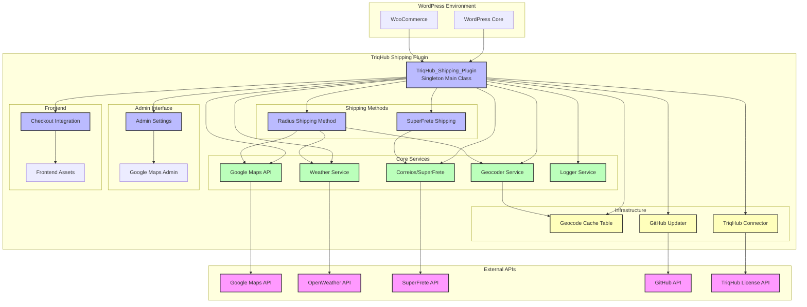
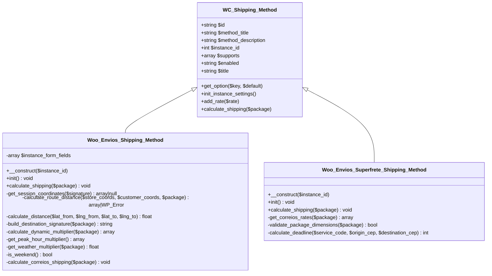
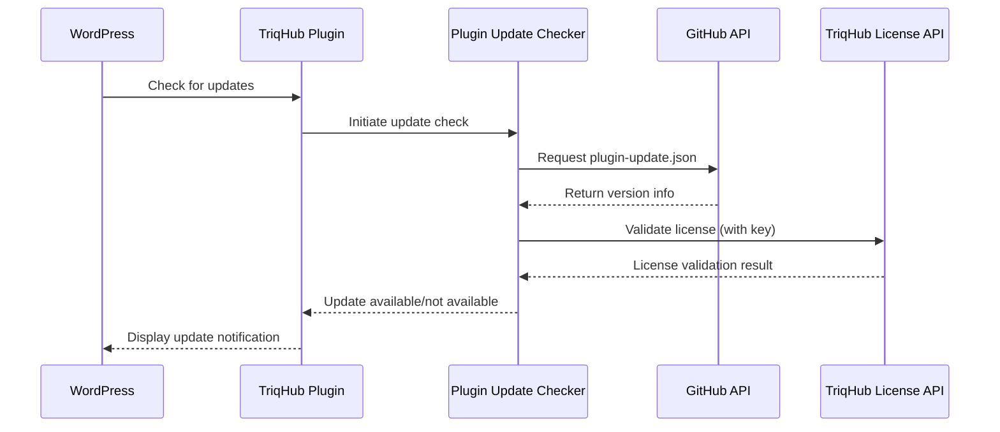
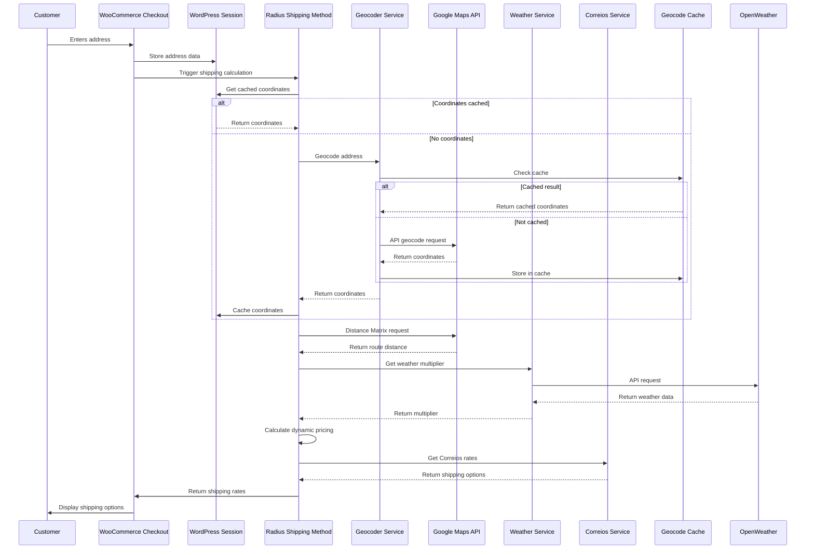
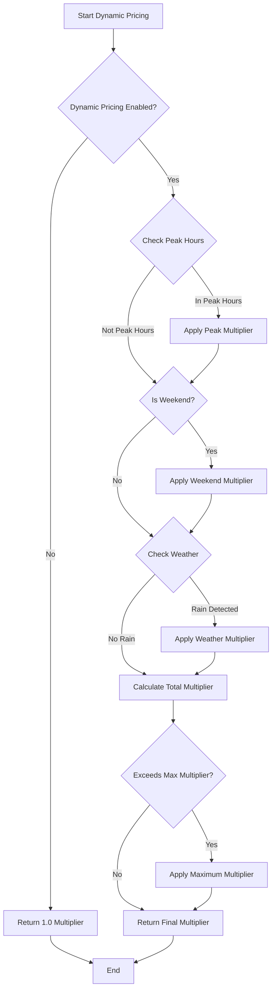

# TriqHub Shipping & Radius - Architecture Documentation

## 1. System Overview

TriqHub Shipping & Radius is a sophisticated WooCommerce shipping plugin that provides intelligent, location-based delivery calculations for Brazilian e-commerce stores. The system combines multiple external APIs (Google Maps, OpenWeather, Correios/SuperFrete) with dynamic pricing algorithms to offer precise shipping rates based on real-time conditions.

### 1.1 Core Architecture Principles

- **Modular Design**: Each major functionality is encapsulated in dedicated classes
- **Singleton Pattern**: Main plugin class uses singleton for single-point initialization
- **Circuit Breaker Pattern**: API failure protection with graceful degradation
- **Caching Strategy**: Multi-layer caching (database, transients, session)
- **Event-Driven**: WordPress hooks and filters for extensibility

## 2. System Architecture Diagram



## 3. Core Module Architecture

### 3.1 Main Plugin Bootstrap (`triqhub-shipping-radius.php`)

**Class**: `TriqHub_Shipping_Plugin`
**Pattern**: Singleton
**Responsibilities**:
- Plugin initialization and lifecycle management
- Dependency loading order management
- Hook registration
- Self-healing mechanisms

**Key Methods**:
```php
public static function instance(): TriqHub_Shipping_Plugin
private function define_constants(): void
private function include_files(): void
private function load_components(): void
private function register_hooks(): void
public function activate(): void
private function create_google_cache_table(): void
private function maybe_create_cache_table(): void
public function register_shipping_method(array $methods): array
public function sort_shipping_rates(array $rates, array $package): array
```

**Dependency Loading Order**:
1. Logger (`class-woo-envios-logger.php`)
2. Google Maps API (`class-woo-envios-google-maps.php`)
3. Geocoder Service (`Services/Geocoder.php`)
4. Correios Service (`Services/class-woo-envios-correios.php`)
5. SuperFrete Shipping (`Services/class-woo-envios-superfrete-shipping-method.php`)
6. Admin Interfaces (`class-woo-envios-google-maps-admin.php`, `class-woo-envios-admin.php`)
7. Weather Service (`class-woo-envios-weather.php`)
8. Checkout Integration (`class-woo-envios-checkout.php`)

### 3.2 Shipping Method Architecture



### 3.3 Service Layer Architecture

#### 3.3.1 Geocoder Service (`Services/Geocoder.php`)
**Responsibilities**:
- Address-to-coordinate conversion
- Multi-provider fallback (Google Maps primary, manual fallback)
- Cache management
- Brazilian CEP validation and formatting

**Key Methods**:
```php
public static function geocode(string $address): ?array
public static function reverse_geocode(float $lat, float $lng): ?array
private static function geocode_via_google(string $address): ?array
private static function geocode_via_fallback(string $address): ?array
private static function normalize_brazilian_address(array $components): array
```

#### 3.3.2 Google Maps API Service (`class-woo-envios-google-maps.php`)
**Responsibilities**:
- Google Maps API integration
- Circuit breaker implementation
- Request retry logic
- Response caching

**Circuit Breaker Implementation**:
```php
private function check_circuit_breaker(): bool
private function record_failure(): void
private function record_success(): void
private function is_circuit_open(): bool
```

**API Endpoints**:
- Geocoding: `https://maps.googleapis.com/maps/api/geocode/json`
- Places Autocomplete: `https://maps.googleapis.com/maps/api/place/autocomplete/json`
- Place Details: `https://maps.googleapis.com/maps/api/place/details/json`
- Distance Matrix: `https://maps.googleapis.com/maps/api/distancematrix/json`

#### 3.3.3 Weather Service (`class-woo-envios-weather.php`)
**Responsibilities**:
- OpenWeather API integration
- Rain detection and intensity classification
- Dynamic pricing multiplier calculation
- Weather data caching

**Key Methods**:
```php
public function get_weather_multiplier(float $lat, float $lng): float
private function get_current_weather(float $lat, float $lng, string $api_key): ?array
private function calculate_rain_multiplier(array $weather_data): float
public function get_weather_description(array $weather_data): string
public function clear_cache(): void
```

**Multiplier Logic**:
- No rain: 1.0
- Light rain/drizzle: 1.2 (configurable)
- Heavy rain (>5mm/h): 1.5 (configurable)
- Thunderstorm: 1.5 (configurable)

#### 3.3.4 Correios/SuperFrete Service (`Services/class-woo-envios-correios.php`)
**Responsibilities**:
- Brazilian postal service integration
- Multiple service types (PAC, SEDEX, Mini)
- Package dimension validation
- Deadline calculation

**Supported Services**:
- PAC (Ágil)
- SEDEX (Expresso)
- SEDEX 10 (Prioritário)
- SEDEX 12 (Urgente)
- SEDEX Hoje (Same-day)
- Mini Envios (Small packages)

### 3.4 Data Storage Architecture

#### 3.4.1 Geocode Cache Table
```sql
CREATE TABLE wp_woo_envios_geocode_cache (
    id BIGINT(20) UNSIGNED NOT NULL AUTO_INCREMENT,
    cache_key VARCHAR(64) NOT NULL,
    result_data LONGTEXT NOT NULL,
    created_at DATETIME NOT NULL DEFAULT CURRENT_TIMESTAMP,
    expires_at DATETIME NOT NULL,
    PRIMARY KEY (id),
    UNIQUE KEY cache_key (cache_key),
    KEY expires_at (expires_at)
) CHARSET=utf8mb4 COLLATE=utf8mb4_unicode_ci;
```

**Cache Strategy**:
- **Cache Key**: MD5 hash of normalized address
- **TTL**: Configurable (default 30 days)
- **Cleanup**: Automatic via `expires_at` index
- **Self-healing**: Table creation on plugin activation and missing table detection

#### 3.4.2 WordPress Options
**Plugin Settings**:
- `woo_envios_google_maps_api_key`: Google Maps API key
- `woo_envios_store_lat` / `woo_envios_store_lng`: Store coordinates
- `woo_envios_radius_tiers`: Distance-based pricing tiers
- `woo_envios_dynamic_pricing_enabled`: Dynamic pricing toggle
- `woo_envios_peak_hours`: Peak hour configurations
- `woo_envios_weather_api_key`: OpenWeather API key
- `woo_envios_enable_logs`: Debug logging toggle

#### 3.4.3 Session Storage
**Session Variables**:
- `woo_envios_coords`: Customer coordinates with signature
- `woo_envios_address_validated`: Address validation status
- `woo_envios_geocode_attempts`: Geocoding attempt counter

### 3.5 Admin Interface Architecture

#### 3.5.1 Main Admin Class (`class-woo-envios-admin.php`)
**Responsibilities**:
- Plugin settings management
- Store coordinate configuration
- Radius tier management
- System status reporting

**Admin Pages**:
1. **General Settings**: API keys, store location
2. **Radius Tiers**: Distance-based pricing configuration
3. **Dynamic Pricing**: Peak hours, weather multipliers
4. **Logs & Debug**: System logs and diagnostics

#### 3.5.2 Google Maps Admin (`class-woo-envios-google-maps-admin.php`)
**Responsibilities**:
- Google Maps API key management
- Geocoding cache management
- API usage statistics
- Circuit breaker status

### 3.6 Checkout Integration Architecture

#### 3.6.1 Checkout Class (`class-woo-envios-checkout.php`)
**Responsibilities**:
- Frontend JavaScript integration
- Address autocomplete
- Real-time coordinate validation
- Shipping method sorting

**Frontend Components**:
1. **Address Autocomplete**: Google Places integration
2. **Coordinate Validation**: Real-time geocoding
3. **Shipping Method Display**: Custom CSS for method ordering
4. **Error Handling**: User-friendly error messages

### 3.7 Update System Architecture

#### 3.7.1 GitHub Updater Integration
**Components**:
- Plugin Update Checker (YahnisElsts library)
- GitHub Release Asset integration
- License key validation
- Update notification system

**Update Flow**:


### 3.8 Logging & Monitoring Architecture

#### 3.8.1 Logger Service (`class-woo-envios-logger.php`)
**Log Levels**:
- `INFO`: Normal operations, shipping calculations
- `WARNING`: Non-critical issues, out-of-range distances
- `ERROR`: API failures, critical errors

**Log Rotation**:
- Daily log files (YYYY-MM-DD.log)
- 7-day retention policy
- Automatic cleanup via WordPress cron
- Protected directory with .htaccess

**Notification System**:
- Admin email alerts for circuit breaker activation
- Rate limiting to prevent spam (1-hour cooldown)
- Detailed error context in notifications

## 4. Data Flow Diagrams

### 4.1 Shipping Calculation Flow



### 4.2 Dynamic Pricing Calculation Flow



## 5. Error Handling & Resilience

### 5.1 Circuit Breaker Pattern
**Implementation Details**:
- **Failure Threshold**: 5 consecutive API failures
- **Half-Open State**: After 5 minutes, allow single test request
- **Reset**: After successful test request, close circuit
- **Fallback**: Use default coordinates when circuit is open

### 5.2 Graceful Degradation
**Fallback Strategies**:
1. **Google Maps API Failure**: Use Havers