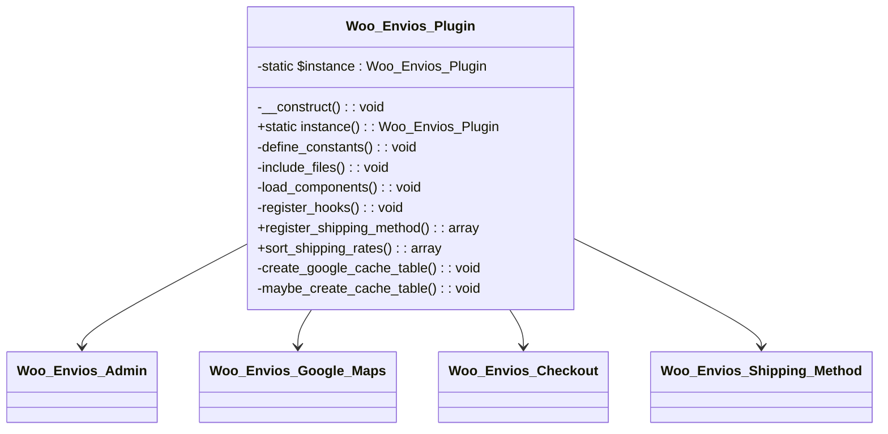
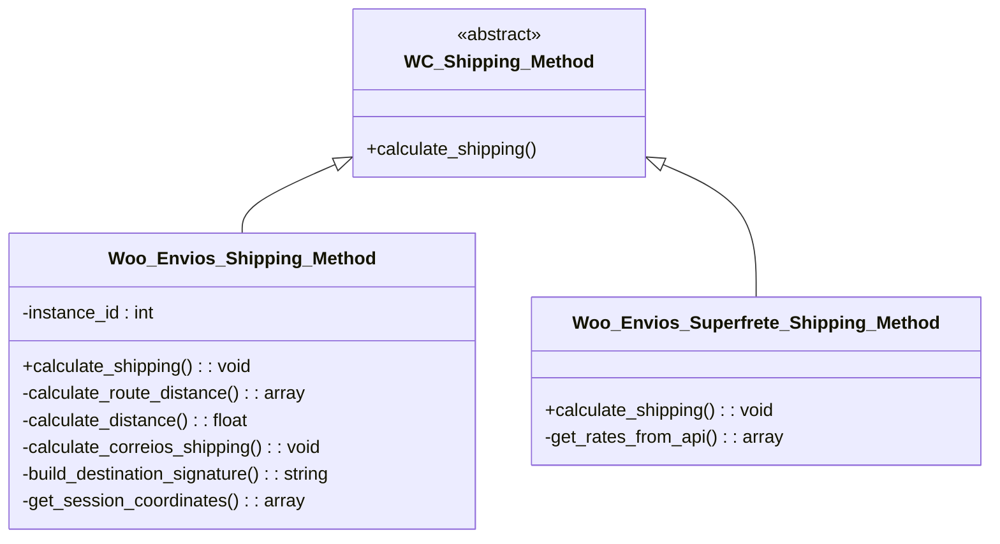
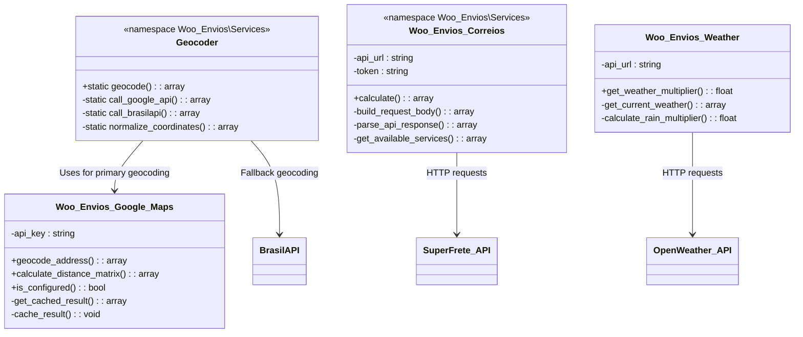
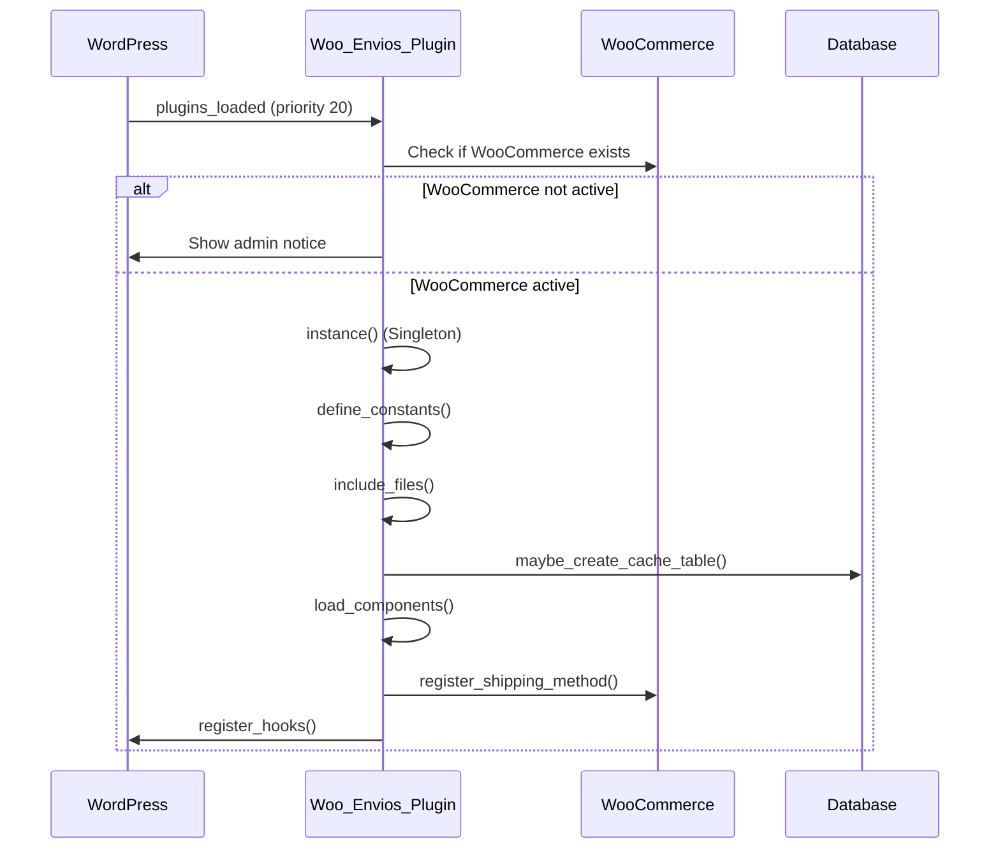
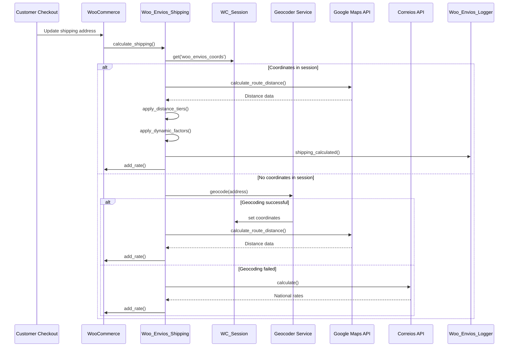
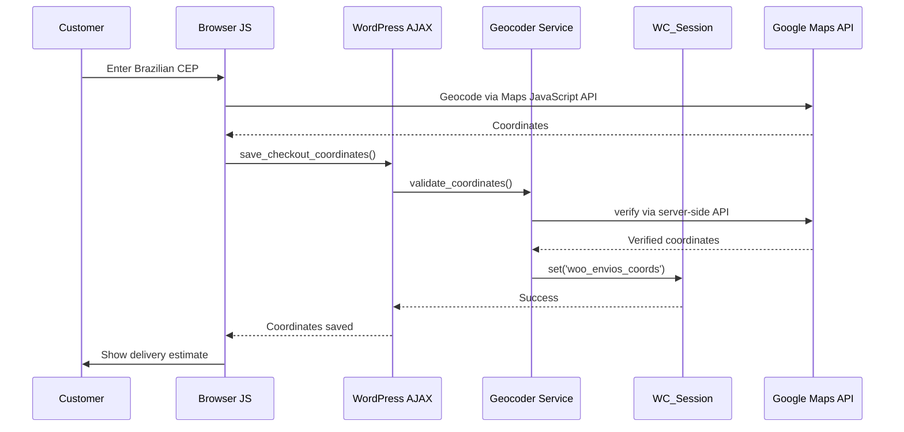

# TriqHub Shipping & Radius Plugin - Architecture Documentation

## 1. Overview

**TriqHub Shipping & Radius** is a sophisticated WooCommerce shipping plugin that implements a dual-layer delivery system:
1. **Local Flash Delivery** - Distance-based shipping using Google Maps API for precise route calculations
2. **National Correios/SuperFrete Integration** - Fallback shipping for customers outside the local radius

## 2. Directory Structure

```
triqhub-shipping-radius/
├── triqhub-shipping-radius.php          # Main plugin bootstrap file
├── plugin-update.json                   # GitHub auto-update configuration
├── assets/
│   ├── css/
│   │   ├── triqhub-admin.css           # TriqHub branding styles
│   │   └── woo-envios-frontend.css     # Frontend checkout styles
│   └── js/
│       └── checkout-coordinates.js     # Client-side geocoding
├── includes/
│   ├── core/
│   │   └── class-triqhub-connector.php # TriqHub invisible connector
│   ├── Services/
│   │   ├── Geocoder.php                # Address geocoding service
│   │   ├── class-woo-envios-correios.php          # Correios/SuperFrete API integration
│   │   └── class-woo-envios-superfrete-shipping-method.php # SuperFrete shipping method
│   ├── class-woo-envios-admin.php      # Admin settings panel
│   ├── class-woo-envios-checkout.php   # Checkout coordinate collection
│   ├── class-woo-envios-google-maps.php # Google Maps API wrapper
│   ├── class-woo-envios-google-maps-admin.php # Google Maps admin settings
│   ├── class-woo-envios-logger.php     # Structured logging system
│   ├── class-woo-envios-shipping.php   # Main shipping calculation logic
│   ├── class-woo-envios-updater.php    # GitHub auto-update handler
│   └── class-woo-envios-weather.php    # Weather-based dynamic pricing
└── vendor/                             # Composer dependencies (plugin-update-checker)
```

## 3. Database Schema

### 3.1 Geocode Cache Table (`wp_woo_envios_geocode_cache`)

```sql
CREATE TABLE wp_woo_envios_geocode_cache (
    id BIGINT(20) UNSIGNED NOT NULL AUTO_INCREMENT,
    cache_key VARCHAR(64) NOT NULL,
    result_data LONGTEXT NOT NULL,
    created_at DATETIME NOT NULL DEFAULT CURRENT_TIMESTAMP,
    expires_at DATETIME NOT NULL,
    PRIMARY KEY (id),
    UNIQUE KEY cache_key (cache_key),
    KEY expires_at (expires_at)
) CHARSET=utf8mb4 COLLATE=utf8mb4_unicode_ci;
```

**Purpose**: Caches Google Maps API responses to reduce API calls and improve performance.

### 3.2 WordPress Transients
- `woo_envios_weather_*` - Weather API responses (1-hour cache)
- Session-based coordinate storage via `WC()->session`

## 4. Core Components & Design Patterns

### 4.1 Singleton Pattern - Main Plugin Class



### 4.2 Strategy Pattern - Shipping Methods



### 4.3 Service Layer Pattern - External API Integrations



## 5. Core Logic Flow

### 5.1 Plugin Initialization Flow



### 5.2 Shipping Calculation Flow



### 5.3 Checkout Coordinate Collection Flow



## 6. Key Architectural Decisions

### 6.1 Dual-Layer Shipping Strategy
- **Primary**: Local radius-based delivery using precise Google Maps routing
- **Fallback**: National Correios/SuperFrete integration for out-of-radius customers
- **Automatic switching**: Based on calculated distance vs configured radius

### 6.2 Coordinate Management
- **Client-side collection**: Google Maps JavaScript API for instant geocoding
- **Server-side validation**: Double-check coordinates via server API
- **Session caching**: Store coordinates in WooCommerce session to avoid re-geocoding
- **Signature-based validation**: MD5 hash of address components ensures data integrity

### 6.3 Error Handling & Fallbacks
1. **Google Maps API failure** → Haversine formula fallback
2. **Geocoding failure** → BrasilAPI fallback
3. **No coordinates available** → Direct Correios calculation
4. **API timeout** → Cached results with graceful degradation

### 6.4 Performance Optimization
- **Database caching**: Geocode results with expiration
- **Transient caching**: Weather API responses
- **Lazy loading**: Shipping classes loaded only when needed
- **Session storage**: Avoid repeated API calls during checkout

### 6.5 Security Considerations
- **API key management**: Secure storage in WordPress options
- **Input validation**: Sanitize all address inputs
- **Nonce verification**: AJAX requests include WordPress nonces
- **Session integrity**: Signature validation prevents tampering

## 7. Integration Points

### 7.1 WooCommerce Integration
- Shipping Zones API
- Shipping Methods API
- Checkout Fields API
- Session Management
- Rate Calculation Hooks

### 7.2 External API Integrations
- **Google Maps Platform**: Geocoding, Distance Matrix
- **SuperFrete API**: Correios shipping calculations
- **OpenWeather API**: Dynamic pricing based on weather
- **BrasilAPI**: Fallback Brazilian CEP lookup

### 7.3 TriqHub Ecosystem
- **Invisible Connector**: `TriqHub_Connector` class for ecosystem integration
- **Branding**: Consistent styling via `triqhub-admin.css`
- **Update System**: GitHub-based auto-updates

## 8. Configuration Management

### 8.1 WordPress Options
```php
// Core settings
woo_envios_lat                    // Store latitude
woo_envios_lng                    // Store longitude
woo_envios_google_maps_api_key    // Google Maps API key
woo_envios_superfrete_token       // SuperFrete API token

// Dynamic pricing
woo_envios_tiers                  // Distance-based price tiers
woo_envios_peak_hours             // Peak hour multipliers
woo_envios_weekend_multiplier     // Weekend pricing
woo_envios_max_multiplier         // Maximum price multiplier
woo_envios_dynamic_pricing_enabled // Enable/disable dynamic pricing

// Weather integration
woo_envios_weather_api_key        // OpenWeather API key
woo_envios_rain_light_multiplier  // Light rain multiplier
woo_envios_rain_heavy_multiplier  // Heavy rain multiplier
```

## 9. Testing Architecture

### 9.1 Test Suite Structure
- **Unit Tests**: Individual class methods
- **Integration Tests**: API integrations
- **End-to-End Tests**: Complete checkout flows
- **Performance Tests**: API response times

### 9.2 Mock Services
- `test-simulation.php`: Complete plugin simulation
- `test-superfrete.php`: SuperFrete API integration test
- `test-full-integration.php`: Comprehensive system test
- `test-plugin-loading.php`: WordPress environment validation

## 10. Deployment & Update Strategy

### 10.1 GitHub Auto-Update System


### 10.2 Version Management
- Semantic versioning: `MAJOR.MINOR.PATCH`
- GitHub releases with assets
- Changelog in repository
- Backward compatibility checks

## 11. Scalability Considerations

### 11.1 Horizontal Scaling
- Stateless session management
- Database caching layer
- API rate limiting
- Queue-based background processing

### 11.2 Performance at Scale
- Redis/memcached for cache
- CDN for static assets
- Database indexing optimization
- API response compression

### 11.3 Multi-Store Support
- Per-store configuration
- Separate API keys
- Isolated caching
- Store-specific shipping rules

## 12. Monitoring & Analytics

### 12.1 Built-in Logging
- Structured JSON logging
- Error tracking
- Performance metrics
- Usage analytics

### 12.2 Health Checks
- API connectivity tests
- Database integrity checks
- Cache validation
- Configuration validation

This architecture provides a robust, scalable foundation for distance-based shipping calculations with multiple fallback strategies and comprehensive error handling. The modular design allows for easy extension and maintenance while maintaining high performance and reliability.