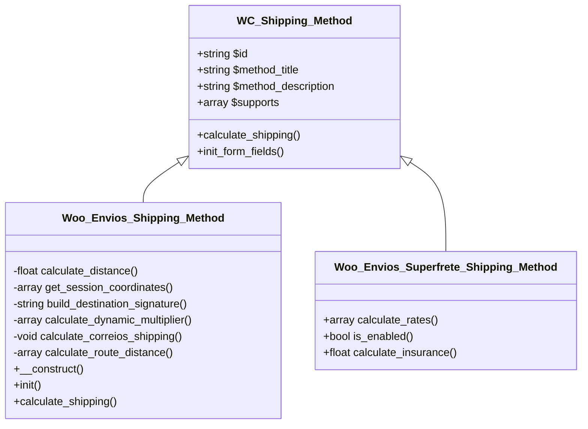
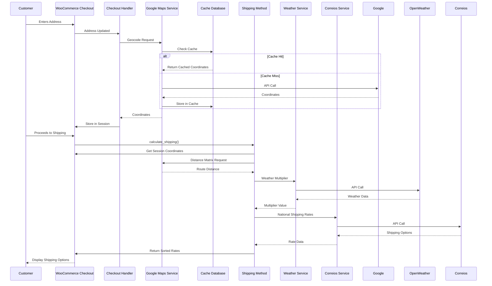
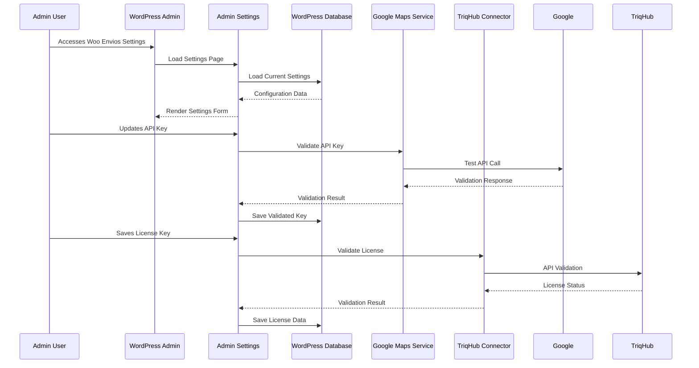
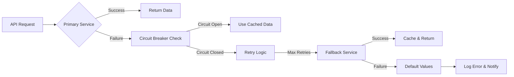

# TriqHub Shipping & Radius - Architecture Documentation

## 1. System Overview

TriqHub Shipping & Radius is a sophisticated WooCommerce shipping plugin that implements a multi-tiered delivery system with dynamic pricing, real-time geocoding, and external API integrations. The system combines local radius-based delivery with national shipping services through a unified architecture.

### 1.1 Core Architecture Principles

- **Modular Design**: Separation of concerns with dedicated service classes
- **Fail-Safe Operations**: Graceful degradation when external services fail
- **Real-time Processing**: On-the-fly geocoding and distance calculations
- **Dynamic Pricing**: Multi-factor price adjustments based on conditions
- **Caching Strategy**: Multi-layer caching for performance optimization

## 2. System Architecture Diagram

```mermaid
graph TB
    subgraph "WordPress Environment"
        WP[WordPress Core]
        WC[WooCommerce]
    end
    
    subgraph "TriqHub Shipping Plugin"
        TP[TriqHub_Shipping_Plugin<br/>Main Controller]
        
        subgraph "Core Services"
            GM[Google Maps Service<br/>Geocoding & Distance]
            GC[Geocoder Service<br/>Address Processing]
            WT[Weather Service<br/>OpenWeather Integration]
            CR[Correios Service<br/>National Shipping]
            SF[SuperFrete Service<br/>Alternative Shipping]
        end
        
        subgraph "Shipping Methods"
            SM[Radius Shipping Method<br/>Local Delivery]
            CM[Correios Shipping Method<br/>National]
        end
        
        subgraph "Admin Interface"
            AD[Admin Settings<br/>Configuration]
            GA[Google Maps Admin<br/>API Management]
        end
        
        subgraph "Frontend Components"
            CH[Checkout Handler<br/>Address Processing]
            AS[Asset Manager<br/>CSS/JS]
        end
        
        subgraph "Infrastructure"
            LG[Logger<br/>Debug & Monitoring]
            UP[Updater<br/>GitHub Updates]
            TC[TriqHub Connector<br/>License Validation]
            DB[(Cache Database<br/>Geocode Results)]
        end
    end
    
    subgraph "External Services"
        GOOGLE[Google Maps API]
        OW[OpenWeather API]
        CORREIOS[Correios API]
        TRQ[TriqHub License API]
        GITHUB[GitHub Repository]
    end
    
    %% Data Flow
    WP --> TP
    WC --> TP
    
    TP --> GM
    TP --> GC
    TP --> WT
    TP --> CR
    TP --> SF
    
    GM --> GOOGLE
    WT --> OW
    CR --> CORREIOS
    SF --> CORREIOS
    
    TP --> SM
    TP --> CM
    
    TP --> AD
    TP --> GA
    
    TP --> CH
    TP --> AS
    
    TP --> LG
    TP --> UP
    TP --> TC
    TP --> DB
    
    TC --> TRQ
    UP --> GITHUB
    
    SM --> GM
    SM --> WT
    SM --> DB
    
    CH --> GM
    CH --> DB
    
    %% Internal Dependencies
    GM --> DB
    AD --> GM
    GA --> GM
    LG --> DB
    
    style TP fill:#e1f5fe
    style GM fill:#f3e5f5
    style SM fill:#e8f5e8
    style DB fill:#fff3e0
    style GOOGLE fill:#ffebee
```



## 3. Core Module Architecture

### 3.1 Main Plugin Controller (`TriqHub_Shipping_Plugin`)

**Responsibilities:**
- Singleton pattern for single instance management
- Plugin lifecycle management (activation/deactivation)
- Dependency loading and initialization order control
- Hook registration and event handling
- Shipping method registration with WooCommerce

**Key Methods:**
- `instance()`: Singleton accessor
- `define_constants()`: Defines plugin constants
- `include_files()`: Loads dependencies in correct order
- `load_components()`: Initializes service instances
- `register_shipping_method()`: Registers with WooCommerce
- `sort_shipping_rates()`: Prioritizes Flash delivery

**Dependencies:**
- WordPress Core Functions
- WooCommerce Shipping API
- All internal service classes

### 3.2 Google Maps Service (`Woo_Envios_Google_Maps`)

**Responsibilities:**
- Google Maps API integration management
- Geocoding address to coordinates
- Distance Matrix calculations
- Circuit breaker pattern implementation
- Response caching and validation

**API Endpoints Managed:**
- Geocoding API: `maps.googleapis.com/maps/api/geocode/json`
- Distance Matrix: `maps.googleapis.com/maps/api/distancematrix/json`
- Places Autocomplete: `maps.googleapis.com/maps/api/place/autocomplete/json`

**Circuit Breaker Pattern:**
```php
private function check_circuit_breaker(): bool
{
    $failures = get_transient('woo_envios_google_api_failures') ?: 0;
    if ($failures >= self::MAX_CONSECUTIVE_FAILURES) {
        $last_failure = get_transient('woo_envios_google_api_last_failure');
        if (time() - $last_failure < 300) { // 5 minutes cooldown
            return false; // Circuit is open
        }
    }
    return true; // Circuit is closed
}
```

### 3.3 Shipping Method (`Woo_Envios_Shipping_Method`)

**Class Hierarchy:**


**Shipping Calculation Flow:**
1. Check if method is enabled
2. Retrieve store coordinates from admin settings
3. Get customer coordinates from session or geocode fallback
4. Calculate distance using Google Distance Matrix (fallback to Haversine)
5. Match distance to configured price tier
6. Apply dynamic multipliers (peak hours, weather, weekend)
7. Add Correios/SuperFrete options for national shipping
8. Return sorted rates with Flash delivery prioritized

### 3.4 Geocoder Service (`Woo_Envios\Services\Geocoder`)

**Responsibilities:**
- Address normalization and parsing
- Multi-source geocoding (primary: Google, fallback: manual)
- Result validation and error handling
- Cache management for geocode results

**Address Processing Pipeline:**
```
Raw Address → Normalization → Validation → Geocoding → Cache Storage → Coordinates
```

### 3.5 Weather Service (`Woo_Envios_Weather`)

**Integration Pattern:**
- OpenWeather API integration with caching
- Rain detection and intensity classification
- Configurable multiplier application
- Cache invalidation and cleanup

**Weather Multiplier Logic:**
```php
private function calculate_rain_multiplier(array $weather_data): float
{
    $condition = strtolower($weather_data['weather'][0]['main']);
    $rain_1h = $weather_data['rain']['1h'] ?? 0;
    
    if ('rain' === $condition || 'drizzle' === $condition) {
        return $rain_1h > 5 ? 1.5 : 1.2; // Heavy vs light rain
    }
    
    if ('thunderstorm' === $condition) {
        return 1.5; // Thunderstorm multiplier
    }
    
    return 1.0; // No weather adjustment
}
```

## 4. Data Flow Architecture

### 4.1 Checkout Process Data Flow



### 4.2 Admin Configuration Data Flow



## 5. Database Architecture

### 5.1 Cache Table Schema

```sql
CREATE TABLE wp_woo_envios_geocode_cache (
    id BIGINT UNSIGNED NOT NULL AUTO_INCREMENT,
    cache_key VARCHAR(64) NOT NULL,
    result_data LONGTEXT NOT NULL,
    created_at DATETIME NOT NULL DEFAULT CURRENT_TIMESTAMP,
    expires_at DATETIME NOT NULL,
    PRIMARY KEY (id),
    UNIQUE KEY cache_key (cache_key),
    KEY expires_at (expires_at)
) CHARACTER SET utf8mb4 COLLATE utf8mb4_unicode_ci;
```

**Cache Strategy:**
- **Key Generation**: MD5 hash of normalized address
- **TTL Configuration**: Configurable (default: 30 days)
- **Cleanup**: Automatic expiration based on `expires_at`
- **Self-healing**: Table creation on plugin activation/update

### 5.2 WordPress Options Used

| Option Name | Purpose | Data Type |
|------------|---------|-----------|
| `woo_envios_google_maps_api_key` | Google Maps API Key | String |
| `woo_envios_store_latitude` | Store base latitude | Float |
| `woo_envios_store_longitude` | Store base longitude | Float |
| `woo_envios_delivery_tiers` | Distance-based price tiers | Array |
| `woo_envios_dynamic_pricing_enabled` | Dynamic pricing toggle | Boolean |
| `woo_envios_peak_hours` | Peak hour configurations | Array |
| `woo_envios_weather_api_key` | OpenWeather API Key | String |
| `triqhub_license_key` | License validation key | String |
| `woo_envios_enable_logs` | Debug logging toggle | Boolean |

## 6. Error Handling Architecture

### 6.1 Multi-layer Error Recovery



### 6.2 Circuit Breaker Implementation

**States:**
1. **CLOSED**: Normal operation, requests pass through
2. **OPEN**: Service unavailable, fail-fast to cached data
3. **HALF-OPEN**: Testing if service recovered

**Configuration:**
- Failure threshold: 5 consecutive failures
- Reset timeout: 5 minutes
- Monitoring: Admin email notifications

## 7. Performance Optimization

### 7.1 Caching Layers

| Layer | Purpose | TTL | Storage |
|-------|---------|-----|---------|
| **Database Cache** | Geocode results | 30 days | MySQL Table |
| **Transient Cache** | Weather data | 1 hour | WordPress Options |
| **Session Cache** | Customer coordinates | Session | WooCommerce Session |
| **Object Cache** | API responses | 5 minutes | WordPress Object Cache |

### 7.2 Lazy Loading Strategy

- Shipping methods loaded only when WooCommerce initializes
- Google Maps API loaded only when needed for geocoding
- Weather service initialized only when dynamic pricing enabled
- Admin interfaces loaded only in WordPress admin area

## 8. Security Architecture

### 8.1 API Key Management

- Encrypted storage in WordPress options
- Format validation before usage
- Separate keys for different services
- Regular validation against source APIs

### 8.2 Input Validation

```php
// Address normalization and validation
private function normalize_address(string $address): string
{
    $address = sanitize_text_field($address);
    $address = trim(preg_replace('/\s+/', ' ', $address));
    return mb_strtolower($address, 'UTF-8');
}

// Coordinate validation
private function validate_coordinates(float $lat, float $lng): bool
{
    return $lat >= -90 && $lat <= 90 && 
           $lng >= -180 && $lng <= 180;
}
```

### 8.3 Session Security

- Signed session data with customer signature
- Session expiration management
- Cross-request validation
- Secure cookie handling

## 9. Deployment Architecture

### 9.1 Update Mechanism

**Dual Update Strategy:**
1. **GitHub Updater**: Primary update source via `plugin-update-checker`
2. **WordPress Repository**: Fallback for manual updates

**Update Flow:**
```
GitHub Release → plugin-update.json → Update Checker → 
License Validation → Download & Install → Activation Hook → 
Database Migration (if needed)
```

### 9.2 Compatibility Matrix

| Component | Minimum Version | Recommended |
|-----------|----------------|-------------|
| WordPress | 6.2 | 6.4+ |
| WooCommerce | 5.0 | 8.0+ |
| PHP | 7.4 | 8.1+ |
| MySQL | 5.6 | 8.0+ |

## 10. Monitoring and Logging

### 10.1 Logging Architecture

**Log Levels:**
- `INFO`: Normal operations, shipping calculations
- `WARNING`: Non-critical issues, fallback operations
- `ERROR`: API failures, configuration problems
- `DEBUG`: Detailed calculation steps (configurable)

**Log Rotation:**
- Daily log files
- 7-day retention policy
- Automatic cleanup
- Secure directory permissions

### 10.2 Health Checks

**Automatic Monitoring:**
- API connectivity tests
- Cache table integrity
- Configuration validation
- License status verification

**Admin Notifications:**
- Email alerts for critical failures
- Dashboard warnings for configuration issues
- Update availability notifications

## 11. Scalability Considerations

### 11.1 Horizontal Scaling

- Stateless design for multi-server deployment
- Shared cache database for geocode results
- External API rate limiting management
- Session-agnostic shipping calculations

### 11.2 Performance Bottlenecks

**Identified Bottlenecks:**
1. Google Maps API rate limits
2. Database cache table size
3. Real-time weather API calls
4. Distance Matrix calculations

**Mitigation Strategies:**
- Aggressive caching with appropriate TTLs
- Circuit breaker pattern for external APIs
- Asynchronous processing where possible
- Batch processing for bulk operations

## 12. Future Architecture Roadmap

### 12.1 Planned Enhancements

1. **Microservices Architecture**: Separate geocoding and calculation services
2. **Redis Integration**: Enhanced caching layer
3. **Webhook Support**: Real-time notifications for shipping events
4. **Machine Learning**: Predictive pricing based on historical data
5. **Multi-warehouse Support**: Distributed delivery network

### 12.2 Integration Points

**Potential Integrations:**
- Route optimization services
- Real-time traffic data
- Alternative mapping providers
- Additional weather data sources
- Logistics platform APIs

This architecture provides a robust foundation for the TriqHub Shipping & Radius plugin, balancing performance, reliability, and extensibility while maintaining compatibility with the WordPress and WooCommerce ecosystems.