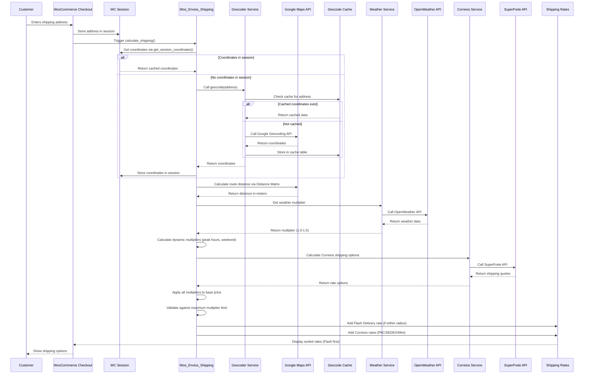
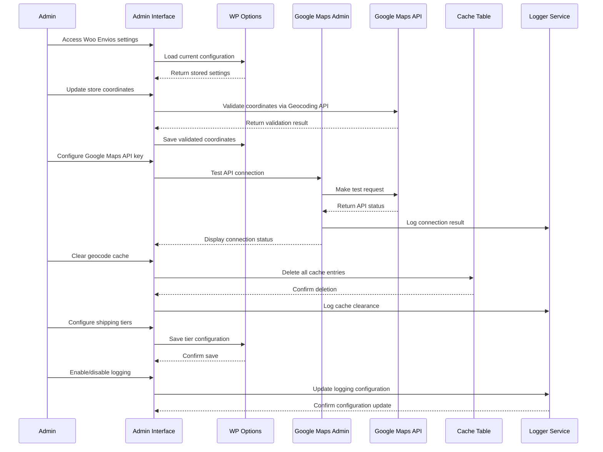

# TriqHub Shipping & Radius - Architecture Documentation

## 1. System Overview

TriqHub Shipping & Radius is a sophisticated WooCommerce extension that provides intelligent, radius-based shipping calculations with dynamic pricing, real-time geocoding, and multi-carrier integration. The system combines local delivery (Flash Delivery) with national carrier services (Correios/SuperFrete) to offer comprehensive shipping solutions for Brazilian e-commerce.

### 1.1 Core Architecture Principles

- **Modular Design**: Independent components with clear interfaces
- **Fault Tolerance**: Circuit breakers, fallback mechanisms, and graceful degradation
- **Performance Optimization**: Caching strategies at multiple levels
- **Extensibility**: Hook-based architecture for custom integrations
- **Observability**: Comprehensive logging and monitoring capabilities

## 2. System Architecture Diagram

```mermaid
graph TB
    subgraph "WordPress Environment"
        WP[WordPress Core]
        WC[WooCommerce]
    end
    
    subgraph "TriqHub Shipping Plugin"
        PLUGIN[Main Plugin Bootstrap]
        
        subgraph "Core Services"
            GEO[Geocoder Service]
            GMAPS[Google Maps API]
            WEATHER[Weather Service]
            LOGGER[Logger Service]
            UPDATER[Update Service]
        end
        
        subgraph "Shipping Methods"
            RADIUS[Radius Shipping]
            SUPERFRETE[SuperFrete Shipping]
            CORREIOS[Correios Integration]
        end
        
        subgraph "Admin Interface"
            ADMIN[Admin Settings]
            GMAPS_ADMIN[Google Maps Admin]
        end
        
        subgraph "Frontend Components"
            CHECKOUT[Checkout Integration]
            ASSETS[Frontend Assets]
        end
        
        subgraph "External Integrations"
            TRQ_CONN[TriqHub Connector]
            API_GOOGLE[Google Maps API]
            API_OPENWEATHER[OpenWeather API]
            API_SUPERFRETE[SuperFrete API]
        end
        
        subgraph "Data Layer"
            CACHE_TABLE[Geocode Cache Table]
            WP_OPTIONS[WordPress Options]
            WC_SESSION[WooCommerce Session]
        end
    end
    
    %% Data Flow
    WP --> PLUGIN
    WC --> PLUGIN
    
    PLUGIN --> CORE_SERVICES
    PLUGIN --> SHIPPING_METHODS
    PLUGIN --> ADMIN_INTERFACE
    PLUGIN --> FRONTEND_COMPONENTS
    
    CORE_SERVICES --> EXTERNAL_INTEGRATIONS
    SHIPPING_METHODS --> DATA_LAYER
    ADMIN_INTERFACE --> DATA_LAYER
    
    %% Service Dependencies
    GEO --> GMAPS
    RADIUS --> GEO
    RADIUS --> WEATHER
    SUPERFRETE --> CORREIOS
    
    %% External Connections
    GMAPS --> API_GOOGLE
    WEATHER --> API_OPENWEATHER
    SUPERFRETE --> API_SUPERFRETE
    TRQ_CONN --> TRQ_SERVER[TriqHub License Server]
    
    %% Data Storage
    GEO --> CACHE_TABLE
    ADMIN --> WP_OPTIONS
    CHECKOUT --> WC_SESSION
    
    classDef core fill:#e1f5fe,stroke:#01579b
    classDef service fill:#f3e5f5,stroke:#4a148c
    classDef external fill:#e8f5e8,stroke:#1b5e20
    classDef data fill:#fff3e0,stroke:#e65100
    
    class PLUGIN,GEO,GMAPS,WEATHER,LOGGER,UPDATER core
    class RADIUS,SUPERFRETE,CORREIOS,ADMIN,GMAPS_ADMIN,CHECKOUT,ASSETS service
    class TRQ_CONN,API_GOOGLE,API_OPENWEATHER,API_SUPERFRETE external
    class CACHE_TABLE,WP_OPTIONS,WC_SESSION data
```



## 3. Core Module Architecture

### 3.1 Plugin Bootstrap (`triqhub-shipping-radius.php`)

**Responsibilities**:
- Plugin initialization and lifecycle management
- Dependency validation (WordPress, WooCommerce)
- Singleton pattern implementation
- Hook registration and component orchestration

**Key Components**:
```php
class Woo_Envios_Plugin {
    private static $instance = null;
    
    // Core initialization sequence
    private function __construct() {
        $this->define_constants();
        $this->include_files();
        $this->load_components();
        $this->register_hooks();
    }
    
    // Self-healing mechanisms
    private function maybe_create_cache_table();
    
    // Update management
    private function init_updater();
}
```

### 3.2 Class Hierarchy and Relationships

```mermaid
classDiagram
    class Woo_Envios_Plugin {
        -static $instance
        +VERSION
        -__construct()
        +instance() Woo_Envios_Plugin
        -define_constants()
        -include_files()
        -load_components()
        -register_hooks()
        +register_shipping_method(array) array
        +sort_shipping_rates(array, array) array
        +activate() void
    }
    
    class WC_Shipping_Method {
        <<Abstract>>
        #id
        #method_title
        #method_description
        #instance_id
        #supports
        #enabled
        #title
        +get_option(string, mixed) mixed
        +init_instance_settings()
        +add_rate(array)
        +calculate_shipping(array)
    }
    
    class Woo_Envios_Shipping_Method {
        -__construct(int)
        +init() void
        +calculate_shipping(array) void
        -get_session_coordinates(string) array|null
        -calculate_distance(float, float, float, float) float
        -calculate_route_distance(array, array, array) array|WP_Error
        -calculate_dynamic_multiplier(array) array
        -calculate_correios_shipping(array) void
    }
    
    class Woo_Envios_Google_Maps {
        -api_key
        -cache_ttl
        -api_urls
        +is_configured() bool
        +geocode(string) array|WP_Error
        +calculate_distance(string, string) array|WP_Error
        -make_api_request(string, array, int) array|WP_Error
        -check_circuit_breaker() bool
        -record_failure() void
        -record_success() void
    }
    
    class Woo_Envios_Weather {
        -API_URL
        -CACHE_DURATION
        +get_weather_multiplier(float, float) float
        -get_current_weather(float, float, string) array|null
        -calculate_rain_multiplier(array) float
        +clear_cache() void
    }
    
    class Woo_Envios_Logger {
        +shipping_calculated(float, float, float, array, string, array, array) void
        +error(string) void
        +info(string) void
        +warning(string) void
        +api_failure(string, string) void
        +circuit_breaker_opened(int) void
        -notify_admin_api_failure(int) void
        +cleanup_old_logs() void
    }
    
    class Woo_Envios_Admin {
        +get_store_coordinates() array
        +match_tier_by_distance(float) array|false
        +save_settings() void
        -render_settings_page() void
        -validate_coordinates(array) bool
    }
    
    class Woo_Envios_Checkout {
        -__construct()
        +enqueue_checkout_scripts() void
        +add_checkout_fields(array) array
        +process_checkout_fields() void
        +update_order_meta(int, array) void
        -ajax_geocode_address() void
    }
    
    class "Woo_Envios\Services\Geocoder" {
        +geocode(string) array|false
        -geocode_via_google(string) array|false
        -geocode_via_correios(string) array|false
        -save_to_cache(string, array) void
        -get_from_cache(string) array|false
        -normalize_address(string) string
    }
    
    class "Woo_Envios\Services\Woo_Envios_Correios" {
        +is_enabled() bool
        +calculate(array) array|false
        -build_package_data(array) array
        -call_superfrete_api(array) array|WP_Error
        -parse_api_response(array) array
        -validate_package(array) bool
    }
    
    class "Woo_Envios\Services\Woo_Envios_Superfrete_Shipping_Method" {
        +__construct(int)
        +init() void
        +calculate_shipping(array) void
        -get_correios_services() array
        -filter_services_by_zone(array, array) array
        -calculate_service_cost(array, array) float|false
    }
    
    class TriqHub_Connector {
        -api_key
        -plugin_slug
        -endpoint
        +__construct(string, string)
        -validate_license() bool
        -send_usage_data(array) void
        -check_for_updates() array|false
        -handle_api_response(array) void
    }
    
    %% Inheritance Relationships
    WC_Shipping_Method <|-- Woo_Envios_Shipping_Method
    WC_Shipping_Method <|-- "Woo_Envios\Services\Woo_Envios_Superfrete_Shipping_Method"
    
    %% Composition Relationships
    Woo_Envios_Plugin "1" *-- "1..*" WC_Shipping_Method : manages
    Woo_Envios_Shipping_Method "1" *-- "1" Woo_Envios_Google_Maps : uses
    Woo_Envios_Shipping_Method "1" *-- "1" Woo_Envios_Weather : uses
    Woo_Envios_Shipping_Method "1" *-- "1" "Woo_Envios\Services\Geocoder" : uses
    Woo_Envios_Shipping_Method "1" *-- "1" "Woo_Envios\Services\Woo_Envios_Correios" : uses
    Woo_Envios_Plugin "1" *-- "1" TriqHub_Connector : contains
    Woo_Envios_Admin "1" *-- "1" Woo_Envios_Google_Maps : configures
```

## 4. Data Flow Architecture

### 4.1 Shipping Calculation Flow



### 4.2 Admin Configuration Flow



## 5. Component Architecture Details

### 5.1 Geocoding Service Architecture

**Primary Responsibilities**:
- Convert addresses to geographic coordinates
- Implement multi-source fallback (Google Maps → Correios)
- Manage caching with TTL-based expiration
- Handle API failures with circuit breakers

**Cache Strategy**:
```php
// Cache table structure
CREATE TABLE wp_woo_envios_geocode_cache (
    id BIGINT UNSIGNED AUTO_INCREMENT,
    cache_key VARCHAR(64) NOT NULL,      // MD5 hash of normalized address
    result_data LONGTEXT NOT NULL,       // JSON-encoded geocode result
    created_at DATETIME DEFAULT CURRENT_TIMESTAMP,
    expires_at DATETIME NOT NULL,        // TTL-based expiration
    PRIMARY KEY (id),
    UNIQUE KEY cache_key (cache_key),
    KEY expires_at (expires_at)
);
```

**Fallback Mechanism**:
1. Primary: Google Maps Geocoding API
2. Secondary: Correios CEP lookup (Brazil-specific)
3. Tertiary: Default coordinates (configurable)

### 5.2 Dynamic Pricing Engine

**Multiplier Sources**:
1. **Time-based**: Peak hours configuration
2. **Calendar-based**: Weekend surcharges
3. **Weather-based**: Rain/thunderstorm adjustments
4. **Configurable Limits**: Maximum multiplier caps

**Calculation Formula**:
```
final_price = base_price × peak_multiplier × weekend_multiplier × weather_multiplier
final_price = min(final_price, base_price × max_multiplier)
```

### 5.3 Circuit Breaker Pattern Implementation

**Failure Tracking**:
```php
class Woo_Envios_Google_Maps {
    private const MAX_CONSECUTIVE_FAILURES = 5;
    
    private function check_circuit_breaker(): bool {
        $failures = (int) get_transient('woo_envios_gmaps_failures');
        return $failures >= self::MAX_CONSECUTIVE_FAILURES;
    }
    
    private function record_failure(): void {
        $failures = (int) get_transient('woo_envios_gmaps_failures');
        $failures++;
        set_transient('woo_envios_gmaps_failures', $failures, 300); // 5 minutes
    }
    
    private function record_success(): void {
        delete_transient('woo_envios_gmaps_failures');
    }
}
```

### 5.4 Session Management Architecture

**Coordinate Storage Strategy**:
```php
// Session data structure
$session_data = [
    'lat' => -23.550520,          // Latitude
    'lng' => -46.633308,          // Longitude
    'signature' => 'md5_hash',    // Address signature for validation
    'timestamp' => 1678901234,    // Cache timestamp
];

// Signature generation
$signature = md5(strtolower(implode('|', [
    $city,
    $state,
    preg_replace('/\D/', '', $postcode),
    $country
])));
```

## 6. Database Schema

### 6.1 Core Tables

**Geocode Cache Table**:
```sql
CREATE TABLE wp_woo_envios_geocode_cache (
    id BIGINT UNSIGNED NOT NULL AUTO_INCREMENT,
    cache_key VARCHAR(64) NOT NULL,
    result_data LONGTEXT NOT NULL,
    created_at DATETIME NOT NULL DEFAULT CURRENT_TIMESTAMP,
    expires_at DATETIME NOT NULL,
    PRIMARY KEY (id),
    UNIQUE KEY cache_key (cache_key),
    KEY expires_at (expires