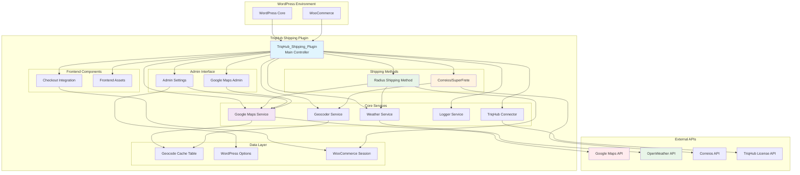
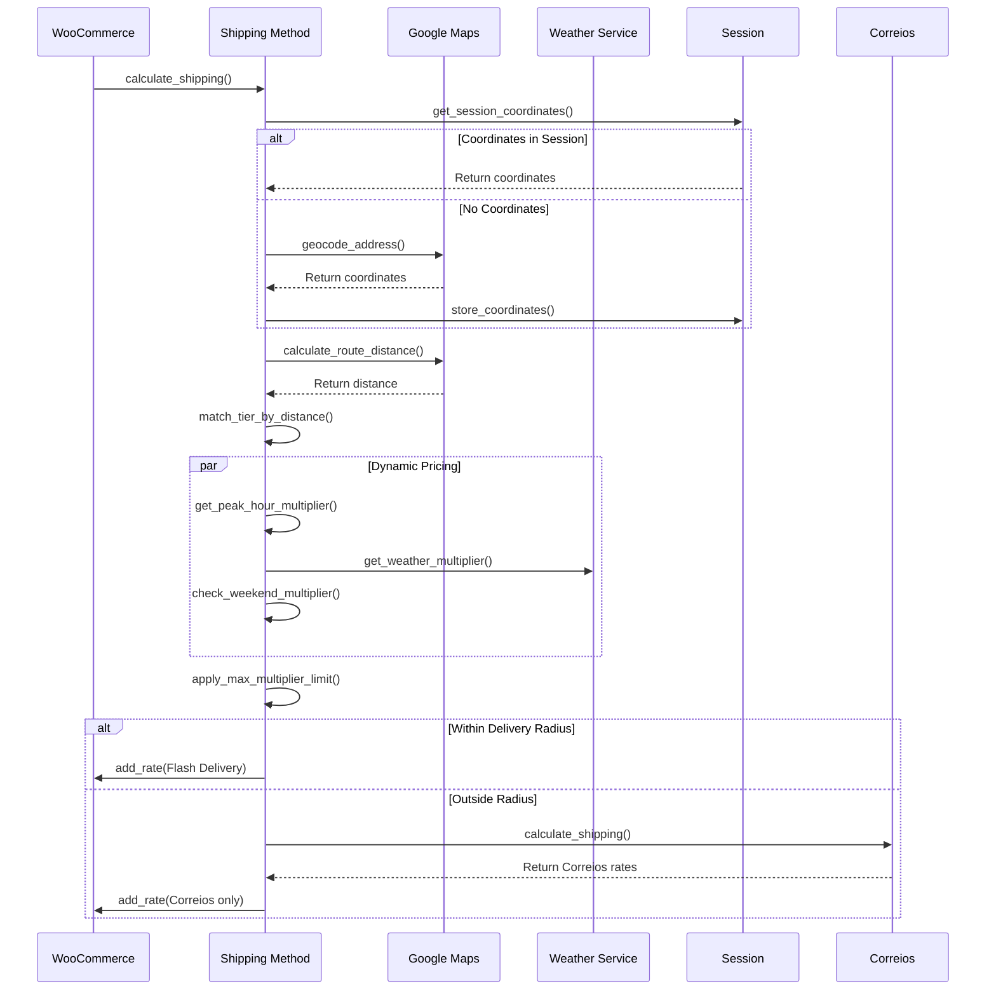
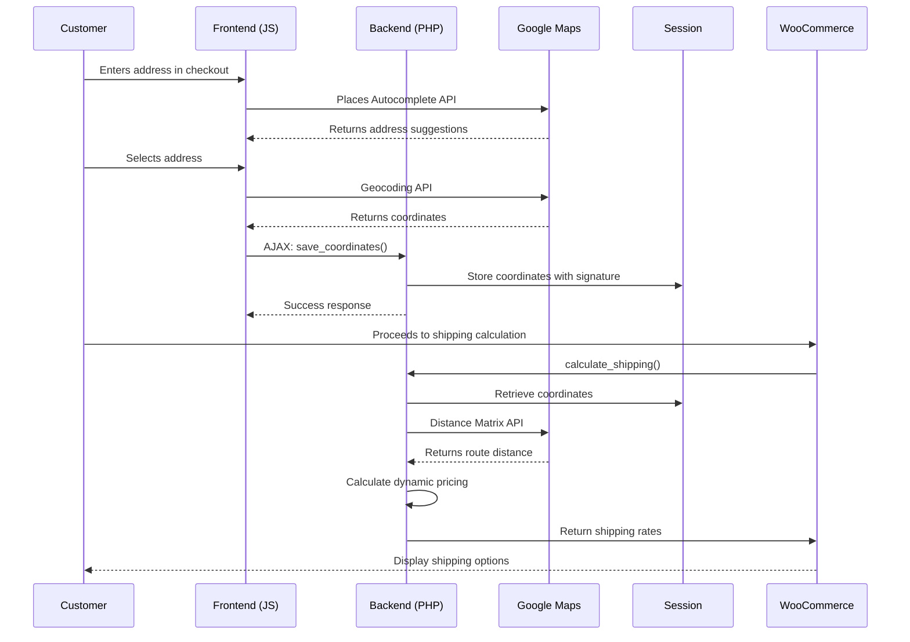
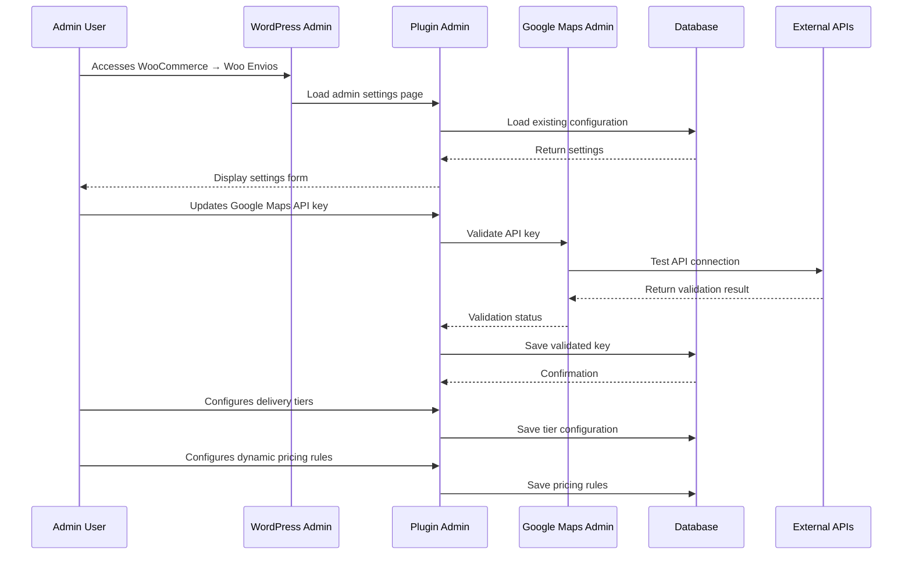
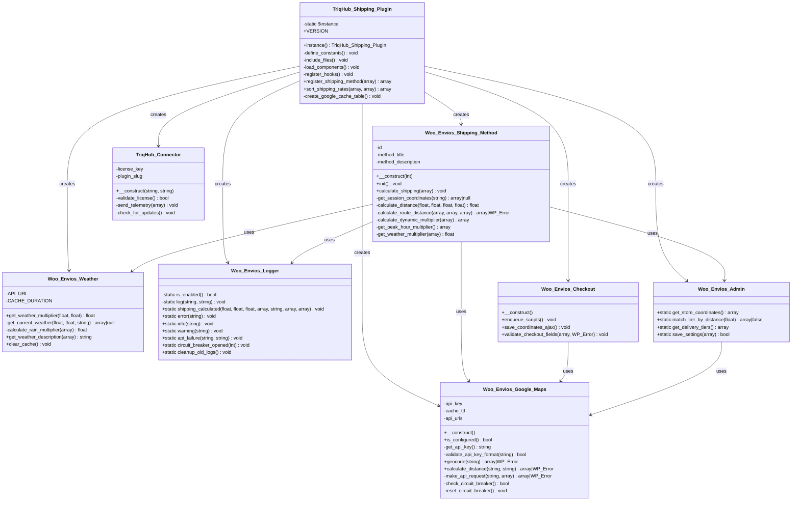

# TriqHub Shipping & Radius - Architecture Documentation

## System Overview

TriqHub Shipping & Radius is a sophisticated WooCommerce extension that provides intelligent shipping calculations based on geographical radius, real-time weather conditions, and dynamic pricing. The system integrates multiple external APIs (Google Maps, OpenWeather, Correios/SuperFrete) to deliver precise shipping rates for Brazilian e-commerce operations.

### Core Architecture Principles

1. **Modular Design**: Separation of concerns with dedicated service classes
2. **Fault Tolerance**: Circuit breaker patterns and graceful degradation
3. **Performance Optimization**: Caching strategies at multiple levels
4. **Extensibility**: Hook-based architecture for third-party integrations
5. **Real-time Processing**: Dynamic pricing based on external conditions

## System Architecture Diagram



## Core Module Architecture

### 1. Main Plugin Controller (`TriqHub_Shipping_Plugin`)

**Responsibilities**:
- Singleton pattern for single instance management
- Plugin lifecycle management (activation/deactivation)
- Dependency loading and initialization order
- Hook registration and event handling
- Self-healing mechanisms (cache table creation)

**Key Methods**:
- `instance()`: Singleton accessor
- `define_constants()`: Defines plugin constants
- `include_files()`: Loads dependencies in correct order
- `load_components()`: Initializes service instances
- `register_shipping_method()`: Registers shipping methods with WooCommerce
- `sort_shipping_rates()`: Prioritizes Flash delivery over other methods

**Dependencies**:
- WordPress Core Functions
- WooCommerce Shipping Methods API
- All internal service classes

### 2. Google Maps Service (`Woo_Envios_Google_Maps`)

**Responsibilities**:
- Google Maps API integration management
- Geocoding (address to coordinates conversion)
- Distance Matrix calculations (route-based distances)
- Circuit breaker implementation for API failure handling
- Response caching and TTL management

**API Endpoints Managed**:
- Geocoding API: `https://maps.googleapis.com/maps/api/geocode/json`
- Places Autocomplete: `https://maps.googleapis.com/maps/api/place/autocomplete/json`
- Place Details: `https://maps.googleapis.com/maps/api/place/details/json`
- Distance Matrix: `https://maps.googleapis.com/maps/api/distancematrix/json`

**Circuit Breaker Pattern**:
```php
private function check_circuit_breaker(): bool
{
    $failures = get_transient('woo_envios_google_maps_failures') ?: 0;
    $last_failure = get_transient('woo_envios_google_maps_last_failure');
    
    if ($failures >= self::MAX_CONSECUTIVE_FAILURES) {
        // Circuit is open - check if cooldown period has passed
        if (time() - $last_failure < 300) { // 5 minute cooldown
            return false; // Circuit is open
        }
        // Cooldown passed, reset circuit
        $this->reset_circuit_breaker();
    }
    
    return true; // Circuit is closed, allow requests
}
```

### 3. Shipping Method (`Woo_Envios_Shipping_Method`)

**Responsibilities**:
- Shipping rate calculation based on distance
- Dynamic pricing with multiple multipliers
- Session-based coordinate management
- Fallback mechanisms for geocoding failures
- Integration with Correios/SuperFrete for out-of-range deliveries

**Calculation Flow**:


### 4. Weather Service (`Woo_Envios_Weather`)

**Responsibilities**:
- OpenWeather API integration
- Rain detection and intensity classification
- Weather-based pricing multipliers
- Response caching (1-hour TTL)
- Cache invalidation and cleanup

**Multiplier Logic**:
- No rain: 1.0x (no adjustment)
- Light rain/drizzle: 1.2x (configurable)
- Heavy rain (>5mm/h): 1.5x (configurable)
- Thunderstorm: 1.5x (configurable)

### 5. Logger Service (`Woo_Envios_Logger`)

**Responsibilities**:
- Structured logging with rotation (7-day retention)
- Log level management (info, warning, error)
- Admin notification system for critical failures
- API failure tracking and circuit breaker integration
- Shipping calculation audit trails

**Log Structure**:
```
[2024-01-15 14:30:45] [INFO] FRETE CALCULADO | Distância: 5.2 km | Base: R$ 15.00 | Final: R$ 18.00 | Multiplicadores: Pico +20%, Chuva +20%
```

### 6. Geocoder Service (`Woo_Envios\Services\Geocoder`)

**Responsibilities**:
- Address normalization and validation
- Multi-source geocoding (primary: Google Maps, fallback: manual)
- Cache management with database table
- Coordinate validation and error handling

**Cache Table Schema**:
```sql
CREATE TABLE wp_woo_envios_geocode_cache (
    id BIGINT UNSIGNED AUTO_INCREMENT,
    cache_key VARCHAR(64) NOT NULL,
    result_data LONGTEXT NOT NULL,
    created_at DATETIME DEFAULT CURRENT_TIMESTAMP,
    expires_at DATETIME NOT NULL,
    PRIMARY KEY (id),
    UNIQUE KEY cache_key (cache_key),
    KEY expires_at (expires_at)
);
```

## Data Flow Architecture

### 1. Checkout Process Flow



### 2. Admin Configuration Flow



## Class Hierarchy and Relationships



## Database Schema

### 1. Geocode Cache Table (`wp_woo_envios_geocode_cache`)
```sql
CREATE TABLE wp_woo_envios_geocode_cache (
    id BIGINT UNSIGNED NOT NULL AUTO_INCREMENT,
    cache_key VARCHAR(64) NOT NULL,
    result_data LONGTEXT NOT NULL,
    created_at DATETIME NOT NULL DEFAULT CURRENT_TIMESTAMP,
    expires_at DATETIME NOT NULL,
    PRIMARY KEY (id),
    UNIQUE KEY cache_key (cache_key),
    KEY expires_at (expires_at)
) ENGINE=InnoDB DEFAULT CHARSET=utf8mb4 COLLATE=utf8mb4_unicode_ci;
```

### 2. WordPress Options (Plugin Settings)
- `woo_envios_google_maps_api_key`: Google Maps API key
- `woo_envios_store_latitude`: Store base latitude
- `woo_envios_store_longitude`: Store base longitude
- `woo_envios_delivery_tiers`: JSON-encoded delivery tiers
- `woo_envios_dynamic_pricing_enabled`: Boolean flag
- `woo_envios_peak_hours`: JSON-encoded peak hour configurations
- `woo_envios_weather_api_key`: OpenWeather API key
- `woo_envios_rain_light_multiplier`: Light rain multiplier
- `woo_envios_rain_heavy_multiplier`: Heavy rain multiplier
- `woo_envios_weekend_multiplier`: Weekend multiplier
- `woo_envios_max_multiplier`: Maximum allowed multiplier
- `woo_envios_enable_logs`: Enable/disable logging
- `triqhub_license_key`: TriqHub license key

### 3. WooCommerce Session Data
- `woo_envios_coords`: Customer coordinates with signature
  - `lat`: Latitude (float)
  - `lng`: Longitude (float)
  - `signature`: MD5 hash of normalized address

## External API Integration Architecture

### 1. Google Maps API Integration
**Authentication**: API Key-based authentication
**Rate Limiting**: Implemented via circuit breaker pattern
**Caching Strategy**: 30-day TTL for geocode results
**Error Handling**: Graceful degradation to Haversine formula

### 2. OpenWeather API Integration
**Authentication**: API Key-based authentication
**Cache Strategy**: 1-hour TTL for weather data
**Data Processing**: Rain intensity classification
**Fallback**: No weather adjustment if API fails

### 3. Correios/SuperFrete Integration
**Authentication**: Token-based authentication
**Service Types**: PAC, SEDEX, Mini Envios
**Fallback Strategy**: Primary shipping method when outside radius
**Error Handling**: Silent failure with logging

### 4. TriqHub License API
**Authentication**: License key validation
