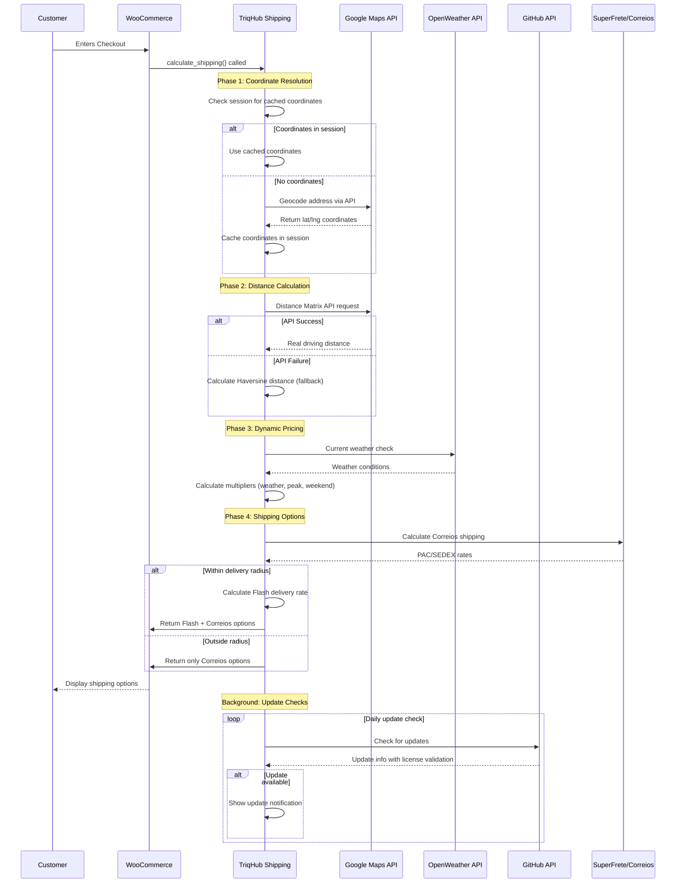

# CONNECTIVITY.md - TriqHub: Shipping & Radius

## Overview

This document details the external API integrations, webhook structures, network communication patterns, and error handling strategies implemented in the TriqHub Shipping & Radius plugin. The system orchestrates multiple external services to provide real-time shipping calculations with dynamic pricing based on distance, weather conditions, and peak hours.

## External API Integrations

### 1. Google Maps Platform APIs

#### 1.1 Geocoding API
**Purpose**: Convert Brazilian postal codes (CEP) and addresses to geographic coordinates (latitude/longitude).

**Endpoint**: `https://maps.googleapis.com/maps/api/geocode/json`

**Authentication**: API Key (39-character string starting with "AIza")

**Request Parameters**:
```json
{
  "address": "CEP or full address",
  "key": "API_KEY",
  "region": "br",
  "language": "pt-BR"
}
```

**Response Structure**:
```json
{
  "results": [
    {
      "geometry": {
        "location": {
          "lat": -23.550520,
          "lng": -46.633308
        }
      },
      "formatted_address": "São Paulo, SP, Brazil"
    }
  ],
  "status": "OK"
}
```

**Cache Strategy**: Results cached in `wp_woo_envios_geocode_cache` table with 30-day TTL.

#### 1.2 Distance Matrix API
**Purpose**: Calculate real driving distance between store location and customer coordinates.

**Endpoint**: `https://maps.googleapis.com/maps/api/distancematrix/json`

**Request Parameters**:
```json
{
  "origins": "lat,lng",
  "destinations": "lat,lng",
  "key": "API_KEY",
  "units": "metric",
  "mode": "driving",
  "language": "pt-BR"
}
```

**Fallback Mechanism**: If API fails, system uses Haversine formula for straight-line distance calculation.

#### 1.3 Places Autocomplete API
**Purpose**: Provide address suggestions during checkout for Brazilian addresses.

**Endpoint**: `https://maps.googleapis.com/maps/api/place/autocomplete/json`

**Request Parameters**:
```json
{
  "input": "partial address",
  "key": "API_KEY",
  "components": "country:br",
  "language": "pt-BR",
  "types": "address"
}
```

### 2. OpenWeather API

**Purpose**: Detect current weather conditions (rain intensity) for dynamic pricing adjustments.

**Endpoint**: `https://api.openweathermap.org/data/2.5/weather`

**Authentication**: API Key

**Request Parameters**:
```json
{
  "lat": latitude,
  "lon": longitude,
  "appid": "API_KEY",
  "units": "metric",
  "lang": "pt_br"
}
```

**Weather Multiplier Logic**:
- No rain: 1.0x multiplier
- Light rain/drizzle: 1.2x multiplier (configurable)
- Heavy rain (>5mm/h): 1.5x multiplier (configurable)
- Thunderstorm: 1.5x multiplier

**Cache Strategy**: 1-hour transient cache using WordPress transients.

### 3. TriqHub License API

**Purpose**: License validation and update distribution via GitHub integration.

**Endpoint**: GitHub API with license key injection

**Authentication Flow**:
1. License key stored in WordPress options (`triqhub_license_key`)
2. Key injected into GitHub API requests via filter hook
3. Site URL included for domain validation

**Update Request Structure**:
```json
{
  "license_key": "TRQ-XXXX-XXXX-XXXX",
  "site_url": "https://example.com",
  "plugin_version": "1.2.9"
}
```

### 4. WooCommerce Native Integration

**Purpose**: Seamless integration with WooCommerce shipping system.

**Integration Points**:
- Shipping method registration via `woocommerce_shipping_methods` filter
- Rate calculation via `calculate_shipping()` method
- Session management for coordinate storage
- Checkout field modifications

**Session Data Structure**:
```php
WC()->session->set('woo_envios_coords', [
    'lat' => -23.550520,
    'lng' => -46.633308,
    'signature' => 'md5_hash_of_address_components'
]);
```

## Webhook Structures

### 1. GitHub Webhook for Automatic Updates

**Trigger**: Push to main branch or new release

**Payload Structure**:
```json
{
  "ref": "refs/heads/main",
  "repository": {
    "full_name": "gustavofullstack/triqhub-shipping-radius"
  },
  "head_commit": {
    "id": "commit_hash",
    "message": "Update description"
  }
}
```

**Processing**: Plugin Update Checker (PUC) library handles update detection and installation.

### 2. Plugin Update Checker Integration

**Custom Filter**: `puc_request_info_query_args-{slug}`

**Purpose**: Inject license key into update requests

**Implementation**:
```php
add_filter('puc_request_info_query_args-triqhub-shipping-radius', function($queryArgs) {
    $license_key = get_option('triqhub_license_key');
    if (!empty($license_key)) {
        $queryArgs['license_key'] = $license_key;
        $queryArgs['site_url'] = home_url();
    }
    return $queryArgs;
});
```

## Network Configuration

### Timeout Settings

| API Service | Timeout | Retry Attempts | Circuit Breaker Threshold |
|-------------|---------|----------------|---------------------------|
| Google Maps | 10 seconds | 3 | 5 consecutive failures |
| OpenWeather | 5 seconds | 2 | 3 consecutive failures |
| GitHub API | 15 seconds | 2 | N/A |
| WooCommerce | N/A (local) | N/A | N/A |

### Circuit Breaker Implementation

**Google Maps Circuit Breaker Logic**:
```php
private function is_circuit_open() {
    $failures = get_transient('woo_envios_api_failures');
    return $failures && $failures >= self::MAX_CONSECUTIVE_FAILURES;
}

private function record_failure() {
    $failures = get_transient('woo_envios_api_failures') ?: 0;
    $failures++;
    set_transient('woo_envios_api_failures', $failures, 3600);
    
    if ($failures >= self::MAX_CONSECUTIVE_FAILURES) {
        Woo_Envios_Logger::circuit_breaker_opened($failures);
    }
}
```

### Cache Configuration

**Database Cache Table** (`wp_woo_envios_geocode_cache`):
```sql
CREATE TABLE wp_woo_envios_geocode_cache (
    id bigint(20) unsigned NOT NULL AUTO_INCREMENT,
    cache_key varchar(64) NOT NULL,
    result_data longtext NOT NULL,
    created_at datetime NOT NULL DEFAULT CURRENT_TIMESTAMP,
    expires_at datetime NOT NULL,
    PRIMARY KEY (id),
    UNIQUE KEY cache_key (cache_key),
    KEY expires_at (expires_at)
);
```

**Transient Cache**:
- Weather data: 1 hour
- API failures: 1 hour
- Last notification: 1 hour

## Error Handling Strategies

### 1. Graceful Degradation

**Primary Strategy**: When external APIs fail, the system gracefully degrades functionality:

1. **Google Maps Failure**:
   - Use Haversine formula for distance calculation
   - Fall back to default coordinates (`WOO_ENVIOS_DEFAULT_LAT`, `WOO_ENVIOS_DEFAULT_LNG`)
   - Continue showing Correios shipping options

2. **OpenWeather Failure**:
   - Default to 1.0x weather multiplier
   - Continue with base pricing

3. **Geocoding Failure**:
   - Server-side fallback geocoding attempt
   - Show only Correios shipping options if geocoding fails

### 2. Logging System

**Log Levels**:
- `INFO`: Normal operations, shipping calculations
- `WARNING`: Non-critical issues, distance out of range
- `ERROR`: API failures, critical errors

**Log Storage**: Daily log files in `/wp-content/uploads/woo-envios-logs/`

**Log Rotation**: Automatic cleanup of logs older than 7 days

### 3. Admin Notifications

**Trigger Conditions**:
- Circuit breaker opens (5 consecutive API failures)
- Critical configuration missing (API keys, store coordinates)

**Notification Method**: WordPress admin notices and email alerts

**Rate Limiting**: 1 notification per hour maximum

### 4. User-Facing Error Handling

**Checkout Experience**:
- Always show at least Correios shipping options
- Clear error messages for configuration issues
- No shipping method shown only if all calculations fail

## Security Considerations

### 1. API Key Management

**Storage**: Encrypted in WordPress options table
**Validation**: Format validation (39 chars, starts with "AIza")
**Rotation**: Manual rotation via admin interface

### 2. Data Privacy

**Geolocation Data**:
- Only stored in session (temporary)
- Not persisted to database long-term
- Used exclusively for shipping calculations

**Address Data**:
- Normalized before hashing for signatures
- Never transmitted to third parties except Google Maps

### 3. Request Validation

**Signature Verification**:
```php
private function build_destination_signature(array $package): string {
    $destination = $package['destination'] ?? [];
    $postcode = preg_replace('/\D/', '', $destination['postcode'] ?? '');
    $parts = [
        sanitize_text_field($destination['city'] ?? ''),
        sanitize_text_field($destination['state'] ?? ''),
        $postcode,
        sanitize_text_field($destination['country'] ?? ''),
    ];
    $normalized = strtolower(implode('|', $parts));
    return md5($normalized);
}
```

## Integration Flow Diagram



## Monitoring and Maintenance

### 1. Health Checks

**Automatic Checks**:
- API key validity
- Cache table existence
- Required WooCommerce version
- PHP version compatibility

**Manual Checks**:
- Google Maps API quota usage
- OpenWeather API calls
- Log file size and rotation

### 2. Performance Metrics

**Key Metrics to Monitor**:
- Average API response time
- Cache hit rate
- Circuit breaker status
- Shipping calculation success rate

**Monitoring Tools**:
- WordPress debug log
- Plugin-specific log files
- WooCommerce system status

### 3. Update Procedures

**Automatic Updates**:
1. GitHub webhook triggers update check
2. License validation via injected parameters
3. Secure download and installation
4. Database migration if needed

**Manual Updates**:
1. Download from GitHub
2. Verify license key
3. Upload via WordPress admin
4. Clear caches if needed

## Troubleshooting Guide

### Common Issues and Solutions

| Issue | Symptoms | Solution |
|-------|----------|----------|
| No shipping methods shown | Empty shipping options at checkout | 1. Verify store coordinates<br>2. Check Google Maps API key<br>3. Enable logging for debugging |
| Incorrect distances | Shipping calculations seem wrong | 1. Clear geocode cache<br>2. Verify address normalization<br>3. Check Distance Matrix API status |
| API timeouts | Slow checkout, timeouts | 1. Increase timeout settings<br>2. Check circuit breaker status<br>3. Verify network connectivity |
| License validation fails | Update notifications missing | 1. Verify license key format<br>2. Check site URL configuration<br>3. Ensure GitHub API access |

### Debug Mode

**Enable Debug Logging**:
```php
update_option('woo_envios_enable_logs', true);
```

**Log Location**: `wp-content/uploads/woo-envios-logs/YYYY-MM-DD.log`

**Debug Information Available**:
- API request/response details
- Distance calculations
- Multiplier breakdowns
- Session coordinate data

## Future Integration Roadmap

### Planned Integrations

1. **Additional Shipping Carriers**:
   - Jadlog
   - Azul Cargo
   - Mercado Envios

2. **Advanced Analytics**:
   - Shipping cost optimization
   - Delivery time predictions
   - Customer location heatmaps

3. **Enhanced APIs**:
   - Google Maps Routes API for delivery routing
   - Weather forecast integration for scheduling
   - Traffic pattern integration

### API Version Compatibility

**Current Support**:
- Google Maps API: v3
- OpenWeather API: 2.5
- WooCommerce REST API: v3
- GitHub API: v3

**Deprecation Strategy**: 6-month notice for API version changes with backward compatibility layers.