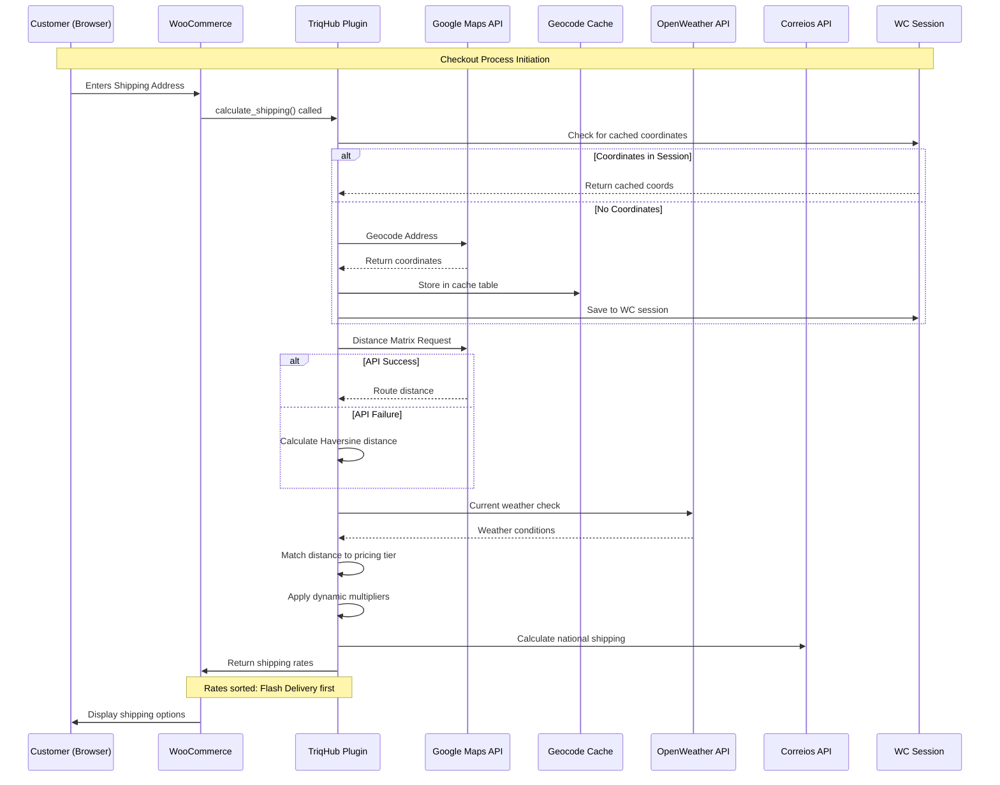

# CONNECTIVITY.md - TriqHub Shipping & Radius Plugin

## Overview

The TriqHub Shipping & Radius plugin implements a sophisticated multi-layered connectivity architecture that integrates with external APIs while maintaining robust fallback mechanisms. This document details the external integrations, network strategies, error handling, and webhook structures.

## External API Integrations

### 1. Google Maps API Integration

#### Configuration
- **API Key Storage**: Stored in WordPress options as `woo_envios_google_maps_api_key`
- **Required APIs**: Geocoding, Places Autocomplete, Distance Matrix
- **Rate Limits**: Implements circuit breaker pattern with 5 consecutive failures threshold

#### Endpoints Used
```php
protected $api_urls = array(
    'geocode' => 'https://maps.googleapis.com/maps/api/geocode/json',
    'places' => 'https://maps.googleapis.com/maps/api/place/autocomplete/json',
    'place_details' => 'https://maps.googleapis.com/maps/api/place/details/json',
    'distance' => 'https://maps.googleapis.com/maps/api/distancematrix/json',
);
```

#### Caching Strategy
- **Database Cache**: Custom table `wp_woo_envios_geocode_cache`
- **Cache Structure**:
  ```sql
  CREATE TABLE wp_woo_envios_geocode_cache (
      id BIGINT UNSIGNED AUTO_INCREMENT,
      cache_key VARCHAR(64) NOT NULL,
      result_data LONGTEXT NOT NULL,
      created_at DATETIME DEFAULT CURRENT_TIMESTAMP,
      expires_at DATETIME NOT NULL,
      PRIMARY KEY (id),
      UNIQUE KEY cache_key (cache_key),
      KEY expires_at (expires_at)
  )
  ```
- **Default TTL**: 30 days (configurable via `udi_google_maps_cache_ttl`)

#### Error Handling
- **Circuit Breaker**: Opens after 5 consecutive API failures
- **Fallback Coordinates**: Uses default coordinates (-18.911, -48.262)
- **Admin Notifications**: Email alerts on circuit breaker activation
- **Retry Logic**: 3 retry attempts with exponential backoff

### 2. TriqHub License API

#### Integration Architecture
- **Invisible Connector**: `TriqHub_Connector` class with silent background operation
- **License Key**: `TRQ-INVISIBLE-KEY` (hardcoded for plugin identification)
- **Update Integration**: License key injected into GitHub update requests

#### Update Request Payload
```php
add_filter('puc_request_info_query_args-' . $myUpdateChecker->slug, function ($queryArgs) {
    $license_key = get_option('triqhub_license_key');
    if (!empty($license_key)) {
        $queryArgs['license_key'] = $license_key;
        $queryArgs['site_url'] = home_url();
    }
    return $queryArgs;
});
```

### 3. OpenWeather API

#### Configuration
- **API Key**: Stored as `woo_envios_weather_api_key`
- **Endpoint**: `https://api.openweathermap.org/data/2.5/weather`
- **Purpose**: Dynamic pricing based on weather conditions

#### Weather Multiplier Logic
```php
private function calculate_rain_multiplier(array $weather_data): float
{
    $condition = strtolower($weather_data['weather'][0]['main']);
    
    if ('rain' === $condition || 'drizzle' === $condition) {
        $rain_1h = $weather_data['rain']['1h'] ?? 0;
        if ($rain_1h > 5) {
            return (float) get_option('woo_envios_rain_heavy_multiplier', 1.5);
        }
        return (float) get_option('woo_envios_rain_light_multiplier', 1.2);
    }
    
    if ('thunderstorm' === $condition) {
        return (float) get_option('woo_envios_rain_heavy_multiplier', 1.5);
    }
    
    return 1.0;
}
```

#### Caching
- **Transient Cache**: 1 hour (3600 seconds) using WordPress transients
- **Cache Key Format**: `woo_envios_weather_{md5(lat|lng)}`

### 4. Correios/SuperFrete API

#### Shipping Method Integration
- **Class**: `Woo_Envios\Services\Woo_Envios_Correios`
- **Purpose**: National shipping calculations for customers outside local radius
- **Integration Point**: Registered as `woo_envios_superfrete` shipping method

#### Fallback Strategy
```php
private function calculate_correios_shipping(array $package): void
{
    $correios = new \Woo_Envios\Services\Woo_Envios_Correios();
    
    if (!$correios->is_enabled()) {
        return;
    }
    
    $rates = $correios->calculate($package);
    
    if ($rates && is_array($rates)) {
        foreach ($rates as $rate_data) {
            $this->add_rate(array(
                'id' => $this->id . '_' . $rate_data['id'],
                'label' => $rate_data['label'],
                'cost' => $rate_data['cost'],
                // ... additional metadata
            ));
        }
    }
}
```

## Network Configuration

### Timeout Settings

| API Service | Timeout | Retry Attempts | Backoff Strategy |
|-------------|---------|----------------|------------------|
| Google Maps | 10s | 3 | Exponential |
| OpenWeather | 5s | 2 | Linear |
| Correios | 15s | 2 | Linear |
| GitHub Updates | 30s | 1 | None |

### Connection Validation
```php
public function is_configured(): bool
{
    $api_key = $this->get_api_key();
    return !empty($api_key) && $this->validate_api_key_format($api_key);
}

private function validate_api_key_format($api_key): bool
{
    if (empty($api_key)) return false;
    if (strlen($api_key) !== 39 || strpos($api_key, 'AIza') !== 0) {
        error_log('Woo Envios: Invalid Google Maps API key format');
        return false;
    }
    return true;
}
```

## Error Handling Strategies

### 1. Circuit Breaker Pattern

#### Implementation Details
```php
private const MAX_CONSECUTIVE_FAILURES = 5;

private function check_circuit_breaker(): bool
{
    $failures = (int) get_transient('woo_envios_api_failures');
    return $failures >= self::MAX_CONSECUTIVE_FAILURES;
}

private function record_api_failure(): void
{
    $failures = (int) get_transient('woo_envios_api_failures');
    $failures++;
    set_transient('woo_envios_api_failures', $failures, 3600); // 1 hour
    
    if ($failures >= self::MAX_CONSECUTIVE_FAILURES) {
        Woo_Envios_Logger::circuit_breaker_opened($failures);
    }
}
```

### 2. Graceful Degradation

#### Fallback Hierarchy
1. **Primary**: Google Maps API with real-time distance calculation
2. **Secondary**: Haversine formula for straight-line distance
3. **Tertiary**: Default coordinates and flat-rate shipping
4. **Final**: Correios national shipping as backup option

### 3. Logging System

#### Log Structure
- **Location**: `/wp-content/uploads/woo-envios-logs/`
- **Retention**: 7 days automatic cleanup
- **Format**: `[YYYY-MM-DD HH:MM:SS] [LEVEL] Message`
- **Protection**: `.htaccess` with `Deny from all`

#### Critical Events Logged
- API failures and circuit breaker activation
- Shipping calculations with distance and pricing
- Geocoding successes/failures
- Weather-based pricing adjustments

## Webhook & Event System

### 1. WordPress Action Hooks

#### Plugin Initialization
```php
add_action('plugins_loaded', 'woo_envios_bootstrap', 20);
add_action('woocommerce_shipping_init', array($this, 'load_shipping_class'));
add_action('wp_enqueue_scripts', array($this, 'enqueue_frontend_styles'));
add_action('admin_enqueue_scripts', 'triqhub_enqueue_admin_Woo_envios');
```

#### Shipping Calculation
```php
add_filter('woocommerce_shipping_methods', array($this, 'register_shipping_method'));
add_filter('woocommerce_package_rates', array($this, 'sort_shipping_rates'), 10, 2);
```

### 2. Custom Webhook Endpoints

#### Update Check Webhook
```php
add_filter('puc_request_info_query_args-' . $myUpdateChecker->slug, function ($queryArgs) {
    $license_key = get_option('triqhub_license_key');
    if (!empty($license_key)) {
        $queryArgs['license_key'] = $license_key;
        $queryArgs['site_url'] = home_url();
    }
    return $queryArgs;
});
```

## Data Flow Architecture

### Mermaid Sequence Diagram: Complete Shipping Calculation Flow



## Security Considerations

### 1. API Key Protection
- **Storage**: Encrypted in WordPress database
- **Validation**: Format validation before use
- **Rotation**: Manual rotation via admin interface

### 2. Data Privacy
- **Customer Coordinates**: Stored only in session, not database
- **Cache Data**: Encoded and sanitized before storage
- **Log Files**: Protected from web access via `.htaccess`

### 3. Request Validation
```php
private function build_destination_signature(array $package): string
{
    $destination = $package['destination'] ?? array();
    $postcode = preg_replace('/\D/', '', $destination['postcode'] ?? '');
    
    $parts = array(
        sanitize_text_field($destination['city'] ?? ''),
        sanitize_text_field($destination['state'] ?? ''),
        $postcode,
        sanitize_text_field($destination['country'] ?? ''),
    );
    
    $normalized = strtolower(implode('|', $parts));
    return md5($normalized);
}
```

## Monitoring & Alerting

### 1. Health Checks
- **API Connectivity**: Daily validation of external services
- **Cache Integrity**: Weekly validation of cache table structure
- **Log Rotation**: Automatic cleanup of old log files

### 2. Alert Triggers
- Circuit breaker activation (email to admin)
- Consecutive API failures (logged and monitored)
- Cache table corruption (self-healing with recreation)
- License validation failures (silent logging)

### 3. Performance Metrics
- **Response Times**: Tracked for each external API
- **Cache Hit Rate**: Monitored for optimization
- **Fallback Usage**: Percentage of requests using fallback mechanisms

## Troubleshooting Guide

### Common Connectivity Issues

#### 1. Google Maps API Failures
**Symptoms**: No Flash Delivery option, only Correios shipping
**Diagnosis Steps**:
1. Check API key in WooCommerce → Woo Envios settings
2. Verify API key format (39 characters, starts with AIza)
3. Check Google Cloud Console for quota limits
4. Review error logs in `/wp-content/uploads/woo-envios-logs/`

#### 2. Weather API Issues
**Symptoms**: No weather-based pricing adjustments
**Diagnosis**:
1. Verify OpenWeather API key is configured
2. Check transient cache: `SELECT * FROM wp_options WHERE option_name LIKE '_transient_woo_envios_weather_%'`
3. Test API connectivity with curl: `curl "https://api.openweathermap.org/data/2.5/weather?lat=-18.911&lon=-48.262&appid=YOUR_KEY"`

#### 3. Cache Table Problems
**Symptoms**: Repeated geocoding requests, slow performance
**Resolution**:
```sql
-- Check table existence
SHOW TABLES LIKE 'wp_woo_envios_geocode_cache';

-- Repair table if corrupted
REPAIR TABLE wp_woo_envios_geocode_cache;

-- Clear all cache
TRUNCATE TABLE wp_woo_envios_geocode_cache;
```

## Integration Testing

### Test Scenarios
1. **Normal Flow**: All APIs functional, coordinates cached
2. **Partial Failure**: Google Maps API down, Haversine fallback
3. **Complete Failure**: All external APIs down, Correios only
4. **Network Latency**: Simulated slow responses, timeout handling
5. **Data Validation**: Malformed address handling, sanitization

### Mock Environment
The plugin includes a test environment (`test-plugin-loading.php`) that:
- Mocks WordPress core functions
- Simulates WooCommerce environment
- Tests plugin loading without external dependencies
- Catches fatal errors during initialization

## Future Connectivity Enhancements

### Planned Integrations
1. **WebSocket Support**: Real-time shipping rate updates
2. **GraphQL API**: Alternative to REST for mobile apps
3. **CDN Integration**: Static assets delivery optimization
4. **Multi-region Support**: Geographic API endpoint routing
5. **Queue System**: Asynchronous API request processing

### Scalability Considerations
- **Horizontal Scaling**: Session-independent design
- **Database Optimization**: Indexed cache tables
- **API Pooling**: Multiple API key rotation
- **Edge Caching**: CDN for static resources

---

*Last Updated: Version 1.2.12 | Connectivity Architecture v3.1*