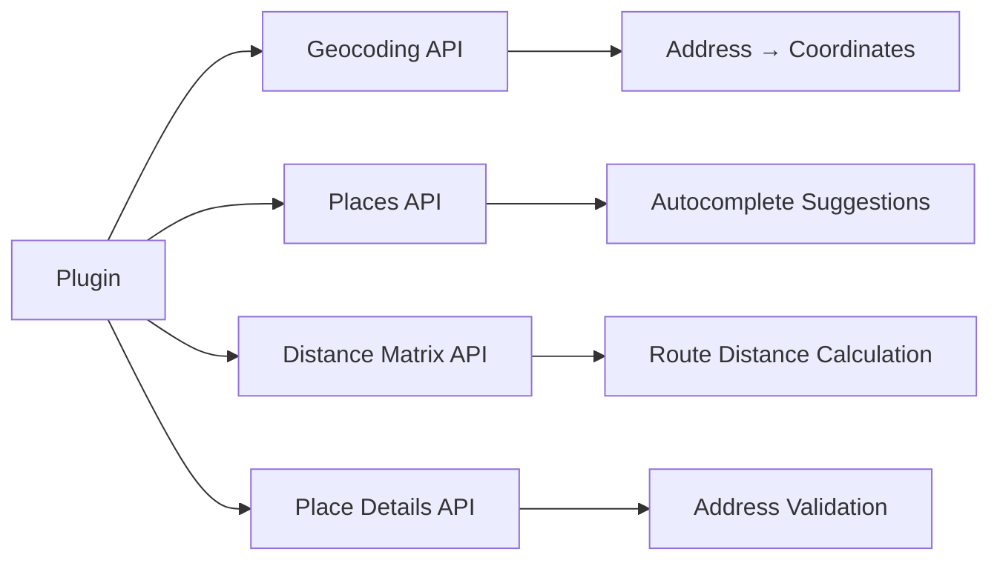
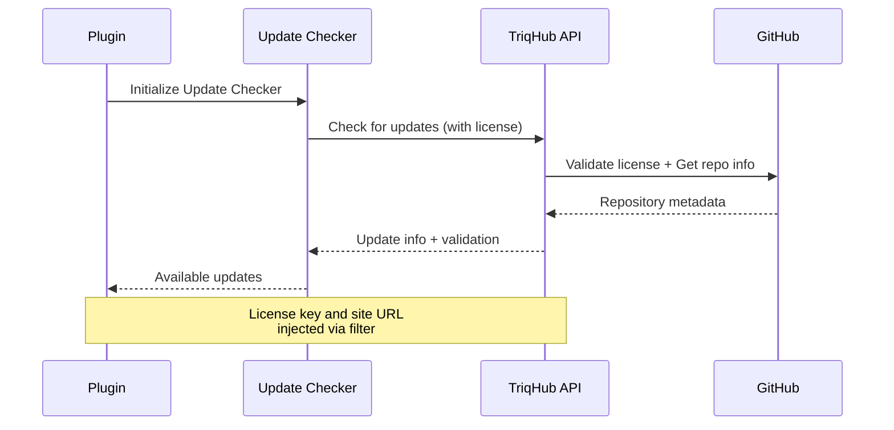
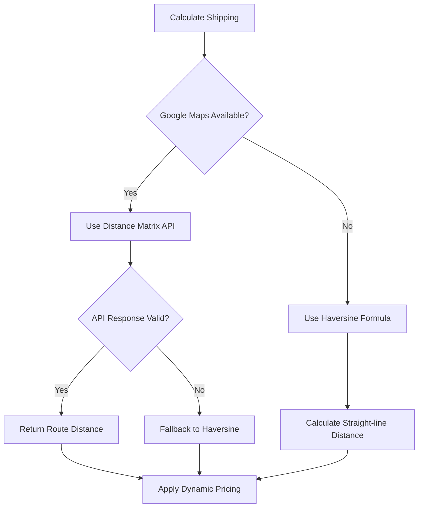
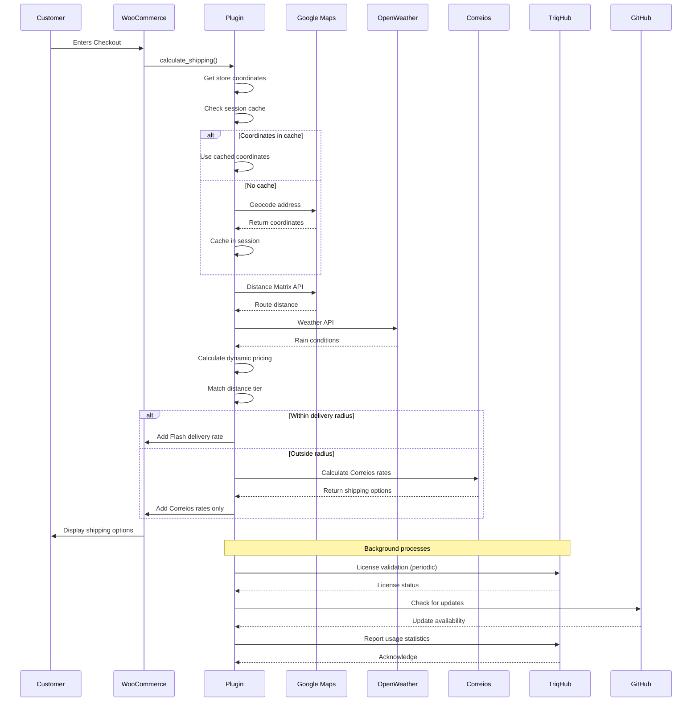

# Connectivity Documentation: TriqHub Shipping & Radius Plugin

## Overview

The TriqHub Shipping & Radius plugin implements a sophisticated multi-service architecture that integrates with several external APIs to provide Brazilian-focused shipping solutions with dynamic pricing, geolocation services, and automated updates.

## External API Integrations

### 1. Google Maps API Integration

#### Configuration
- **API Key Storage**: `woo_envios_google_maps_api_key` WordPress option
- **Validation**: Format validation (39 chars, starts with 'AIza')
- **Cache TTL**: Configurable via `udi_google_maps_cache_ttl` (default: 30 days)

#### Services Used


#### API Endpoints
| Service | Endpoint | Purpose |
|---------|----------|---------|
| Geocoding | `https://maps.googleapis.com/maps/api/geocode/json` | Convert addresses to coordinates |
| Places Autocomplete | `https://maps.googleapis.com/maps/api/place/autocomplete/json` | Address suggestions |
| Place Details | `https://maps.googleapis.com/maps/api/place/details/json` | Validate selected addresses |
| Distance Matrix | `https://maps.googleapis.com/maps/api/distancematrix/json` | Calculate shipping distances |

#### Request Parameters
```php
// Geocoding Request
$params = array(
    'address' => $address,
    'key' => $api_key,
    'region' => 'br',
    'language' => 'pt-BR'
);

// Distance Matrix Request
$params = array(
    'origins' => $origin_coords,
    'destinations' => $destination_coords,
    'key' => $api_key,
    'mode' => 'driving',
    'language' => 'pt-BR',
    'units' => 'metric'
);
```

### 2. OpenWeather API Integration

#### Configuration
- **API Key Storage**: `woo_envios_weather_api_key` WordPress option
- **Cache Duration**: 1 hour (3600 seconds)
- **Endpoint**: `https://api.openweathermap.org/data/2.5/weather`

#### Weather-Based Pricing Multipliers
| Condition | Multiplier Option | Default |
|-----------|------------------|---------|
| Light Rain | `woo_envios_rain_light_multiplier` | 1.2x |
| Heavy Rain | `woo_envios_rain_heavy_multiplier` | 1.5x |
| Thunderstorm | Uses heavy rain multiplier | 1.5x |

#### Request Parameters
```php
$params = array(
    'lat' => $latitude,
    'lon' => $longitude,
    'appid' => $api_key,
    'units' => 'metric',
    'lang' => 'pt_br'
);
```

### 3. TriqHub License API Integration

#### Configuration
- **Connector Class**: `TriqHub_Connector` (invisible integration)
- **License Key**: `triqhub_license_key` WordPress option
- **Site URL**: Automatically included in requests

#### Update Integration Flow


#### License Validation Filter
```php
add_filter('puc_request_info_query_args-triqhub-shipping-radius', function($queryArgs) {
    $license_key = get_option('triqhub_license_key');
    if (!empty($license_key)) {
        $queryArgs['license_key'] = $license_key;
        $queryArgs['site_url'] = home_url();
    }
    return $queryArgs;
});
```

### 4. WooCommerce Native Integration

#### Shipping Method Registration
```php
add_filter('woocommerce_shipping_methods', function($methods) {
    $methods['woo_envios_radius'] = 'Woo_Envios_Shipping_Method';
    $methods['woo_envios_superfrete'] = 'Woo_Envios\Services\Woo_Envios_Superfrete_Shipping_Method';
    return $methods;
});
```

#### Session Data Structure
```php
WC()->session->set('woo_envios_coords', array(
    'lat' => $latitude,
    'lng' => $longitude,
    'signature' => md5($normalized_address)
));
```

### 5. Correios/SuperFrete API Integration

#### Service Configuration
- **Class**: `Woo_Envios\Services\Woo_Envios_Correios`
- **Activation**: Conditional based on store configuration
- **Fallback**: Used when local delivery is unavailable

#### Shipping Calculation Flow
```php
class Woo_Envios_Correios {
    public function calculate(array $package): ?array {
        // 1. Validate package dimensions
        // 2. Prepare API request
        // 3. Call Correios API
        // 4. Parse response
        // 5. Return rates array
    }
}
```

## Webhook Structures

### 1. Update Webhooks

#### GitHub Webhook Payload
```json
{
    "action": "published",
    "release": {
        "tag_name": "v1.2.14",
        "name": "Release 1.2.14",
        "body": "Release notes...",
        "prerelease": false,
        "published_at": "2024-01-15T10:00:00Z"
    },
    "repository": {
        "full_name": "gustavofullstack/triqhub-shipping-radius"
    }
}
```

### 2. License Validation Webhook

#### Request Structure
```json
{
    "license_key": "TRQ-XXXX-XXXX-XXXX",
    "site_url": "https://example.com",
    "plugin_version": "1.2.14",
    "woocommerce_version": "8.0.0",
    "timestamp": "2024-01-15T10:00:00Z"
}
```

#### Response Structure
```json
{
    "valid": true,
    "expires_at": "2024-12-31T23:59:59Z",
    "update_available": true,
    "latest_version": "1.2.15",
    "download_url": "https://github.com/.../triqhub-shipping-radius.zip"
}
```

## Network Configuration

### Timeout Settings

| Service | Timeout | Retry Attempts | Circuit Breaker |
|---------|---------|----------------|-----------------|
| Google Maps API | 10 seconds | 3 | 5 consecutive failures |
| OpenWeather API | 5 seconds | 2 | Not implemented |
| Correios API | 15 seconds | 2 | Not implemented |
| GitHub API | 30 seconds | 3 | Not implemented |

### Circuit Breaker Implementation

```php
class Woo_Envios_Google_Maps {
    private const MAX_CONSECUTIVE_FAILURES = 5;
    
    private function track_api_failure(): void {
        $failures = (int) get_transient('woo_envios_google_maps_failures');
        $failures++;
        
        if ($failures >= self::MAX_CONSECUTIVE_FAILURES) {
            set_transient('woo_envios_google_maps_disabled', true, 300); // 5 minutes
            Woo_Envios_Logger::circuit_breaker_opened($failures);
        }
        
        set_transient('woo_envios_google_maps_failures', $failures, 300);
    }
    
    private function reset_failure_count(): void {
        delete_transient('woo_envios_google_maps_failures');
        delete_transient('woo_envios_google_maps_disabled');
    }
}
```

### Cache Strategies

#### 1. Database Cache (Geocode Results)
```sql
CREATE TABLE wp_woo_envios_geocode_cache (
    id BIGINT UNSIGNED AUTO_INCREMENT,
    cache_key VARCHAR(64) NOT NULL,
    result_data LONGTEXT NOT NULL,
    created_at DATETIME DEFAULT CURRENT_TIMESTAMP,
    expires_at DATETIME NOT NULL,
    PRIMARY KEY (id),
    UNIQUE KEY cache_key (cache_key),
    KEY expires_at (expires_at)
);
```

#### 2. Transient Cache (Weather Data)
```php
// 1-hour cache for weather data
set_transient(
    'woo_envios_weather_' . md5($lat . '|' . $lng),
    $weather_data,
    3600
);
```

#### 3. Session Cache (Customer Coordinates)
```php
// Stored in WooCommerce session
WC()->session->set('woo_envios_coords', array(
    'lat' => $lat,
    'lng' => $lng,
    'signature' => $signature
));
```

## Error Handling Strategies

### 1. Graceful Degradation



### 2. Fallback Mechanisms

#### Geocoding Fallback
```php
private function get_session_coordinates(string $signature): ?array {
    // 1. Check session cache
    $coords = WC()->session->get('woo_envios_coords');
    
    if (empty($coords)) {
        // 2. Server-side geocoding fallback
        $fallback_coords = \Woo_Envios\Services\Geocoder::geocode($address);
        
        if ($fallback_coords) {
            // 3. Save to session for future requests
            WC()->session->set('woo_envios_coords', array(
                'lat' => $fallback_coords['lat'],
                'lng' => $fallback_coords['lng'],
                'signature' => $signature
            ));
            return $fallback_coords;
        }
        
        // 4. Final fallback: Use Correios only
        $this->calculate_correios_shipping($package);
        return null;
    }
    
    return $coords;
}
```

### 3. Error Logging System

#### Log File Structure
```
/upload/woo-envios-logs/
├── YYYY-MM-DD.log
├── .htaccess (Deny from all)
└── (Auto-cleanup after 7 days)
```

#### Log Levels and Context
```php
class Woo_Envios_Logger {
    public static function shipping_calculated(
        float $distance,
        float $base_price,
        float $final_price,
        array $multipliers,
        string $address = '',
        array $store_coords = array(),
        array $customer_coords = array()
    ): void {
        // Structured logging with context
    }
    
    public static function circuit_breaker_opened(int $failures): void {
        // Log + admin notification
    }
    
    public static function distance_out_of_range(
        float $distance,
        array $destination_data
    ): void {
        // Warning for business intelligence
    }
}
```

### 4. Admin Notifications

#### Email Alert System
```php
private static function notify_admin_api_failure(int $failures): void {
    // Rate limiting: 1 notification per hour
    $last_notification = get_transient('woo_envios_last_failure_notification');
    if (false !== $last_notification) {
        return;
    }
    
    $admin_email = get_option('admin_email');
    $subject = 'Woo Envios: Falhas na API do Google Maps';
    $message = sprintf(...);
    
    wp_mail($admin_email, $subject, $message);
    set_transient('woo_envios_last_failure_notification', time(), 3600);
}
```

#### WordPress Admin Notices
```php
add_action('admin_notices', function() {
    if (!class_exists('WooCommerce')) {
        echo '<div class="error"><p>';
        echo esc_html__('Woo Envios requer o WooCommerce para funcionar.', 'woo-envios');
        echo '</p></div>';
    }
});
```

## Complete Integration Flow Diagram



## Security Considerations

### 1. API Key Protection
- API keys stored in WordPress options (encrypted at rest if supported)
- Never exposed in client-side code
- Format validation before use

### 2. Input Sanitization
```php
// Address normalization for signature
$postcode = preg_replace('/\D/', '', $destination['postcode'] ?? '');
$normalized = strtolower(implode('|', array_filter([
    sanitize_text_field($destination['city'] ?? ''),
    sanitize_text_field($destination['state'] ?? ''),
    $postcode,
    sanitize_text_field($destination['country'] ?? '')
])));
```

### 3. Rate Limiting
- Circuit breaker pattern for Google Maps API
- Session-based caching to reduce API calls
- Transient-based notification cooldown

### 4. Data Privacy
- Customer coordinates stored only in session (ephemeral)
- Log files protected by .htaccess
- No PII in external API calls beyond necessary address data

## Monitoring and Maintenance

### 1. Health Checks
```php
class Woo_Envios_Health_Check {
    public static function run(): array {
        return [
            'google_maps' => self::check_google_maps(),
            'weather_api' => self::check_weather_api(),
            'database' => self::check_cache_table(),
            'woocommerce' => self::check_woocommerce(),
            'license' => self::check_license()
        ];
    }
}
```

### 2. Automated Cleanup
```php
// Daily cleanup of old logs
add_action('woo_envios_daily_cleanup', [Woo_Envios_Logger::class, 'cleanup_old_logs']);

// Cache table maintenance
add_action('woo_envios_weekly_maintenance', function() {
    global $wpdb;
    $table = $wpdb->prefix . 'woo_envios_geocode_cache';
    $wpdb->query("DELETE FROM $table WHERE expires_at < NOW()");
});
```

### 3. Performance Metrics
- API response times logged
- Cache hit/miss ratios
- Circuit breaker activation frequency
- Shipping calculation success rate

## Troubleshooting Guide

### Common Issues and Solutions

| Issue | Possible Cause | Solution |
|-------|---------------|----------|
| No shipping methods shown | WooCommerce not active | Activate WooCommerce plugin |
| Google Maps not working | Invalid API key | Regenerate key in Google Cloud Console |
| Weather pricing not applied | Missing API key | Configure OpenWeather API key |
| Updates not showing | License validation failed | Check license key in settings |
| Slow checkout | API timeouts | Increase timeout settings or enable caching |

### Debug Mode
Enable detailed logging via WordPress option:
```php
update_option('woo_envios_enable_logs', true);
```

Logs will be available at: `/wp-content/uploads/woo-envios-logs/YYYY-MM-DD.log`

## Compliance and Standards

### 1. WordPress Coding Standards
- Follows WordPress PHP coding standards
- Proper use of hooks and filters
- Internationalization ready (text domain: `woo-envios`)

### 2. WooCommerce Integration Standards
- Proper shipping method implementation
- Session handling compatible with WC
- Filter usage for extensibility

### 3. API Integration Best Practices
- Exponential backoff for retries
- Circuit breaker pattern
- Comprehensive error handling
-