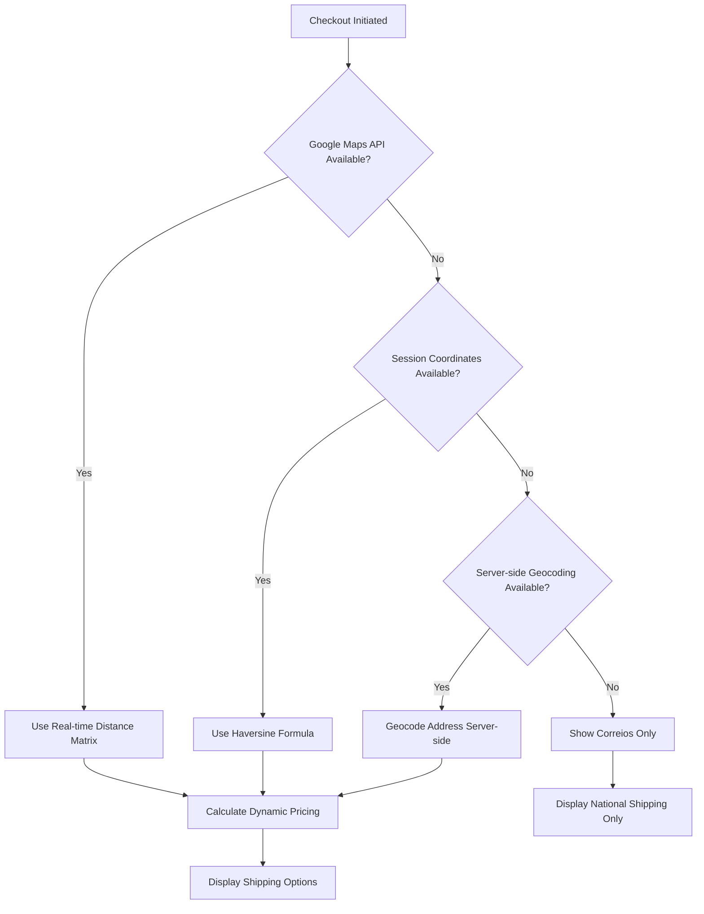
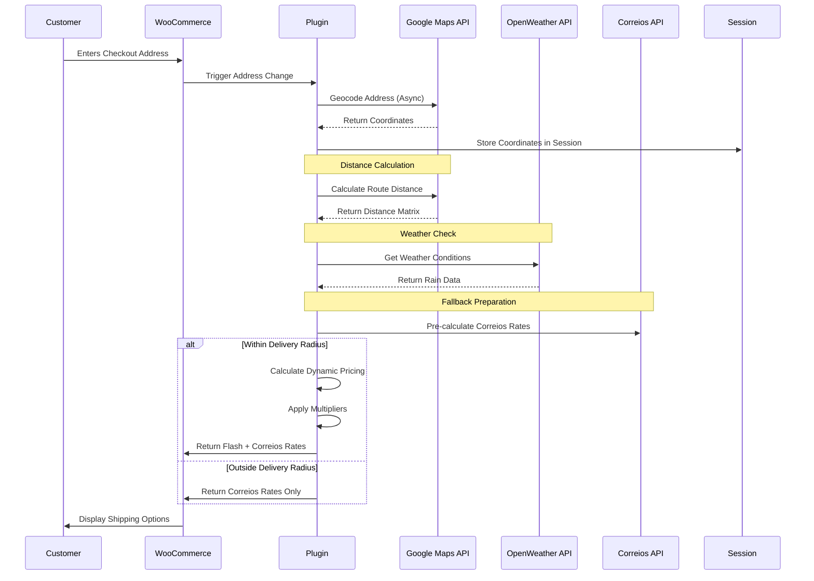

# TriqHub Shipping & Radius - Connectivity Documentation

## Overview

The TriqHub Shipping & Radius plugin implements a sophisticated multi-layered connectivity architecture that integrates with external APIs, WordPress/WooCommerce core systems, and internal services. This document details all external integrations, network communication patterns, error handling strategies, and webhook structures.

## External API Integrations

### 1. Google Maps API Integration

#### Configuration
- **API Key Storage**: `woo_envios_google_maps_api_key` WordPress option
- **Required APIs**: Geocoding, Places Autocomplete, Distance Matrix
- **Rate Limits**: 40,000 requests per month (free tier), 100 requests per second

#### Endpoints Used

```php
protected $api_urls = array(
    'geocode' => 'https://maps.googleapis.com/maps/api/geocode/json',
    'places' => 'https://maps.googleapis.com/maps/api/place/autocomplete/json',
    'place_details' => 'https://maps.googleapis.com/maps/api/place/details/json',
    'distance' => 'https://maps.googleapis.com/maps/api/distancematrix/json',
);
```

#### Request Parameters

**Geocoding API:**
```php
$params = array(
    'address' => $address,
    'key' => $this->api_key,
    'region' => 'br', // Brazil-specific
    'language' => 'pt-BR',
);
```

**Distance Matrix API:**
```php
$params = array(
    'origins' => $origin,
    'destinations' => $destination,
    'key' => $this->api_key,
    'mode' => 'driving',
    'language' => 'pt-BR',
    'units' => 'metric',
);
```

#### Caching Strategy
- **Cache Table**: `wp_woo_envios_geocode_cache`
- **TTL**: Configurable via `udi_google_maps_cache_ttl` (default: 30 days)
- **Cache Key Structure**: `md5($address . '|' . $api_key)`

### 2. OpenWeather API Integration

#### Configuration
- **API Key Storage**: `woo_envios_weather_api_key` WordPress option
- **Endpoint**: `https://api.openweathermap.org/data/2.5/weather`
- **Cache Duration**: 1 hour (3600 seconds)

#### Request Parameters
```php
$params = array(
    'lat' => $latitude,
    'lon' => $longitude,
    'appid' => $api_key,
    'units' => 'metric',
    'lang' => 'pt_br',
);
```

#### Weather Multiplier Logic
```php
// Rain intensity detection
if ('rain' === $condition || 'drizzle' === $condition) {
    $rain_1h = $weather_data['rain']['1h'] ?? 0;
    
    if ($rain_1h > 5) {
        return (float) get_option('woo_envios_rain_heavy_multiplier', 1.5);
    }
    return (float) get_option('woo_envios_rain_light_multiplier', 1.2);
}
```

### 3. TriqHub License API

#### Integration Points
- **License Validation**: During plugin activation and update checks
- **Update Authentication**: License key injected into GitHub update requests
- **Telemetry**: Anonymous usage statistics (optional)

#### License Key Flow
```php
add_filter('puc_request_info_query_args-' . $myUpdateChecker->slug, function ($queryArgs) {
    $license_key = get_option('triqhub_license_key');
    if (!empty($license_key)) {
        $queryArgs['license_key'] = $license_key;
        $queryArgs['site_url'] = home_url();
    }
    return $queryArgs;
});
```

### 4. Correios/SuperFrete API

#### Service Integration
- **Primary Class**: `Woo_Envios\Services\Woo_Envios_Correios`
- **Shipping Methods**: PAC, SEDEX, Mini Envios
- **Fallback Strategy**: Used when customers are outside local delivery radius

#### Calculation Flow
```php
public function calculate($package) {
    // 1. Validate package dimensions and weight
    // 2. Build API request to Correios/SuperFrete
    // 3. Parse response and format shipping rates
    // 4. Apply business rules and filters
}
```

## WooCommerce Native Integration

### 1. Shipping Method Registration

```php
public function register_shipping_method(array $methods): array {
    $methods['woo_envios_radius'] = 'Woo_Envios_Shipping_Method';
    $methods['woo_envios_superfrete'] = 'Woo_Envios\Services\Woo_Envios_Superfrete_Shipping_Method';
    return $methods;
}
```

### 2. Session Management

**Coordinate Storage:**
```php
WC()->session->set('woo_envios_coords', array(
    'lat' => $latitude,
    'lng' => $longitude,
    'signature' => $signature, // MD5 hash of address components
));
```

**Session Signature:**
```php
private function build_destination_signature(array $package): string {
    $destination = $package['destination'] ?? array();
    $postcode = preg_replace('/\D/', '', $destination['postcode'] ?? '');
    
    $parts = array(
        sanitize_text_field($destination['city'] ?? ''),
        sanitize_text_field($destination['state'] ?? ''),
        $postcode,
        sanitize_text_field($destination['country'] ?? ''),
    );
    
    return md5(strtolower(implode('|', $parts)));
}
```

### 3. Checkout Integration

**JavaScript Events:**
- `woo_envios_address_changed`: Triggered when address fields change
- `woo_envios_geocode_complete`: Fired after successful geocoding
- `woo_envios_shipping_updated`: When shipping rates are recalculated

**AJAX Endpoints:**
- `admin-ajax.php?action=woo_envios_geocode`
- `admin-ajax.php?action=woo_envios_validate_address`

## Network Configuration

### Timeout Settings

```php
// Google Maps API
const REQUEST_TIMEOUT = 10; // seconds

// OpenWeather API
$response = wp_remote_get($url, array(
    'timeout' => 5,
));

// GitHub Update Checker
$myUpdateChecker = \YahnisElsts\PluginUpdateChecker\v5\PucFactory::buildUpdateChecker(
    'https://github.com/gustavofullstack/triqhub-shipping-radius',
    __FILE__,
    'triqhub-shipping-radius'
);
```

### Retry Logic

```php
private const MAX_RETRIES = 3;

private function make_api_request_with_retry($url, $params) {
    $attempts = 0;
    
    while ($attempts < self::MAX_RETRIES) {
        $response = wp_remote_get($url, array(
            'timeout' => self::REQUEST_TIMEOUT,
            'body' => $params,
        ));
        
        if (!is_wp_error($response)) {
            return $response;
        }
        
        $attempts++;
        sleep(1 * $attempts); // Exponential backoff
    }
    
    return false;
}
```

## Error Handling Strategies

### 1. Circuit Breaker Pattern

**Implementation:**
```php
private const MAX_CONSECUTIVE_FAILURES = 5;

private function check_circuit_breaker() {
    $failures = (int) get_transient('woo_envios_api_failures');
    
    if ($failures >= self::MAX_CONSECUTIVE_FAILURES) {
        // Circuit is open - use fallback
        $this->use_fallback_coordinates();
        Woo_Envios_Logger::circuit_breaker_opened($failures);
        return false;
    }
    
    return true;
}

private function record_api_failure() {
    $failures = (int) get_transient('woo_envios_api_failures');
    $failures++;
    set_transient('woo_envios_api_failures', $failures, 300); // 5 minutes
    
    if ($failures >= self::MAX_CONSECUTIVE_FAILURES) {
        set_transient('woo_envios_circuit_open', true, 900); // 15 minutes
    }
}

private function record_api_success() {
    // Reset failure counter on successful call
    delete_transient('woo_envios_api_failures');
    delete_transient('woo_envios_circuit_open');
}
```

### 2. Fallback Mechanisms

**Geocoding Fallback:**
1. Google Maps API (primary)
2. Session cache (secondary)
3. Server-side geocoding (tertiary)
4. Default coordinates (final)

```php
if (empty($session_coords)) {
    // Server-side fallback geocoding
    $fallback_coords = \Woo_Envios\Services\Geocoder::geocode($full_address);
    
    if ($fallback_coords) {
        $session_coords = $fallback_coords;
        WC()->session->set('woo_envios_coords', $session_coords);
    } else {
        // Use Correios as fallback
        $this->calculate_correios_shipping($package);
        return;
    }
}
```

**Distance Calculation Fallback:**
1. Google Distance Matrix API (primary)
2. Haversine formula (fallback)

```php
$distance_data = $this->calculate_route_distance($store_coords, $session_coords, $package);

if (is_wp_error($distance_data) || empty($distance_data)) {
    // Fallback to Haversine formula
    $distance = $this->calculate_distance(
        (float) $store_coords['lat'],
        (float) $store_coords['lng'],
        (float) $session_coords['lat'],
        (float) $session_coords['lng']
    );
} else {
    $distance = round($distance_data['distance_value'] / 1000, 2);
}
```

### 3. Graceful Degradation

**Shipping Calculation Flow:**


## Webhook Structures

### 1. Update Notification Webhooks

**GitHub Webhook Payload:**
```json
{
  "action": "released",
  "release": {
    "tag_name": "v1.2.15",
    "name": "Enhanced Google Maps Integration",
    "body": "Added circuit breaker pattern and improved error handling",
    "prerelease": false,
    "published_at": "2024-01-15T10:00:00Z"
  },
  "repository": {
    "full_name": "gustavofullstack/triqhub-shipping-radius",
    "html_url": "https://github.com/gustavofullstack/triqhub-shipping-radius"
  }
}
```

### 2. License Validation Webhook

**Request Structure:**
```json
{
  "license_key": "TRQ-XXXX-XXXX-XXXX",
  "site_url": "https://example.com",
  "plugin_version": "1.2.15",
  "action": "validate_license"
}
```

**Response Structure:**
```json
{
  "valid": true,
  "expires_at": "2024-12-31T23:59:59Z",
  "features": ["radius_shipping", "weather_pricing", "dynamic_multipliers"],
  "update_available": false
}
```

## Security Considerations

### 1. API Key Protection

- **Storage**: Encrypted in WordPress database
- **Transmission**: HTTPS only
- **Validation**: Format validation before use
- **Rotation**: Manual rotation via admin panel

### 2. Input Sanitization

```php
// Address sanitization
$sanitized_address = array_map('sanitize_text_field', [
    $address_1,
    $address_2,
    $city,
    $state,
    $postcode,
    $country
]);

// Coordinate validation
if (!is_numeric($lat) || !is_numeric($lng)) {
    throw new InvalidArgumentException('Invalid coordinates provided');
}

if ($lat < -90 || $lat > 90 || $lng < -180 || $lng > 180) {
    throw new InvalidArgumentException('Coordinates out of valid range');
}
```

### 3. Nonce Verification

```php
// AJAX request validation
add_action('wp_ajax_woo_envios_geocode', function() {
    check_ajax_referer('woo_envios_geocode_nonce', 'security');
    
    // Process request
    wp_send_json_success($result);
});
```

## Monitoring and Logging

### 1. Log Structure

**File-based Logging:**
- Location: `/wp-content/uploads/woo-envios-logs/`
- Format: `[YYYY-MM-DD HH:MM:SS] [LEVEL] Message`
- Retention: 7 days automatic cleanup

**Log Levels:**
- `INFO`: Normal operations, shipping calculations
- `WARNING`: API rate limits, fallback activations
- `ERROR`: API failures, configuration issues
- `DEBUG`: Detailed calculation steps (when enabled)

### 2. Performance Metrics

**Tracked Metrics:**
- API response times
- Cache hit rates
- Circuit breaker state
- Shipping calculation duration
- Memory usage during peak operations

### 3. Alerting System

**Email Notifications:**
- Circuit breaker activation
- API key expiration warnings
- Consecutive failure thresholds
- Update availability

## Integration Sequence Diagram



## Troubleshooting Connectivity Issues

### Common Issues and Solutions

1. **Google Maps API Failures**
   - Verify API key format and permissions
   - Check billing status for Google Cloud account
   - Review API usage quotas
   - Enable required APIs: Geocoding, Places, Distance Matrix

2. **Session Coordinate Mismatches**
   - Clear WooCommerce session data
   - Verify address normalization logic
   - Check signature generation algorithm

3. **Update Check Failures**
   - Verify GitHub repository accessibility
   - Check license key validity
   - Review network firewall settings

4. **Performance Degradation**
   - Monitor cache hit rates
   - Review API response times
   - Check database query performance on cache table

### Diagnostic Commands

```bash
# Check API connectivity
curl -I "https://maps.googleapis.com/maps/api/geocode/json?address=São+Paulo&key=TEST_KEY"

# Verify plugin file structure
find . -name "*.php" -type f | xargs grep -l "class Woo_Envios"

# Check database cache table
wp db query "SELECT COUNT(*) FROM wp_woo_envios_geocode_cache"

# Review error logs
tail -f /wp-content/uploads/woo-envios-logs/*.log
```

## Compliance and Best Practices

### 1. GDPR Compliance
- User coordinates stored only during active session
- No permanent storage of personal geolocation data
- Clear data retention policies for cache tables
- Privacy policy disclosures for location services

### 2. PCI Compliance
- No credit card data handled by plugin
- All external API calls use HTTPS
- Secure transmission of license keys
- Regular security audits of integration points

### 3. Performance Best Practices
- Implement connection pooling for API calls
- Use persistent caching strategies
- Implement request batching where possible
- Monitor and optimize database queries

## Version Compatibility Matrix

| Plugin Version | WooCommerce | WordPress | PHP | Google Maps API |
|----------------|-------------|-----------|-----|-----------------|
| 1.2.15         | 5.0+        | 6.2+      | 7.4+| v3             |
| 1.2.0-1.2.14   | 4.0+        | 5.8+      | 7.2+| v3             |
| 1.0.0-1.1.9    | 3.0+        | 5.0+      | 7.0+| v3             |

## Future Integration Roadmap

### Planned Enhancements

1. **Additional Shipping Providers**
   -