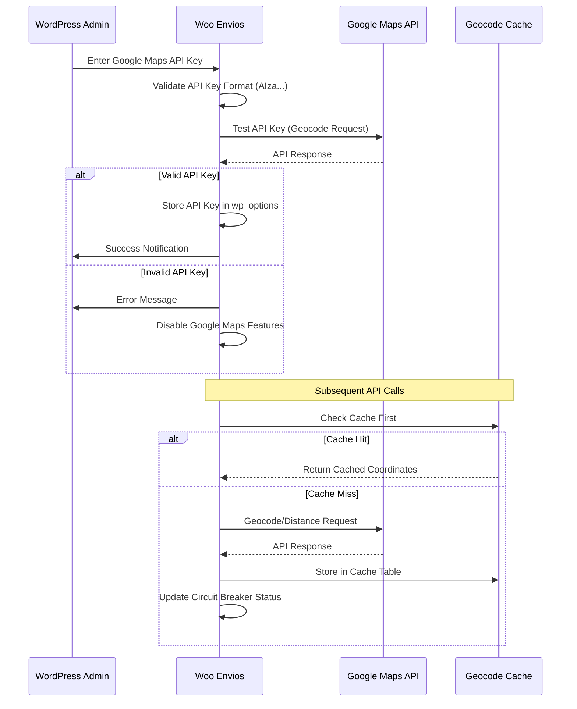
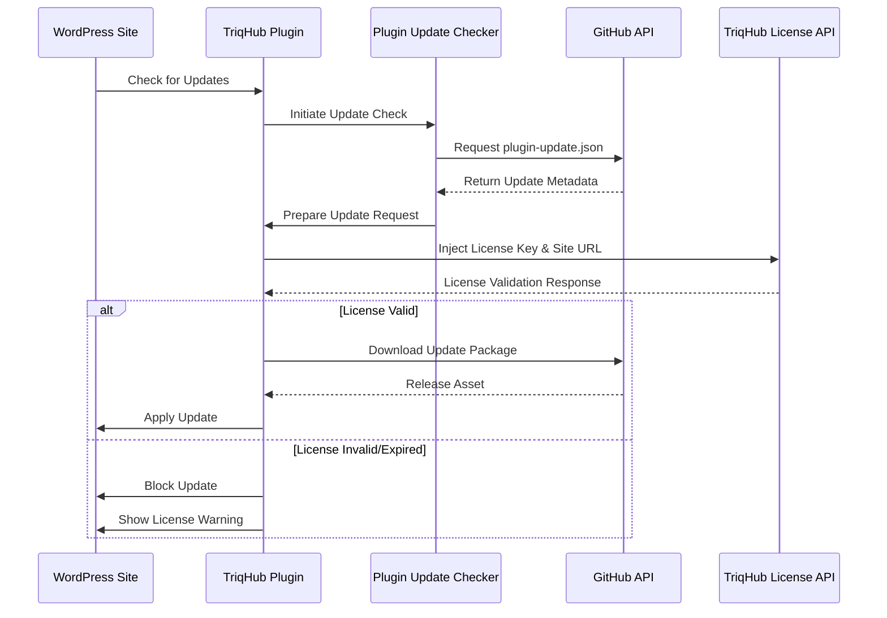
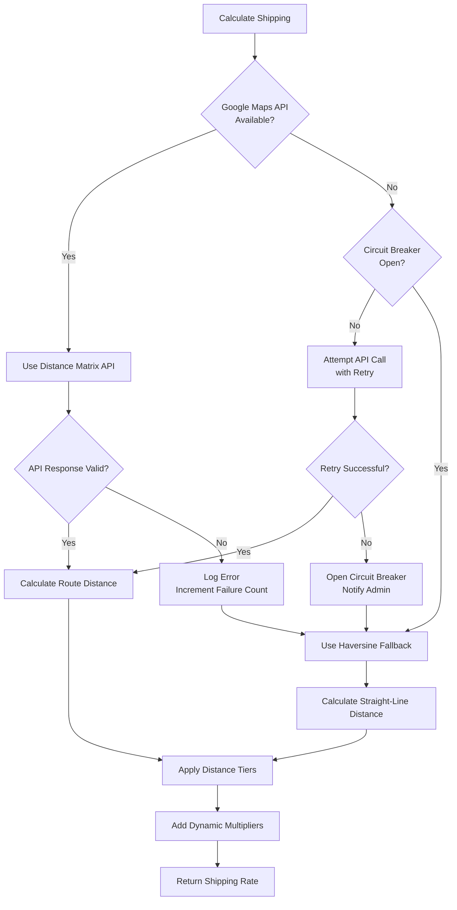

# CONNECTIVITY.md - TriqHub Shipping & Radius Plugin

## Overview

The TriqHub Shipping & Radius plugin implements a sophisticated multi-layered connectivity architecture that integrates with external APIs while maintaining robust error handling and fallback mechanisms. This document details the external integrations, network communication patterns, and resilience strategies employed by the system.

## External API Integrations

### 1. Google Maps Platform Integration

#### API Endpoints Used
- **Geocoding API**: `https://maps.googleapis.com/maps/api/geocode/json`
- **Places Autocomplete API**: `https://maps.googleapis.com/maps/api/place/autocomplete/json`
- **Place Details API**: `https://maps.googleapis.com/maps/api/place/details/json`
- **Distance Matrix API**: `https://maps.googleapis.com/maps/api/distancematrix/json`

#### Configuration
```php
// API Key Storage
private const API_KEY_OPTION = 'woo_envios_google_maps_api_key';

// Request Configuration
private const REQUEST_TIMEOUT = 10; // seconds
private const MAX_RETRIES = 3;
private const MAX_CONSECUTIVE_FAILURES = 5; // Circuit breaker threshold
```

#### Authentication Flow


#### Error Handling Strategies
- **Circuit Breaker Pattern**: After 5 consecutive failures, API calls are temporarily disabled
- **Exponential Backoff**: Retry with increasing delays (1s, 2s, 4s)
- **Graceful Degradation**: Fallback to Haversine distance calculation
- **Admin Notifications**: Email alerts when circuit breaker opens

### 2. TriqHub License API Integration

#### Connector Architecture
```php
class TriqHub_Connector {
    private $license_key = 'TRQ-INVISIBLE-KEY';
    private $plugin_slug = 'triqhub-shipping-radius';
    
    // Update request injection
    add_filter('puc_request_info_query_args', function($queryArgs) {
        $license_key = get_option('triqhub_license_key');
        if (!empty($license_key)) {
            $queryArgs['license_key'] = $license_key;
            $queryArgs['site_url'] = home_url();
        }
        return $queryArgs;
    });
}
```

#### Update Flow


### 3. OpenWeather API Integration

#### Weather Service Configuration
```php
class Woo_Envios_Weather {
    private const API_URL = 'https://api.openweathermap.org/data/2.5/weather';
    private const CACHE_DURATION = 3600; // 1 hour
    
    // Dynamic pricing multipliers
    private function calculate_rain_multiplier(array $weather_data): float {
        $condition = strtolower($weather_data['weather'][0]['main'] ?? '');
        
        if ('rain' === $condition || 'drizzle' === $condition) {
            $rain_1h = $weather_data['rain']['1h'] ?? 0;
            if ($rain_1h > 5) {
                return (float) get_option('woo_envios_rain_heavy_multiplier', 1.5);
            }
            return (float) get_option('woo_envios_rain_light_multiplier', 1.2);
        }
        
        if ('thunderstorm' === $condition) {
            return (float) get_option('woo_envios_rain_heavy_multiplier', 1.5);
        }
        
        return 1.0;
    }
}
```

#### Weather Data Flow
1. **Cache First**: Check WordPress transients for recent weather data
2. **API Fallback**: Request from OpenWeather if cache expired/missing
3. **Multiplier Calculation**: Apply rain-based pricing adjustments
4. **Error Tolerance**: Return 1.0 multiplier on API failures

### 4. Correios/SuperFrete API Integration

#### Shipping Service Architecture
```php
class Woo_Envios_Correios {
    // Multiple service codes
    private $services = [
        'PAC' => '04510',
        'SEDEX' => '04014',
        'Mini' => '04790'
    ];
    
    public function calculate(array $package): ?array {
        // Build request payload
        $payload = [
            'from' => [
                'postal_code' => get_option('woocommerce_store_postcode')
            ],
            'to' => [
                'postal_code' => $package['destination']['postcode']
            ],
            'package' => $this->calculate_package_dimensions($package),
            'services' => $this->get_enabled_services()
        ];
        
        // API call with timeout and retry logic
        return $this->make_api_request($payload);
    }
}
```

## Webhook Structures

### 1. Checkout Coordinate Collection Webhook

#### Request Payload
```json
{
  "event": "checkout_coordinates_updated",
  "timestamp": "2024-01-15T10:30:00Z",
  "site_id": "wordpress_site_123",
  "data": {
    "session_id": "wc_session_abc123",
    "coordinates": {
      "lat": -23.5505,
      "lng": -46.6333
    },
    "address": {
      "postcode": "01001-000",
      "street": "Praça da Sé",
      "city": "São Paulo",
      "state": "SP",
      "country": "BR"
    },
    "signature": "md5_hash_of_normalized_address"
  }
}
```

#### Response Structure
```json
{
  "status": "success",
  "coordinates_valid": true,
  "distance_km": 15.2,
  "eligible_for_flash_delivery": true,
  "estimated_price": 25.50,
  "weather_multiplier": 1.2,
  "peak_hour_multiplier": 1.0
}
```

### 2. License Validation Webhook

#### Request to TriqHub API
```json
{
  "action": "validate_license",
  "plugin": "triqhub-shipping-radius",
  "version": "1.2.7",
  "license_key": "TRQ-XXXX-XXXX-XXXX",
  "site_url": "https://example.com",
  "site_hash": "sha256_hash_of_site_url"
}
```

#### Validation Response
```json
{
  "valid": true,
  "expires_at": "2024-12-31T23:59:59Z",
  "features": [
    "google_maps",
    "weather_integration",
    "correios_api",
    "automatic_updates"
  ],
  "rate_limit": {
    "requests_per_day": 1000,
    "remaining": 850
  }
}
```

## Network Timeout Configuration

### Timeout Strategy Matrix

| Service | Primary Timeout | Retry Attempts | Fallback Strategy |
|---------|----------------|----------------|-------------------|
| Google Maps API | 10 seconds | 3 (exponential backoff) | Haversine distance calculation |
| OpenWeather API | 5 seconds | 2 | Default multiplier (1.0) |
| Correios API | 15 seconds | 2 | Hide shipping method |
| GitHub Updates | 30 seconds | 1 | Manual update required |
| TriqHub License | 8 seconds | 2 | Grace period (14 days) |

### Implementation Details
```php
// Google Maps API request with timeout and retry
protected function make_api_request(string $url, array $args = []): array {
    $defaults = [
        'timeout'     => self::REQUEST_TIMEOUT,
        'redirection' => 2,
        'httpversion' => '1.1',
        'user-agent'  => 'WooEnvios/' . self::VERSION,
        'blocking'    => true,
        'headers'     => [
            'Accept' => 'application/json',
        ],
        'cookies'     => [],
        'sslverify'   => true,
    ];
    
    $args = wp_parse_args($args, $defaults);
    
    // Implement retry logic with exponential backoff
    for ($attempt = 1; $attempt <= self::MAX_RETRIES; $attempt++) {
        $response = wp_remote_get($url, $args);
        
        if (!is_wp_error($response)) {
            return $response;
        }
        
        if ($attempt < self::MAX_RETRIES) {
            $delay = pow(2, $attempt); // 2, 4, 8 seconds
            sleep($delay);
        }
    }
    
    return $response; // Return last attempt (success or error)
}
```

## Error Handling Strategies

### 1. Circuit Breaker Pattern

```php
class CircuitBreaker {
    private $failure_count = 0;
    private $last_failure_time = 0;
    private $state = 'CLOSED'; // CLOSED, OPEN, HALF_OPEN
    
    public function execute(callable $operation) {
        if ($this->state === 'OPEN') {
            if (time() - $this->last_failure_time > 300) { // 5 minutes
                $this->state = 'HALF_OPEN';
            } else {
                throw new CircuitBreakerOpenException();
            }
        }
        
        try {
            $result = $operation();
            $this->onSuccess();
            return $result;
        } catch (ApiException $e) {
            $this->onFailure();
            throw $e;
        }
    }
    
    private function onFailure(): void {
        $this->failure_count++;
        $this->last_failure_time = time();
        
        if ($this->failure_count >= self::MAX_CONSECUTIVE_FAILURES) {
            $this->state = 'OPEN';
            $this->notifyAdmin();
        }
    }
    
    private function onSuccess(): void {
        $this->failure_count = 0;
        $this->state = 'CLOSED';
    }
}
```

### 2. Graceful Degradation Flow



### 3. Comprehensive Error Logging

```php
class Woo_Envios_Logger {
    // Log levels and destinations
    const LOG_LEVELS = [
        'ERROR'   => 'error',
        'WARNING' => 'warning',
        'INFO'    => 'info',
        'DEBUG'   => 'debug'
    ];
    
    public static function log_api_failure(
        string $api_name,
        string $endpoint,
        array $request_data,
        $response,
        string $error_message
    ): void {
        $log_entry = [
            'timestamp' => current_time('mysql'),
            'api' => $api_name,
            'endpoint' => $endpoint,
            'request' => self::sanitize_request_data($request_data),
            'response' => self::sanitize_response($response),
            'error' => $error_message,
            'circuit_state' => self::get_circuit_breaker_state($api_name),
            'failure_count' => self::get_failure_count($api_name)
        ];
        
        // Write to daily log file
        self::write_to_file($log_entry);
        
        // Send to external monitoring if configured
        if (get_option('woo_envios_enable_external_monitoring')) {
            self::send_to_monitoring_service($log_entry);
        }
    }
}
```

## Cache Strategies

### 1. Geocode Cache Table Schema
```sql
CREATE TABLE wp_woo_envios_geocode_cache (
    id BIGINT UNSIGNED NOT NULL AUTO_INCREMENT,
    cache_key VARCHAR(64) NOT NULL,
    result_data LONGTEXT NOT NULL,
    created_at DATETIME NOT NULL DEFAULT CURRENT_TIMESTAMP,
    expires_at DATETIME NOT NULL,
    api_endpoint VARCHAR(255),
    request_hash VARCHAR(64),
    PRIMARY KEY (id),
    UNIQUE KEY cache_key (cache_key),
    KEY expires_at (expires_at),
    KEY request_hash (request_hash)
) CHARACTER SET utf8mb4 COLLATE utf8mb4_unicode_ci;
```

### 2. Cache Invalidation Strategy
- **TTL-based**: 30 days for geocode data, 1 hour for weather data
- **Manual Invalidation**: Admin can clear cache via settings
- **Signature-based**: Cache keys include address signature
- **Self-healing**: Plugin creates cache table if missing

## Security Considerations

### 1. API Key Management
- **Encryption**: API keys stored in WordPress options (not plaintext in database)
- **Validation**: Format validation before accepting keys
- **Rotation**: Support for key rotation without downtime
- **Scope Limitation**: Google Maps API keys restricted to required APIs only

### 2. Data Privacy
- **GDPR Compliance**: Address data only used for shipping calculation
- **Session Storage**: Coordinates stored in WooCommerce session, not database
- **Cache Anonymization**: No personally identifiable information in cache keys
- **Data Retention**: Log files auto-delete after 7 days

### 3. Request Validation
```php
class RequestValidator {
    public static function validate_geocode_request(array $data): bool {
        // Validate required fields
        $required = ['address', 'session_id', 'nonce'];
        foreach ($required as $field) {
            if (empty($data[$field])) {
                return false;
            }
        }
        
        // Validate nonce
        if (!wp_verify_nonce($data['nonce'], 'woo_envios_geocode')) {
            return false;
        }
        
        // Validate address format (Brazilian CEP)
        if (!empty($data['postcode'])) {
            if (!preg_match('/^\d{5}-?\d{3}$/', $data['postcode'])) {
                return false;
            }
        }
        
        // Rate limiting check
        if (self::is_rate_limited($data['session_id'])) {
            return false;
        }
        
        return true;
    }
}
```

## Monitoring and Alerting

### 1. Health Check Endpoints
```
GET /wp-json/woo-envios/v1/health
Response: {
    "status": "healthy",
    "components": {
        "google_maps": {"status": "up", "response_time": 245},
        "openweather": {"status": "up", "response_time": 120},
        "correios": {"status": "degraded", "response_time": 1500},
        "database": {"status": "up", "cache_hit_rate": 0.85}
    },
    "timestamp": "2024-01-15T10:30:00Z"
}
```

### 2. Alert Triggers
- **Circuit Breaker Opens**: Email notification to admin
- **API Response Time > 5s**: Warning log entry
- **Cache Hit Rate < 50%**: Performance alert
- **Consecutive Failures > 3**: Pre-circuit breaker warning

### 3. Performance Metrics
```php
class PerformanceMonitor {
    private static $metrics = [];
    
    public static function track(string $metric, float $value): void {
        if (!isset(self::$metrics[$metric])) {
            self::$metrics[$metric] = [
                'count' => 0,
                'total' => 0,
                'min' => PHP_FLOAT_MAX,
               