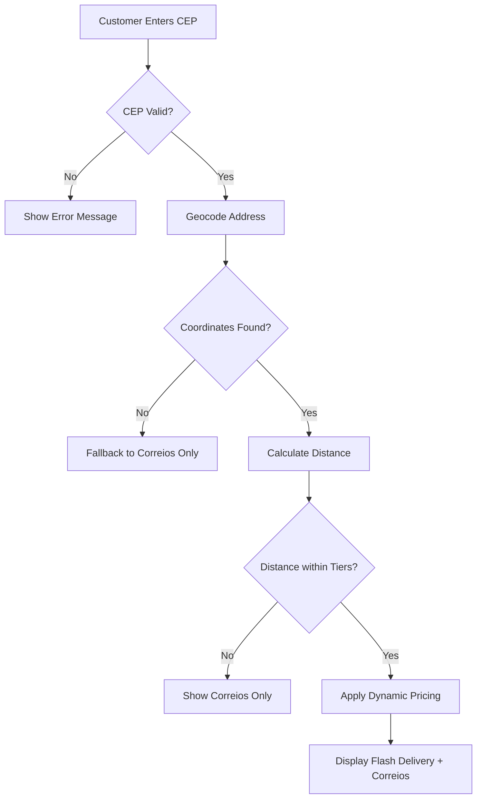

# TriqHub: Shipping & Radius - User Guide

## Table of Contents
1. [Overview](#overview)
2. [System Requirements](#system-requirements)
3. [Installation & Setup](#installation--setup)
4. [Configuration Guide](#configuration-guide)
5. [Shipping Methods](#shipping-methods)
6. [Dynamic Pricing](#dynamic-pricing)
7. [Troubleshooting](#troubleshooting)
8. [Advanced Features](#advanced-features)
9. [Maintenance](#maintenance)
10. [FAQs](#faqs)

## Overview

TriqHub: Shipping & Radius is a sophisticated WooCommerce shipping plugin that automates Brazilian postal code (CEP) coordinate collection at checkout and integrates radius-based shipping rules. The plugin leverages Google Maps API for maximum precision and offers dynamic pricing based on weather conditions, peak hours, and distance tiers.

### Key Features
- **Radius-Based Shipping**: Calculate local delivery costs based on straight-line distance from your store
- **Google Maps Integration**: Precise geocoding and distance calculations using real route data
- **Dynamic Pricing**: Adjust shipping costs based on weather, time of day, and weekends
- **Multiple Shipping Methods**: Flash Delivery (local) + Correios/SuperFrete (national)
- **Automatic Updates**: GitHub-based update system with license key integration
- **Comprehensive Logging**: Detailed debugging and error tracking
- **Self-Healing Architecture**: Automatic cache table creation and fallback mechanisms

## System Requirements

### Minimum Requirements
- **WordPress**: 6.2 or higher
- **WooCommerce**: 5.0 or higher
- **PHP**: 7.4 or higher
- **MySQL**: 5.6 or higher
- **Memory Limit**: 128MB minimum (256MB recommended)
- **cURL**: Enabled for API communications

### Recommended Requirements
- **PHP**: 8.0 or higher
- **Memory Limit**: 256MB or higher
- **Max Execution Time**: 30 seconds
- **SSL Certificate**: Required for secure API communications

### Required APIs
1. **Google Maps API Key** (Essential for geocoding and distance calculations)
2. **OpenWeather API Key** (Optional, for weather-based pricing)
3. **SuperFrete/Correios API** (Optional, for national shipping calculations)

## Installation & Setup

### Step 1: Plugin Installation

#### Method A: WordPress Admin Dashboard
1. Navigate to **Plugins → Add New**
2. Click **Upload Plugin**
3. Select the `triqhub-shipping-radius.zip` file
4. Click **Install Now**
5. After installation, click **Activate**

#### Method B: Manual Installation via FTP
1. Download the plugin ZIP file
2. Extract the contents to your computer
3. Connect to your WordPress site via FTP/SFTP
4. Upload the `triqhub-shipping-radius` folder to `/wp-content/plugins/`
5. Navigate to **Plugins** in WordPress admin
6. Find "TriqHub: Shipping & Radius" and click **Activate**

### Step 2: Initial Configuration

After activation, follow these steps:

1. **Verify WooCommerce Compatibility**
   - Ensure WooCommerce 5.0+ is installed and activated
   - The plugin will display an admin notice if WooCommerce is missing

2. **Configure Store Location**
   - Navigate to **WooCommerce → Settings → Shipping → Woo Envios**
   - Enter your store's base coordinates (latitude/longitude)
   - Alternatively, use the Google Maps interface to pinpoint your location

3. **Set Up Shipping Zones**
   - Go to **WooCommerce → Settings → Shipping → Shipping Zones**
   - Create a new zone or edit an existing one
   - Add "Woo Envios — Raio Escalonado" as a shipping method

### Step 3: API Configuration

#### Google Maps API Setup
1. **Obtain API Key**:
   - Visit [Google Cloud Console](https://console.cloud.google.com/)
   - Create a new project or select existing
   - Enable the following APIs:
     - Maps JavaScript API
     - Geocoding API
     - Distance Matrix API
     - Places API
   - Create credentials → API Key
   - Restrict the API key to your domain

2. **Configure in Plugin**:
   - Navigate to **WooCommerce → Woo Envios → Google Maps**
   - Paste your Google Maps API key
   - Click **Save Changes**

#### OpenWeather API (Optional)
1. **Obtain API Key**:
   - Register at [OpenWeather](https://openweathermap.org/api)
   - Subscribe to the "Current Weather Data" API (free tier available)
   - Copy your API key

2. **Configure in Plugin**:
   - Navigate to **WooCommerce → Woo Envios → Dynamic Pricing**
   - Enter your OpenWeather API key
   - Configure rain multipliers as needed

## Configuration Guide

### Store Settings

#### Base Coordinates
```php
// Default coordinates (Uberlândia, Brazil)
define('WOO_ENVIOS_DEFAULT_LAT', -18.911);
define('WOO_ENVIOS_DEFAULT_LNG', -48.262);
```

**To Configure**:
1. Navigate to **WooCommerce → Woo Envios → General Settings**
2. Enter your store's latitude and longitude
3. Use the "Pick on Map" button for visual selection
4. Click **Save Coordinates**

#### Distance Tiers Configuration

Configure delivery radius tiers with corresponding prices:

1. Navigate to **WooCommerce → Woo Envios → Distance Tiers**
2. Add tiers in ascending order:
   - **Tier 1**: 0-5 km → R$ 10.00
   - **Tier 2**: 5-10 km → R$ 15.00
   - **Tier 3**: 10-15 km → R$ 20.00
   - **Tier 4**: 15-20 km → R$ 25.00

**Important**: The plugin will only show Flash Delivery for addresses within configured tiers. Addresses outside all tiers will only see Correios/SuperFrete options.

### Shipping Method Configuration

#### Flash Delivery (Local Radius Shipping)

**Settings Location**: WooCommerce → Settings → Shipping → [Zone Name] → Woo Envios — Raio Escalonado

| Setting | Description | Default Value |
|---------|-------------|---------------|
| **Enabled** | Enable/disable the shipping method | Yes |
| **Title** | Display name shown to customers | "Entrega Flash" |
| **Tax Status** | Whether shipping cost is taxable | Taxable |
| **Cost** | Base cost (overridden by distance tiers) | 0 |

#### Correios/SuperFrete Configuration

1. Navigate to **WooCommerce → Woo Envios → Correios Settings**
2. Enable/disable Correios integration
3. Configure API credentials (if using SuperFrete)
4. Set default package dimensions and weights
5. Select available services (PAC, SEDEX, Mini)

### Dynamic Pricing Configuration

#### Peak Hours Configuration

Configure time-based pricing multipliers:

1. Navigate to **WooCommerce → Woo Envios → Dynamic Pricing → Peak Hours**
2. Add peak periods:
   - **Name**: Lunch Rush
   - **Start Time**: 11:30
   - **End Time**: 13:30
   - **Multiplier**: 1.2 (20% increase)
3. Multiple periods can be configured for different times of day

#### Weather-Based Pricing

Configure rain-based pricing adjustments:

1. Navigate to **WooCommerce → Woo Envios → Dynamic Pricing → Weather**
2. **Light Rain Multiplier**: 1.2 (20% increase for drizzle/light rain)
3. **Heavy Rain Multiplier**: 1.5 (50% increase for heavy rain/thunderstorms)
4. **OpenWeather API Key**: Required for weather data

#### Weekend Pricing

Configure weekend surcharges:

1. Navigate to **WooCommerce → Woo Envios → Dynamic Pricing → Weekend**
2. **Weekend Multiplier**: 1.3 (30% increase on Saturdays and Sundays)
3. **Apply to**: Both Saturday and Sunday

#### Maximum Multiplier Limit

Set a cap on total dynamic pricing increases:

1. Navigate to **WooCommerce → Woo Envios → Dynamic Pricing → Limits**
2. **Maximum Total Multiplier**: 2.0 (100% maximum increase)
3. This prevents excessive pricing during multiple adverse conditions

### Cache Configuration

#### Geocode Cache Settings

The plugin caches Google Maps API responses to improve performance:

1. Navigate to **WooCommerce → Woo Envios → Advanced → Cache**
2. **Cache Duration**: 30 days (default)
3. **Clear Cache**: Button to manually clear all cached geocode data
4. **Auto-cleanup**: Enabled by default (removes expired cache entries)

#### Session Cache Settings

Customer coordinates are cached in WooCommerce session:

1. **Session Signature**: Based on normalized address components
2. **Cache Invalidation**: Automatically invalidates when address changes
3. **Fallback Mechanism**: Server-side geocoding if session data is missing

## Shipping Methods

### Flash Delivery (Local Radius Shipping)

#### How It Works
1. **Address Collection**: Customer enters Brazilian CEP at checkout
2. **Geocoding**: Plugin converts CEP to coordinates using Google Maps
3. **Distance Calculation**: Calculates straight-line distance from store
4. **Tier Matching**: Finds appropriate price tier based on distance
5. **Dynamic Pricing**: Applies weather, time, and weekend multipliers
6. **Rate Display**: Shows Flash Delivery option if within configured radius

#### Display Logic


### Correios/SuperFrete Integration

#### Supported Services
- **PAC**: Economical service with longer delivery times
- **SEDEX**: Priority express delivery
- **Mini**: Small package service for lightweight items

#### Configuration Steps
1. **Enable Integration**: Woo Envios → Correios Settings → Enable
2. **API Setup**: Enter SuperFrete API credentials (if using)
3. **Service Selection**: Choose which services to offer
4. **Package Defaults**: Set default dimensions and weights
5. **Testing**: Use test mode to verify calculations

#### Fallback Behavior
When Flash Delivery cannot be calculated (outside radius or geocoding failure), the plugin automatically shows Correios options as a fallback.

## Dynamic Pricing

### Multiplier Calculation

The plugin applies multipliers in this order:

1. **Base Tier Price**: Determined by distance from store
2. **Peak Hour Multiplier**: Applied during configured peak periods
3. **Weekend Multiplier**: Applied on Saturdays and Sundays
4. **Weather Multiplier**: Applied based on current rain conditions
5. **Maximum Cap**: Total multiplier cannot exceed configured maximum

### Example Calculation

**Scenario**: 
- Distance: 8 km (Tier price: R$ 15.00)
- Time: 12:00 PM (Peak hour multiplier: 1.2)
- Day: Saturday (Weekend multiplier: 1.3)
- Weather: Light rain (Weather multiplier: 1.2)
- Max multiplier: 2.0

**Calculation**:
```
Base: R$ 15.00
× Peak: 1.2 = R$ 18.00
× Weekend: 1.3 = R$ 23.40
× Weather: 1.2 = R$ 28.08
Check max: 1.2 × 1.3 × 1.2 = 1.872 (under 2.0)
Final Price: R$ 28.08
```

### Real-time Adjustments

#### Weather Detection
The plugin checks OpenWeather API every hour (cached) to determine:
- **No Rain**: Multiplier = 1.0
- **Light Rain/Drizzle**: Multiplier = 1.2 (configurable)
- **Heavy Rain/Thunderstorm**: Multiplier = 1.5 (configurable)

#### Peak Hour Detection
Based on server time (configured in WordPress settings):
- **Automatic Detection**: Compares current time with configured periods
- **Multiple Periods**: Supports multiple peak periods per day
- **Timezone Aware**: Uses WordPress timezone settings

## Troubleshooting

### Common Issues and Solutions

#### Issue 1: Shipping Methods Not Showing

**Symptoms**:
- No shipping options at checkout
- "No shipping methods available" message

**Solutions**:
1. **Verify Store Coordinates**:
   - Check Woo Envios → General Settings
   - Ensure latitude/longitude are set
   - Use "Test Coordinates" button

2. **Check Shipping Zone Configuration**:
   - Verify zone includes customer's location
   - Ensure "Woo Envios — Raio Escalonado" is added to zone
   - Check zone restriction settings

3. **Enable Debug Logging**:
   - Navigate to Woo Envios → Advanced → Logging
   - Enable "Debug Mode"
   - Check logs at `/wp-content/uploads/woo-envios-logs/`

4. **Verify Google Maps API**:
   - Check API key is valid and not expired
   - Verify required APIs are enabled
   - Check API usage limits

#### Issue 2: Incorrect Distance Calculations

**Symptoms**:
- Shipping prices don't match expected distances
- Customers charged for wrong tier

**Solutions**:
1. **Clear Geocode Cache**:
   - Navigate to Woo Envios → Advanced → Cache
   - Click "Clear All Cache"
   - Test with fresh address

2. **Verify Address Format**:
   - Ensure Brazilian CEP format: 00000-000
   - Check for special characters in address
   - Test with known valid addresses

3. **Check Distance Matrix API**:
   - Verify Distance Matrix API is enabled
   - Check API response in browser console
   - Test with Google Maps Distance Matrix directly

#### Issue 3: Dynamic Pricing Not Working

**Symptoms**:
- No price adjustments for peak hours/weekends/weather
- Multipliers not applying correctly

**Solutions**:
1. **Verify Dynamic Pricing Settings**:
   - Check Woo Envios → Dynamic Pricing → Enabled
   - Verify multiplier values are > 1.0
   - Check peak hour time ranges

2. **Check OpenWeather API**:
   - Verify API key is valid
   - Check API response using test endpoint
   - Ensure "Current Weather" API is subscribed

3. **Server Time Configuration**:
   - Verify WordPress timezone settings
   - Check server time matches WordPress time
   - Test with different times of day

#### Issue 4: Plugin Update Failures

**Symptoms**:
- Update notifications not showing
- Manual update fails
- Version mismatch errors

**Solutions**:
1. **Check GitHub Connection**:
   - Verify `plugin-update-checker` is installed
   - Check GitHub repository accessibility
   - Verify license key (if required)

2. **File Permissions**:
   - Check `/wp-content/plugins/` write permissions
   - Verify PHP can create temporary files
   - Check disk space availability

3. **Manual Update**:
   - Download latest release from GitHub
   - Deactivate current plugin
   - Upload and replace files via FTP
   - Reactivate plugin

### Debug Mode

#### Enabling Debug Mode
1. Navigate to **WooCommerce → Woo Envios → Advanced → Logging**
2. Enable "Debug Mode"
3. Select log level (Info, Warning, Error)
4. Click **Save Settings**

#### Log File Location
- **Path**: `/wp-content/uploads/woo-envios-logs/`
- **Format**: `YYYY-MM-DD.log`
- **Retention**: 7 days (auto-cleaned)

#### Sample Log Entry
```
[2024-01-15 14:30:45] [INFO] FRETE CALCULADO | Distância: 8.5 km | Base: R$ 15.00 | Final: R$ 28.08 | Multiplicadores: Pico +20%, Fim de semana +30%, Chuva +20%
[2024-01-15 14:30:45] [INFO] Flash delivery rate ADDED: Entrega Flash @ R$28.08
```

### API Error Handling

#### Google Maps API Errors

**Common Error Codes**:
- `REQUEST_DENIED`: Invalid API key or missing permissions
- `OVER_QUERY_LIMIT`: Daily quota exceeded
- `ZERO_RESULTS`: Address not found
- `INVALID_REQUEST`: Missing required parameters

**Automatic Fallback**:
1. **Circuit Breaker**: After 5 consecutive failures, API calls are disabled for 1 hour
2. **Default Coordinates**: Uses `WOO_ENVIOS_DEFAULT_LAT/LNG`
3. **Haversine Fallback**: Uses mathematical distance calculation instead of Distance Matrix
4. **Admin Notification**: Sends email to site admin

#### OpenWeather API Errors

**Fallback Behavior**:
- Returns multiplier 1.0 (no adjustment)
- Logs error for debugging
- Continues with other dynamic pricing factors

## Advanced Features

### Custom Hooks and Filters

#### Actions

| Hook | Description | Parameters |
|------|-------------|------------|
| `woo_envios_before_shipping_calculation` | Fires before shipping calculation | `$package` (array) |
| `woo_envios_after_shipping_calculation` | Fires after shipping calculation | `$rates` (array), `$package` (array) |
| `woo_envios_geocode_success` | Fires when geocoding succeeds | `$coordinates` (array), `$address` (string) |
| `woo_envios_geocode_failure` | Fires when geocoding fails | `$error` (string), `$address` (string)