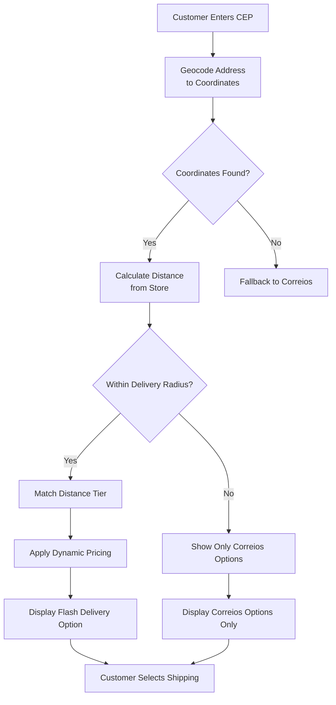

# TriqHub: Shipping & Radius - User Guide

## Table of Contents
1. [Introduction](#introduction)
2. [System Requirements](#system-requirements)
3. [Installation & Activation](#installation--activation)
4. [Initial Configuration](#initial-configuration)
5. [Shipping Configuration](#shipping-configuration)
6. [Google Maps Integration](#google-maps-integration)
7. [Dynamic Pricing Features](#dynamic-pricing-features)
8. [Troubleshooting](#troubleshooting)
9. [Advanced Usage Scenarios](#advanced-usage-scenarios)
10. [Maintenance & Updates](#maintenance--updates)

## Introduction

TriqHub: Shipping & Radius is a sophisticated WooCommerce shipping plugin designed for Brazilian e-commerce businesses. The plugin automates coordinate collection during checkout using Brazilian postal codes (CEP) and integrates radius-based shipping rules with Google Maps API for maximum precision. Key features include:

- **Radius-Based Local Delivery**: Calculate shipping costs based on straight-line distance from your store
- **Google Maps Integration**: Accurate geocoding and distance calculations
- **Dynamic Pricing**: Adjust prices based on weather, peak hours, and weekends
- **SuperFrete Integration**: Fallback shipping options for customers outside delivery radius
- **Real-time Weather Integration**: Adjust pricing based on rain conditions
- **Circuit Breaker Protection**: Automatic fallback when APIs fail

## System Requirements

### Minimum Requirements
- **WordPress**: 6.2 or higher
- **WooCommerce**: 5.0 or higher
- **PHP**: 7.4 or higher
- **MySQL**: 5.6 or higher
- **Memory Limit**: 128MB minimum (256MB recommended)
- **Execution Time**: 30 seconds minimum

### Recommended Configuration
- **PHP**: 8.0 or higher
- **Memory Limit**: 256MB
- **Max Execution Time**: 60 seconds
- **cURL Extension**: Enabled
- **JSON Extension**: Enabled
- **OpenSSL**: Enabled for secure API connections

### API Requirements
- **Google Maps API Key**: Required for geocoding and distance calculations
- **OpenWeather API Key**: Optional for weather-based pricing
- **SuperFrete Account**: Optional for national shipping integration

## Installation & Activation

### Method 1: WordPress Admin Dashboard
1. Navigate to **Plugins → Add New**
2. Click **Upload Plugin**
3. Select the `triqhub-shipping-radius.zip` file
4. Click **Install Now**
5. After installation, click **Activate Plugin**

### Method 2: Manual Installation via FTP
1. Download the plugin ZIP file
2. Extract the contents to your computer
3. Connect to your WordPress site via FTP/SFTP
4. Navigate to `/wp-content/plugins/`
5. Upload the `triqhub-shipping-radius` folder
6. Go to **Plugins → Installed Plugins**
7. Find "TriqHub: Shipping & Radius" and click **Activate**

### Post-Installation Verification
After activation, verify the plugin is working correctly:

1. Check for any error messages in the WordPress admin area
2. Navigate to **WooCommerce → Settings → Shipping**
3. Verify that "Woo Envios — Raio Escalonado" appears in available shipping methods
4. Check the plugin status in **WooCommerce → Status → Logs** for any initialization errors

## Initial Configuration

### Step 1: Plugin Settings Access
Navigate to **WooCommerce → Woo Envios** to access the main configuration panel.

### Step 2: Store Coordinates Setup
1. **Store Address**: Enter your complete business address
2. **Manual Coordinates** (optional):
   - Latitude: `-18.911` (default Uberlândia)
   - Longitude: `-48.262` (default Uberlândia)
3. Click **Save Coordinates** to geocode your address

### Step 3: Shipping Zones Configuration
1. Go to **WooCommerce → Settings → Shipping → Shipping Zones**
2. Create a new zone or edit an existing one
3. Add shipping method: **Woo Envios — Raio Escalonado**
4. Configure zone restrictions based on regions or postal codes

### Step 4: Distance Tiers Configuration
Configure your delivery radius tiers in **WooCommerce → Woo Envios → Distance Tiers**:

| Tier Name | Max Distance (km) | Price (R$) | Description |
|-----------|-------------------|------------|-------------|
| Tier 1 | 5 | 10.00 | Immediate neighborhood |
| Tier 2 | 10 | 15.00 | Nearby districts |
| Tier 3 | 20 | 25.00 | City outskirts |
| Tier 4 | 30 | 35.00 | Metropolitan area |

**Configuration Tips:**
- Start with 3-4 tiers for simplicity
- Consider traffic patterns and delivery times
- Test distances using Google Maps driving directions
- Adjust prices based on fuel costs and delivery time

## Shipping Configuration

### Local Delivery (Flash Delivery)
The plugin's primary shipping method calculates costs based on straight-line distance from your store:



### SuperFrete Integration
For customers outside your delivery radius, the plugin automatically provides SuperFrete shipping options:

1. **Enable SuperFrete**: Go to **WooCommerce → Woo Envios → SuperFrete Settings**
2. **Configure Services**: Select which services to offer (PAC, SEDEX, Mini)
3. **Set Defaults**: Configure fallback behavior when local delivery isn't available
4. **Test Integration**: Place test orders to different regions to verify calculations

### Shipping Method Priority
The plugin automatically sorts shipping methods to display Flash Delivery first:

1. **Flash Delivery** (woo_envios_radius) - Top priority
2. **SuperFrete Options** - Secondary options
3. **Other WooCommerce Methods** - Fallback options

## Google Maps Integration

### API Key Configuration
1. **Obtain API Key**:
   - Go to [Google Cloud Console](https://console.cloud.google.com/)
   - Create a new project or select existing
   - Enable: Geocoding API, Places API, Distance Matrix API
   - Create credentials → API Key
   - Restrict key to your domain

2. **Configure in Plugin**:
   - Navigate to **WooCommerce → Woo Envios → Google Maps**
   - Enter your API Key
   - Click **Validate Key** to test connectivity
   - Save settings

### Geocoding Cache
The plugin caches geocoding results to improve performance:

- **Cache Duration**: 30 days (configurable)
- **Cache Table**: `wp_woo_envios_geocode_cache`
- **Manual Cache Clear**: Available in admin settings
- **Automatic Cleanup**: Expired entries removed automatically

### Address Validation
Enable address validation for accurate deliveries:

1. **Enable Places Autocomplete**: In Google Maps settings
2. **Configure Fields**: Map address fields to WooCommerce checkout
3. **Validation Rules**: Set minimum address completeness requirements
4. **Error Messages**: Customize validation failure messages

### Distance Calculation Methods
The plugin uses multiple methods for distance calculation:

1. **Primary**: Google Distance Matrix API (driving distance)
2. **Fallback**: Haversine formula (straight-line distance)
3. **Configuration**: Choose preferred method in settings

## Dynamic Pricing Features

### Weather-Based Pricing
Integrate with OpenWeather API to adjust prices during rain:

1. **Get API Key**: Register at [OpenWeatherMap](https://openweathermap.org/api)
2. **Configure in Plugin**: Woo Envios → Weather Settings
3. **Set Multipliers**:
   - Light Rain: 1.2x (20% increase)
   - Heavy Rain: 1.5x (50% increase)
   - Thunderstorm: 1.5x (50% increase)

4. **Weather Conditions**:
   ```php
   // Example weather detection logic
   if ($rain_1h > 5) {
       // Heavy rain (>5mm/hour)
       $multiplier = 1.5;
   } elseif ($condition === 'rain') {
       // Light to moderate rain
       $multiplier = 1.2;
   } else {
       // No rain
       $multiplier = 1.0;
   }
   ```

### Peak Hour Pricing
Configure price increases during busy periods:

1. **Define Peak Periods**:
   ```json
   [
     {
       "name": "Lunch Rush",
       "start": "11:30",
       "end": "13:30",
       "multiplier": 1.3
     },
     {
       "name": "Evening Rush",
       "start": "17:00",
       "end": "19:00",
       "multiplier": 1.4
     }
   ]
   ```

2. **Configuration Interface**:
   - Add/remove peak periods
   - Set custom multipliers per period
   - Enable/disable feature globally

### Weekend Pricing
Adjust prices for weekend deliveries:

1. **Enable Feature**: Woo Envios → Dynamic Pricing
2. **Set Multiplier**: Default 1.0 (no increase)
3. **Custom Weekends**: Define Saturday/Sunday separately
4. **Holiday Handling**: Option to treat holidays as weekends

### Maximum Multiplier Limit
Protect against excessive price increases:

- **Default Limit**: 2.0x (100% increase)
- **Configurable**: Set in dynamic pricing settings
- **Calculation**: `final_price = min(base_price * multipliers, base_price * max_multiplier)`

## Troubleshooting

### Common Issues and Solutions

#### Issue 1: Plugin Not Appearing in Shipping Methods
**Symptoms**:
- No "Woo Envios — Raio Escalonado" in shipping zones
- Shipping method dropdown empty

**Solutions**:
1. **Verify WooCommerce Version**: Ensure WooCommerce 5.0+ is installed
2. **Check Plugin Activation**: Confirm plugin is active in Plugins list
3. **Clear Caches**:
   ```bash
   # Clear WordPress transients
   wp transient delete --all
   
   # Clear WooCommerce shipping cache
   wp wc shipping_zone list
   ```
4. **Check PHP Error Log**: Look for class loading errors

#### Issue 2: Google Maps API Errors
**Symptoms**:
- "Invalid API key" messages
- Addresses not geocoding
- Distance calculations failing

**Solutions**:
1. **Verify API Key**:
   - Check key is valid and not expired
   - Verify required APIs are enabled
   - Confirm domain restrictions are correct

2. **Test API Connectivity**:
   ```bash
   # Test Geocoding API
   curl "https://maps.googleapis.com/maps/api/geocode/json?address=São+Paulo&key=YOUR_API_KEY"
   
   # Test Distance Matrix API
   curl "https://maps.googleapis.com/maps/api/distancematrix/json?origins=-23.5505,-46.6333&destinations=-22.9068,-43.1729&key=YOUR_API_KEY"
   ```

3. **Check API Quotas**:
   - Monitor usage in Google Cloud Console
   - Request quota increase if needed
   - Implement caching to reduce API calls

#### Issue 3: Distance Calculations Incorrect
**Symptoms**:
- Shipping prices don't match expected distances
- Customers outside radius receiving local delivery

**Solutions**:
1. **Verify Store Coordinates**:
   - Check coordinates in Woo Envios settings
   - Test with known addresses
   - Use "Test Coordinates" feature

2. **Check Distance Calculation Method**:
   - Confirm Google Maps API is working
   - Test Haversine fallback
   - Compare both methods for consistency

3. **Debug Logging**:
   Enable debug logs in **Woo Envios → Logging Settings**
   Check log files at `/wp-content/uploads/woo-envios-logs/`

#### Issue 4: Dynamic Pricing Not Working
**Symptoms**:
- No price adjustments for weather/peak hours
- Multipliers not applying correctly

**Solutions**:
1. **Verify Feature Enablement**:
   - Check dynamic pricing is enabled
   - Confirm weather API key is valid
   - Verify peak hour configurations

2. **Test Weather Integration**:
   ```php
   // Manual weather test
   $weather = new Woo_Envios_Weather();
   $multiplier = $weather->get_weather_multiplier(-23.5505, -46.6333);
   echo "Weather multiplier: " . $multiplier;
   ```

3. **Check Timezone Settings**:
   - Confirm WordPress timezone matches your location
   - Verify peak hour times are in correct timezone
   - Test with current time display

### Debug Mode
Enable comprehensive debugging for complex issues:

1. **Enable Debug Logging**:
   ```php
   // Add to wp-config.php
   define('WP_DEBUG', true);
   define('WP_DEBUG_LOG', true);
   define('WP_DEBUG_DISPLAY', false);
   ```

2. **Plugin-Specific Debug**:
   - Woo Envios → Settings → Enable Debug Mode
   - Check "Log all API requests"
   - Enable "Detailed calculation logging"

3. **Review Logs**:
   - WordPress debug log: `/wp-content/debug.log`
   - Plugin logs: `/wp-content/uploads/woo-envios-logs/`
   - WooCommerce logs: **WooCommerce → Status → Logs**

### Circuit Breaker Status
The plugin includes automatic failure protection:

1. **Check Circuit Status**:
   ```sql
   -- Check failure count
   SELECT option_value 
   FROM wp_options 
   WHERE option_name = 'woo_envios_api_failure_count';
   
   -- Check circuit state
   SELECT option_value 
   FROM wp_options 
   WHERE option_name = 'woo_envios_circuit_open';
   ```

2. **Reset Circuit Breaker**:
   - Automatic reset after 5 minutes
   - Manual reset in admin settings
   - Clear failure count to restore API functionality

## Advanced Usage Scenarios

### Scenario 1: Multi-Store Configuration
**Requirement**: Deliver from multiple locations with different radius rules

**Solution**:
1. **Create Shipping Zones** for each store location
2. **Configure Store-Specific Settings**:
   ```php
   // Custom store coordinates per zone
   add_filter('woo_envios_store_coordinates', function($coords, $zone_id) {
       switch($zone_id) {
           case 1: // Zone 1 - Store A
               return ['lat' => -23.5505, 'lng' => -46.6333];
           case 2: // Zone 2 - Store B
               return ['lat' => -22.9068, 'lng' => -43.1729];
           default:
               return $coords;
       }
   }, 10, 2);
   ```

3. **Zone-Specific Tiers**:
   - Different distance tiers per zone
   - Custom pricing based on location
   - Zone-specific dynamic pricing rules

### Scenario 2: Subscription-Based Delivery
**Requirement**: Offer discounted shipping for subscription customers

**Solution**:
1. **Integrate with Subscription Plugin**:
   ```php
   add_filter('woo_envios_shipping_multiplier', function($multiplier, $customer_id) {
       if (wcs_user_has_subscription($customer_id)) {
           // Apply 20% discount for subscribers
           return $multiplier * 0.8;
       }
       return $multiplier;
   }, 10, 2);
   ```

2. **Subscription-Only Delivery Windows**:
   - Priority delivery for subscribers
   - Extended delivery radius
   - Guaranteed delivery times

### Scenario 3: Real-Time Delivery Tracking
**Requirement**: Show delivery progress to customers

**Solution**:
1. **Integrate Delivery Tracking API**:
   ```php
   // Add tracking to order meta
   add_action('woocommerce_order_status_processing', function($order_id) {
       $order = wc_get_order($order_id);
       $shipping_method = $order->get_shipping_method();
       
       if (strpos($shipping_method, 'woo_envios_radius') !== false) {
           // Generate tracking code
           $tracking_code = 'TRQ' . date('Ymd') . $order_id;
           update_post_meta($order_id, '_woo_envios_tracking', $tracking_code);
           
           // Send tracking email
           $this->send_tracking_email($order, $tracking_code);
       }
   });
   ```

2. **Customer Portal Integration**:
   - Add tracking section to My Account
   - Real-time delivery status updates
   - Estimated delivery time display

### Scenario 4: Bulk Order Discounts
**Requirement**: Discount shipping for large orders

**Solution**:
1. **Cart-Based Discount Rules**:
   ```php
   add_filter('woo_envios_shipping_cost', function($cost, $cart_total) {
       if ($cart_total > 500) {
           // Free shipping for orders over R$500
           return 0;
       } elseif ($cart_total > 200) {
           // 50% discount for orders over R$200
           return $cost * 0.5;
       }
       return $cost;
   }, 10, 2);
   ```

2. **Product-Based Rules**:
   - Free shipping for specific products
   - Category-based shipping rules
   - Weight-based pricing adjustments

### Scenario 5: Scheduled Deliveries
**Requirement**: Allow customers to choose delivery time slots

**Solution**:
1. **Time Slot Integration**:
   ```php
   // Add time slot selector to checkout