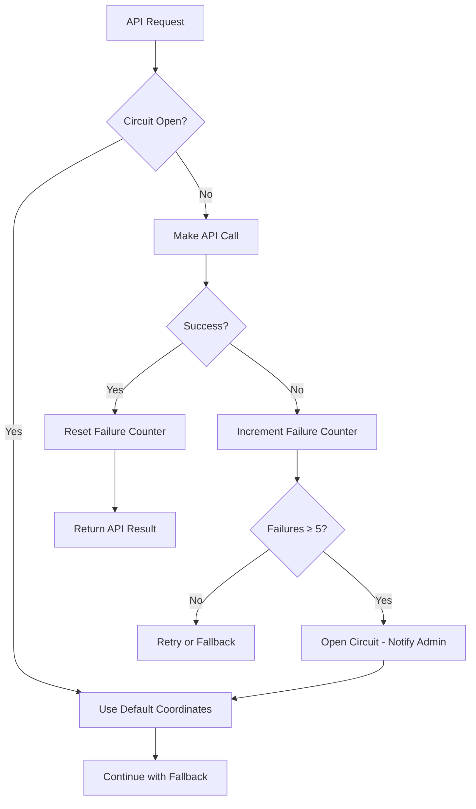

# TriqHub: Shipping & Radius - User Guide

## Table of Contents
1. [Overview](#overview)
2. [System Requirements](#system-requirements)
3. [Installation & Setup](#installation--setup)
4. [Configuration Guide](#configuration-guide)
5. [Shipping Methods](#shipping-methods)
6. [Advanced Features](#advanced-features)
7. [Troubleshooting](#troubleshooting)
8. [Performance Optimization](#performance-optimization)
9. [Security Considerations](#security-considerations)
10. [FAQ](#faq)

## Overview

TriqHub: Shipping & Radius is a sophisticated WooCommerce shipping solution that automates Brazilian postal code (CEP) coordinate collection at checkout and integrates radius-based shipping rules with Google Maps API precision. The plugin provides two primary shipping methods:

1. **Flash Delivery (Local Radius)**: Calculates delivery costs based on straight-line distance from your store location
2. **SuperFrete/Correios**: Provides national shipping options (PAC/SEDEX/Mini) for customers outside your delivery radius

### Key Features
- **Automatic Geocoding**: Converts Brazilian CEPs to precise coordinates using Google Maps API
- **Dynamic Pricing**: Adjusts shipping costs based on distance, weather conditions, peak hours, and weekends
- **Circuit Breaker Protection**: Automatically falls back to default coordinates during API failures
- **Real-time Distance Calculation**: Uses Google Distance Matrix API for accurate route distances
- **Weather Integration**: Adjusts pricing based on current weather conditions via OpenWeather API
- **Comprehensive Logging**: Detailed logging system for debugging and monitoring

## System Requirements

### Minimum Requirements
- **WordPress**: 6.2 or higher
- **WooCommerce**: 5.0 or higher
- **PHP**: 7.4 or higher
- **MySQL**: 5.6 or higher
- **Memory Limit**: 128MB minimum (256MB recommended)
- **Execution Time**: 30 seconds minimum

### Required APIs
1. **Google Maps API Key** (Required for geocoding and distance calculation)
2. **OpenWeather API Key** (Optional, for weather-based pricing)
3. **SuperFrete API Key** (Optional, for national shipping calculations)

### Server Requirements
- cURL enabled
- JSON extension enabled
- OpenSSL extension enabled
- WordPress CRON enabled for scheduled tasks

## Installation & Setup

### Step 1: Plugin Installation

#### Method A: WordPress Admin Dashboard
1. Navigate to **Plugins → Add New**
2. Search for "TriqHub: Shipping & Radius"
3. Click **Install Now** and then **Activate**

#### Method B: Manual Upload
1. Download the plugin ZIP file
2. Go to **Plugins → Add New → Upload Plugin**
3. Select the ZIP file and click **Install Now**
4. Activate the plugin

#### Method C: FTP Upload
1. Extract the plugin ZIP file
2. Upload the `triqhub-shipping-radius` folder to `/wp-content/plugins/`
3. Navigate to **Plugins** in WordPress admin
4. Find "TriqHub: Shipping & Radius" and click **Activate**

### Step 2: Initial Configuration

After activation, follow these steps:

1. **Verify WooCommerce is Active**: Ensure WooCommerce is installed and activated
2. **Check System Status**: Go to **WooCommerce → Status** to verify requirements
3. **Configure Shipping Zones**: Set up your shipping zones in **WooCommerce → Settings → Shipping**

### Step 3: API Key Configuration

#### Google Maps API Key
1. Go to **WooCommerce → Settings → Woo Envios**
2. Navigate to the **Google Maps** tab
3. Enter your Google Maps API key
4. Click **Save Changes**

#### Obtaining Google Maps API Key
1. Visit [Google Cloud Console](https://console.cloud.google.com/)
2. Create a new project or select existing
3. Enable the following APIs:
   - Geocoding API
   - Places API
   - Distance Matrix API
   - Maps JavaScript API
4. Create credentials (API Key)
5. Restrict the API key to your domain
6. Copy the API key to the plugin settings

## Configuration Guide

### Store Location Setup

#### Setting Store Coordinates
1. Navigate to **WooCommerce → Settings → Woo Envios → General**
2. Enter your store's address or coordinates:
   - **Store Address**: Full address for geocoding
   - **Manual Coordinates**: Direct latitude/longitude input
3. Click **Geocode Address** to convert address to coordinates
4. Verify coordinates appear in the fields
5. Save changes

#### Distance Tiers Configuration
Configure your delivery radius pricing tiers:

1. Go to **WooCommerce → Settings → Woo Envios → Distance Tiers**
2. Add tiers with the following parameters:
   - **Maximum Distance (km)**: Furthest distance for this tier
   - **Price (R$)**: Delivery cost for this distance range
   - **Label**: Display name for the tier
3. Example configuration:
   ```
   Tier 1: 0-5km → R$ 10.00
   Tier 2: 5-10km → R$ 15.00
   Tier 3: 10-15km → R$ 20.00
   ```
4. Click **Add Tier** for each range
5. Save configuration

### Shipping Method Configuration

#### Flash Delivery Settings
1. Go to **WooCommerce → Settings → Shipping**
2. Click on your shipping zone
3. Add shipping method: **Woo Envios — Raio Escalonado**
4. Configure instance settings:
   - **Enabled**: Yes/No toggle
   - **Title**: Display name (e.g., "Entrega Flash")
   - **Tax Status**: Taxable/None
5. Save changes

#### SuperFrete/Correios Configuration
1. Navigate to **WooCommerce → Settings → Woo Envios → Correios**
2. Enable SuperFrete integration
3. Enter your SuperFrete API credentials:
   - Email
   - Token
   - Postal Code (Store origin)
4. Configure service options:
   - PAC
   - SEDEX
   - Mini Envios
5. Set default dimensions and weights
6. Save configuration

### Dynamic Pricing Configuration

#### Peak Hours Pricing
1. Go to **WooCommerce → Settings → Woo Envios → Dynamic Pricing**
2. Enable dynamic pricing
3. Configure peak hours:
   - **Name**: Peak period identifier
   - **Start Time**: Beginning of peak period (HH:MM)
   - **End Time**: End of peak period (HH:MM)
   - **Multiplier**: Price multiplier (e.g., 1.2 for 20% increase)
4. Add multiple peak periods as needed
5. Set maximum multiplier limit

#### Weather-Based Pricing
1. Obtain OpenWeather API key from [openweathermap.org](https://openweathermap.org/api)
2. Enter API key in **WooCommerce → Settings → Woo Envios → Weather**
3. Configure multipliers:
   - **Light Rain**: Multiplier for drizzle/light rain
   - **Heavy Rain**: Multiplier for heavy rain/thunderstorms
4. Test weather integration

#### Weekend Pricing
1. Enable weekend pricing in dynamic settings
2. Set weekend multiplier (applies Saturday and Sunday)
3. Configure specific weekend hours if needed

## Shipping Methods

### Flash Delivery (Local Radius)

#### How It Works
1. Customer enters Brazilian CEP at checkout
2. Plugin geocodes CEP to coordinates using Google Maps API
3. Calculates straight-line distance from store to customer
4. Matches distance to configured pricing tier
5. Applies dynamic pricing multipliers
6. Displays Flash Delivery option if within range

#### Customer Experience
- **Within Radius**: Flash Delivery appears as primary option
- **Outside Radius**: Only SuperFrete/Correios options shown
- **Multiple Options**: Customers can choose between Flash and Correios

#### Configuration Parameters
- **Base Price**: Tier-based pricing by distance
- **Dynamic Adjustments**: Weather, time, and day multipliers
- **Maximum Distance**: Configurable delivery radius
- **Fallback Behavior**: Automatic switch to Correios when outside radius

### SuperFrete/Correios Integration

#### Supported Services
- **PAC**: Economical national delivery
- **SEDEX**: Express national delivery
- **Mini Envios**: Small package delivery

#### Configuration Requirements
- Valid SuperFrete account
- API credentials (email and token)
- Store origin postal code
- Default package dimensions

#### Calculation Process
1. Retrieves customer destination from checkout
2. Sends request to SuperFrete API
3. Receives real-time shipping quotes
4. Displays available options to customer
5. Updates costs based on cart weight and dimensions

## Advanced Features

### Geocoding Cache System

#### Cache Table Management
The plugin creates a dedicated cache table (`wp_woo_envios_geocode_cache`) to store geocoding results:

```sql
CREATE TABLE wp_woo_envios_geocode_cache (
    id bigint(20) unsigned NOT NULL AUTO_INCREMENT,
    cache_key varchar(64) NOT NULL,
    result_data longtext NOT NULL,
    created_at datetime NOT NULL DEFAULT CURRENT_TIMESTAMP,
    expires_at datetime NOT NULL,
    PRIMARY KEY (id),
    UNIQUE KEY cache_key (cache_key),
    KEY expires_at (expires_at)
);
```

#### Cache Benefits
- **Reduced API Calls**: Minimizes Google Maps API usage
- **Faster Checkout**: Cached coordinates load instantly
- **Cost Savings**: Reduces API billing costs
- **Fallback Support**: Provides data during API outages

#### Cache Management
1. **Automatic Cleanup**: Expired entries removed automatically
2. **Manual Clear**: Option in admin settings
3. **TTL Configuration**: Adjust cache duration (default: 30 days)

### Circuit Breaker Protection

#### Failure Detection
The plugin monitors API failures and implements circuit breaker pattern:



#### Circuit States
- **Closed**: Normal operation, API calls allowed
- **Open**: API disabled after 5 consecutive failures
- **Half-Open**: Testing API after cool-down period

#### Configuration
- **Max Failures**: 5 consecutive failures (configurable)
- **Cool-down Period**: 1 hour
- **Admin Notifications**: Email alerts on circuit opening

### Weather Integration

#### OpenWeather API Setup
1. Register at [OpenWeatherMap.org](https://openweathermap.org/)
2. Generate API key in your account
3. Configure in plugin settings
4. Test connection

#### Weather Conditions Mapping
- **Clear/Sunny**: No multiplier (1.0x)
- **Drizzle/Light Rain**: Configurable multiplier (default: 1.2x)
- **Heavy Rain/Storm**: Configurable multiplier (default: 1.5x)
- **Other Conditions**: No adjustment

#### Cache Strategy
- Weather data cached for 1 hour
- Automatic cache invalidation
- Fallback to no multiplier on API failure

### Dynamic Pricing Engine

#### Multiplier Stacking
The plugin applies multipliers in this order:

1. **Base Tier Price**: Distance-based pricing
2. **Peak Hour Multiplier**: Time-based adjustments
3. **Weekend Multiplier**: Day-based adjustments
4. **Weather Multiplier**: Condition-based adjustments
5. **Maximum Cap**: Limits total multiplier

#### Calculation Example
```
Base Price: R$ 15.00 (for 8km distance)
Peak Hour: 1.2x multiplier (+20%)
Weekend: 1.1x multiplier (+10%)
Light Rain: 1.2x multiplier (+20%)

Calculation:
15.00 × 1.2 = 18.00
18.00 × 1.1 = 19.80
19.80 × 1.2 = 23.76

Final Price: R$ 23.76
```

#### Configuration Limits
- Set maximum total multiplier (default: 2.0x)
- Enable/disable individual multiplier types
- Configure specific time periods

## Troubleshooting

### Common Issues and Solutions

#### Issue 1: Plugin Not Loading
**Symptoms**: 
- Plugin doesn't appear in WordPress
- Fatal error on activation
- White screen in admin

**Solutions**:
1. **Check PHP Version**: Ensure PHP 7.4 or higher
2. **Verify WooCommerce**: Confirm WooCommerce 5.0+ is active
3. **Check Error Logs**: Review WordPress debug log
4. **Conflict Testing**: Deactivate other plugins temporarily
5. **Memory Increase**: Increase PHP memory limit to 256MB

#### Issue 2: Shipping Methods Not Showing
**Symptoms**:
- No shipping options at checkout
- "No shipping methods available" message
- Flash Delivery missing

**Solutions**:
1. **Verify Shipping Zone**: Ensure zone includes customer location
2. **Check Store Coordinates**: Confirm coordinates are set
3. **API Key Validation**: Test Google Maps API key
4. **Distance Tiers**: Verify tiers are configured
5. **Session Data**: Check browser console for JavaScript errors

#### Issue 3: Incorrect Distance Calculations
**Symptoms**:
- Wrong delivery prices
- Customers outside radius getting Flash Delivery
- Inconsistent distance measurements

**Solutions**:
1. **Coordinate Accuracy**: Verify store coordinates precision
2. **Google API Status**: Check Google Maps API service status
3. **Cache Clear**: Clear geocoding cache
4. **Haversine Fallback**: Test distance calculation method
5. **Address Validation**: Ensure customer addresses are complete

#### Issue 4: API Rate Limiting
**Symptoms**:
- "OVER_QUERY_LIMIT" errors
- Slow geocoding responses
- Increased API costs

**Solutions**:
1. **Cache Optimization**: Increase cache TTL
2. **API Key Rotation**: Use multiple API keys
3. **Request Batching**: Implement batch geocoding
4. **Usage Monitoring**: Track API usage in Google Cloud Console
5. **Circuit Breaker**: Let circuit breaker manage failures

#### Issue 5: Performance Issues
**Symptoms**:
- Slow checkout loading
- Delayed shipping calculations
- High server load

**Solutions**:
1. **Cache Configuration**: Optimize cache settings
2. **CDN Integration**: Use CDN for static assets
3. **Database Optimization**: Index cache table
4. **Async Loading**: Implement asynchronous geocoding
5. **Resource Monitoring**: Monitor server resources

### Debug Mode

#### Enabling Debug Logging
1. Navigate to **WooCommerce → Settings → Woo Envios → Advanced**
2. Enable "Debug Logging"
3. Set log level (Info, Warning, Error)
4. Save changes

#### Log File Location
Logs are stored in: `/wp-content/uploads/woo-envios-logs/`
- Daily log files (YYYY-MM-DD.log)
- Protected by .htaccess
- Auto-cleanup after 7 days

#### Log Analysis
Common log entries to monitor:
- `FRETE CALCULADO`: Shipping calculation details
- `FALHA API`: API failure notifications
- `CIRCUIT BREAKER`: Circuit state changes
- `DISTÂNCIA FORA DO ALCANCE`: Out-of-range deliveries

### Testing Procedures

#### Geocoding Test
1. Go to **WooCommerce → Settings → Woo Envios → Tools**
2. Enter test addresses or CEPs
3. Click "Test Geocoding"
4. Verify coordinates and cache status

#### Shipping Calculation Test
1. Add products to cart
2. Proceed to checkout
3. Enter test addresses at different distances
4. Verify shipping options and prices
5. Check debug logs for calculation details

#### API Connectivity Test
1. Test Google Maps API connectivity
2. Verify SuperFrete API connection
3. Check OpenWeather API status
4. Monitor API response times

## Performance Optimization

### Cache Optimization Strategies

#### Geocoding Cache
- **Default TTL**: 30 days (2,592,000 seconds)
- **Adjustment**: Reduce for high-volume stores
- **Monitoring**: Track cache hit ratio
- **Purge Strategy**: Scheduled cleanup of expired entries

#### Database Optimization
1. **Index Management**:
   ```sql
   ALTER TABLE wp_woo_envios_geocode_cache 
   ADD INDEX idx_cache_lookup (cache_key, expires_at);
   ```
2. **Table Maintenance**:
   - Weekly optimization
   - Monthly cleanup of old data
   - Monitor table size growth

3. **Query Optimization**:
   - Use prepared statements
   - Limit result sets
   - Implement pagination for admin views

### API Usage Optimization

#### Request Batching
- Group multiple address geocoding requests
- Implement request queuing
- Use async processing for non-critical operations

#### Rate Limiting
- Implement client-side rate limiting
- Respect Google Maps API quotas
- Use exponential backoff for retries

#### Fallback Strategies
- Use cached data during peak loads
- Implement graceful degradation
- Provide user feedback during delays

### Frontend Optimization

#### JavaScript Optimization
- Minify and combine scripts
- Implement lazy loading
- Use browser caching headers
- Optimize Google Maps API loading

#### CSS Optimization
- Minify stylesheets
- Implement critical CSS
- Use efficient selectors
- Remove unused styles

#### Asset Delivery
- Use CDN for static assets
- Implement HTTP/2
- Enable compression
- Set proper cache headers

## Security Considerations

### API Key Security

#### Google Maps API Key Restrictions
1. **HTTP Referrers**: Restrict to your domain
2. **IP Restrictions**: Limit to your server IP
3. **API Restrictions**: Enable only required APIs
4. **Key Rotation**: Regular key rotation schedule

#### SuperFrete API Security
- Store