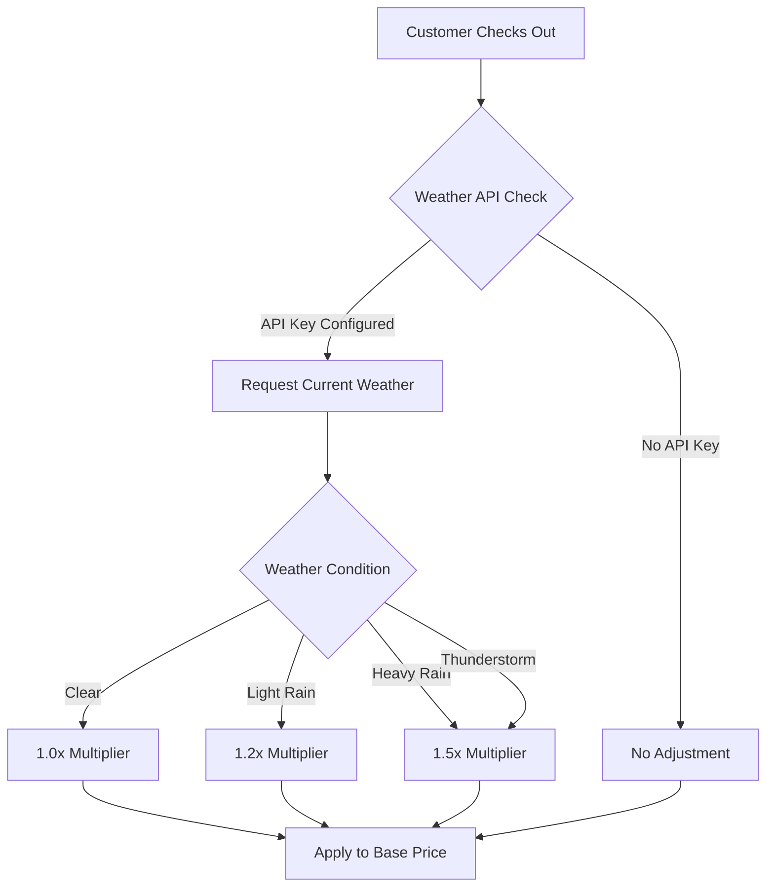

# TriqHub: Shipping & Radius - User Guide

## Table of Contents
1. [Introduction](#introduction)
2. [System Requirements](#system-requirements)
3. [Installation & Setup](#installation--setup)
4. [Configuration Guide](#configuration-guide)
5. [Shipping Methods](#shipping-methods)
6. [Dynamic Pricing Features](#dynamic-pricing-features)
7. [Troubleshooting](#troubleshooting)
8. [Advanced Usage](#advanced-usage)
9. [Maintenance & Best Practices](#maintenance--best-practices)

## Introduction

TriqHub: Shipping & Radius is a sophisticated WooCommerce shipping plugin that automates Brazilian postal code (CEP) coordinate collection at checkout and integrates radius-based shipping rules. The plugin leverages Google Maps API for maximum precision and offers dynamic pricing based on weather conditions, peak hours, and distance calculations.

### Key Features
- **Radius-Based Shipping**: Calculate local delivery costs based on straight-line distance from your store
- **Google Maps Integration**: Precise geocoding and distance calculations using Google Maps APIs
- **Dynamic Pricing**: Adjust shipping costs based on weather, time of day, and weekends
- **Multiple Shipping Methods**: Combine local "Flash Delivery" with Correios/SuperFrete for national coverage
- **Automatic Updates**: GitHub-based update system with license key integration
- **Comprehensive Logging**: Detailed logging system for debugging and monitoring

## System Requirements

### Minimum Requirements
- **WordPress**: 6.2 or higher
- **WooCommerce**: 5.0 or higher
- **PHP**: 7.4 or higher
- **MySQL**: 5.6 or higher
- **Memory Limit**: 128MB minimum (256MB recommended)
- **Execution Time**: 30 seconds minimum

### Required APIs
1. **Google Maps API Key** (Required for geocoding and distance calculations)
2. **OpenWeather API Key** (Optional, for weather-based pricing)
3. **Correios/SuperFrete API** (Optional, for national shipping)

### Browser Compatibility
- Chrome 80+
- Firefox 75+
- Safari 13+
- Edge 80+

## Installation & Setup

### Step 1: Plugin Installation

#### Method A: WordPress Admin Dashboard
1. Navigate to **Plugins → Add New**
2. Click **Upload Plugin**
3. Select the `triqhub-shipping-radius.zip` file
4. Click **Install Now**
5. After installation, click **Activate**

#### Method B: Manual Installation via FTP
1. Download the plugin ZIP file
2. Extract the contents to your computer
3. Connect to your WordPress site via FTP/SFTP
4. Upload the `triqhub-shipping-radius` folder to `/wp-content/plugins/`
5. Navigate to **Plugins** in WordPress admin
6. Find "TriqHub: Shipping & Radius" and click **Activate**

### Step 2: Initial Configuration Check

After activation, verify the following:

1. **WooCommerce Status**: Ensure WooCommerce is active and properly configured
2. **PHP Version**: Confirm PHP 7.4+ is running
3. **Database Tables**: Check that the geocode cache table was created
   - Table name: `wp_woo_envios_geocode_cache`
   - Should contain columns: `id`, `cache_key`, `result_data`, `created_at`, `expires_at`

### Step 3: License Activation (Optional)

For automatic updates via GitHub:

1. Navigate to **WooCommerce → Settings → Woo Envios**
2. Locate the **License Key** field
3. Enter your TriqHub license key (if provided)
4. Save changes

## Configuration Guide

### 1. Google Maps API Configuration

#### Obtaining a Google Maps API Key
1. Go to [Google Cloud Console](https://console.cloud.google.com/)
2. Create a new project or select an existing one
3. Enable the following APIs:
   - **Geocoding API**
   - **Places API**
   - **Distance Matrix API**
4. Create credentials → API Key
5. Restrict the API key to your domain
6. Copy the API key

#### Plugin Configuration
1. Navigate to **WooCommerce → Settings → Woo Envios → Google Maps**
2. Paste your Google Maps API key
3. Configure cache settings:
   - **Cache TTL**: Default 30 days (recommended)
   - **Enable Caching**: Always enabled for performance
4. Save changes

### 2. Store Location Configuration

#### Setting Store Coordinates
1. Navigate to **WooCommerce → Settings → Woo Envios → Store Location**
2. Enter your store's address or coordinates:
   - **Method A**: Enter full address and click "Geocode"
   - **Method B**: Manually enter latitude and longitude
3. Verify coordinates on the embedded map
4. Save location

#### Default Coordinates (Fallback)
If geocoding fails, the plugin uses:
- **Latitude**: -18.911 (Uberlândia, MG)
- **Longitude**: -48.262

### 3. Shipping Tiers Configuration

#### Creating Distance-Based Tiers
1. Navigate to **WooCommerce → Settings → Woo Envios → Shipping Tiers**
2. Add tiers in ascending order of distance:

| Tier | Max Distance (km) | Price (R$) | Label |
|------|-------------------|------------|-------|
| 1    | 5                 | 10.00      | Local |
| 2    | 10                | 15.00      | Medium |
| 3    | 20                | 25.00      | Extended |

3. **Important**: Tiers must be contiguous (no gaps)
4. Customers beyond the last tier will not see Flash Delivery

### 4. Dynamic Pricing Configuration

#### Weather-Based Pricing
1. Obtain an OpenWeather API key from [openweathermap.org](https://openweathermap.org/api)
2. Navigate to **WooCommerce → Settings → Woo Envios → Weather**
3. Enter your OpenWeather API key
4. Configure multipliers:
   - **Light Rain**: 1.2x (20% increase)
   - **Heavy Rain**: 1.5x (50% increase)
5. Save settings

#### Peak Hour Pricing
1. Navigate to **WooCommerce → Settings → Woo Envios → Peak Hours**
2. Add peak periods:

| Name | Start Time | End Time | Multiplier |
|------|------------|----------|------------|
| Lunch | 11:30 | 13:30 | 1.3x |
| Dinner | 18:00 | 20:00 | 1.4x |

3. Time format: 24-hour (HH:MM)

#### Weekend Pricing
1. Navigate to **WooCommerce → Settings → Woo Envios → Weekend**
2. Set weekend multiplier (default: 1.0 = no increase)
3. Recommended: 1.2x - 1.5x for weekends

#### Maximum Multiplier Limit
1. Set a cap to prevent excessive pricing
2. Default: 2.0x (maximum 100% increase)
3. Recommended range: 1.5x - 3.0x

### 5. Correios/SuperFrete Configuration

#### Enabling National Shipping
1. Navigate to **WooCommerce → Settings → Woo Envios → Correios**
2. Enable Correios integration
3. Configure API credentials (if using SuperFrete)
4. Set default services:
   - PAC
   - SEDEX
   - Mini Envios

#### Service Priority
1. Local customers: Flash Delivery appears first
2. Outside radius: Only Correios options shown
3. Both available: Customers can choose between Flash and Correios

## Shipping Methods

### Flash Delivery (Local Radius Shipping)

#### How It Works
1. **Address Collection**: Customer enters Brazilian CEP at checkout
2. **Geocoding**: Plugin converts address to coordinates using Google Maps
3. **Distance Calculation**: Straight-line distance from store to customer
4. **Tier Matching**: Finds appropriate price tier based on distance
5. **Dynamic Adjustments**: Applies weather, time, and weekend multipliers
6. **Display**: Shows calculated price at checkout

#### Customer Experience
```
Checkout Process:
1. Enter shipping address with CEP
2. System automatically geocodes address
3. Shipping options appear:
   - Flash Delivery: R$ 15.00 (5-10km)
   - Correios PAC: R$ 25.00 (5-7 days)
   - Correios SEDEX: R$ 35.00 (2-3 days)
4. Customer selects preferred option
```

#### Visual Indicators
- **Flash Delivery**: Highlighted as first option
- **Distance Info**: Available in order meta data
- **Multiplier Breakdown**: Logged for admin review

### Correios/SuperFrete Integration

#### Fallback Strategy
When Flash Delivery is not available (outside radius), the plugin:
1. Automatically calculates Correios shipping
2. Shows all available services (PAC, SEDEX, Mini)
3. Maintains consistent checkout experience

#### Configuration Options
- **Service Selection**: Choose which Correios services to offer
- **Price Display**: Show with or without taxes
- **Delivery Estimates**: Include estimated delivery times

## Dynamic Pricing Features

### Weather-Based Pricing Flow



### Peak Hour Detection

#### Configuration Example
```php
// Peak hours configuration
$peak_hours = [
    [
        'name' => 'Lunch Rush',
        'start' => '11:30',
        'end' => '13:30',
        'multiplier' => 1.3
    ],
    [
        'name' => 'Evening Rush',
        'start' => '18:00',
        'end' => '20:00',
        'multiplier' => 1.4
    ]
];
```

#### Time Zone Considerations
- Uses WordPress timezone settings
- All times in 24-hour format
- Automatically adjusts for daylight saving

### Weekend Pricing

#### Configuration
- **Saturday & Sunday**: Configurable multiplier
- **Holidays**: Not automatically detected (requires manual configuration)
- **Special Dates**: Can be configured as additional peak periods

## Troubleshooting

### Common Issues and Solutions

#### Issue 1: No Shipping Methods Appear
**Symptoms**: Checkout shows "No shipping options available"
**Possible Causes**:
1. Store coordinates not configured
2. Google Maps API key missing or invalid
3. All customers outside configured radius
4. WooCommerce shipping zones misconfigured

**Solutions**:
1. Verify store coordinates in **Woo Envios → Store Location**
2. Check Google Maps API key in **Woo Envios → Google Maps**
3. Review shipping tiers configuration
4. Check WooCommerce shipping zones include your region

#### Issue 2: Incorrect Distance Calculations
**Symptoms**: Customers charged wrong tier prices
**Possible Causes**:
1. Incorrect store coordinates
2. Google Maps API quota exceeded
3. Cache showing old geocode data
4. Address normalization issues

**Solutions**:
1. Re-geocode store address
2. Check Google Cloud Console for quota limits
3. Clear geocode cache:
   ```sql
   TRUNCATE TABLE wp_woo_envios_geocode_cache;
   ```
4. Enable debug logging to see actual coordinates

#### Issue 3: Google Maps API Errors
**Symptoms**: "Geocoding failed" messages in logs
**Possible Causes**:
1. Invalid API key
2. API not enabled in Google Cloud
3. Billing not set up
4. Request limit exceeded

**Solutions**:
1. Verify API key format (starts with AIza, 39 characters)
2. Enable required APIs in Google Cloud Console
3. Set up billing account
4. Implement API key rotation if hitting limits

#### Issue 4: Weather Pricing Not Working
**Symptoms**: No weather-based adjustments applied
**Possible Causes**:
1. OpenWeather API key missing
2. API request failing
3. Weather cache issues
4. Location coordinates invalid

**Solutions**:
1. Configure OpenWeather API key
2. Check API response in logs
3. Clear weather cache:
   ```php
   $weather_service->clear_cache();
   ```
4. Verify store coordinates are valid

### Debugging Tools

#### 1. Enable Detailed Logging
1. Navigate to **WooCommerce → Settings → Woo Envios → Logging**
2. Enable "Debug Logging"
3. Logs are saved to: `/wp-content/uploads/woo-envios-logs/`
4. Logs auto-clean after 7 days

#### 2. Session Data Inspection
Add to theme's `functions.php` (temporary):
```php
add_action('wp_footer', function() {
    if (function_exists('WC') && WC()->session) {
        echo '<pre>';
        print_r(WC()->session->get('woo_envios_coords'));
        echo '</pre>';
    }
});
```

#### 3. API Response Testing
Test Google Maps API directly:
```php
// Test script
$google_maps = new Woo_Envios_Google_Maps();
$result = $google_maps->geocode('Av. Paulista, 1000, São Paulo, SP');
print_r($result);
```

### Error Messages Reference

| Error Code | Meaning | Solution |
|------------|---------|----------|
| `INVALID_REQUEST` | Google Maps API key issue | Verify API key and enabled APIs |
| `OVER_QUERY_LIMIT` | API quota exceeded | Check Google Cloud Console quotas |
| `REQUEST_DENIED` | API key restricted | Add domain to API key restrictions |
| `UNKNOWN_ERROR` | Temporary Google issue | Retry after 5 minutes |
| `ZERO_RESULTS` | Address not found | Verify address format |

## Advanced Usage

### Custom Hooks and Filters

#### Available Actions
```php
// Fires after successful geocoding
add_action('woo_envios_after_geocode', function($address, $coordinates) {
    // Custom logic here
}, 10, 2);

// Fires before shipping calculation
add_action('woo_envios_before_calculate_shipping', function($package) {
    // Modify package data
});

// Fires after shipping calculation
add_action('woo_envios_after_calculate_shipping', function($rates, $package) {
    // Modify rates array
}, 10, 2);
```

#### Available Filters
```php
// Modify geocoding address before API call
add_filter('woo_envios_geocode_address', function($address) {
    return $address . ', Brasil'; // Always append country
});

// Custom distance calculation
add_filter('woo_envios_calculate_distance', function($distance, $store_coords, $customer_coords) {
    // Apply custom distance formula
    return $distance * 1.1; // Add 10% buffer
}, 10, 3);

// Modify dynamic multipliers
add_filter('woo_envios_dynamic_multipliers', function($multipliers, $package) {
    // Add custom multiplier logic
    $multipliers['custom'] = 1.1;
    return $multipliers;
}, 10, 2);

// Custom rate sorting
add_filter('woo_envios_sort_rates', function($rates) {
    // Implement custom sorting logic
    uasort($rates, function($a, $b) {
        return $a['cost'] <=> $b['cost'];
    });
    return $rates;
});
```

### Custom Shipping Tiers Programmatically

```php
// Add custom tier logic
add_filter('woo_envios_shipping_tiers', function($tiers) {
    // Dynamic tier based on cart total
    $cart_total = WC()->cart->get_cart_contents_total();
    
    if ($cart_total > 500) {
        // Free shipping for high-value orders
        $tiers[] = [
            'max_distance' => 20,
            'price' => 0,
            'label' => 'Free Local Delivery'
        ];
    }
    
    return $tiers;
});
```

### Integration with Other Plugins

#### 1. WooCommerce Subscriptions
```php
// Special pricing for subscription customers
add_filter('woo_envios_dynamic_multipliers', function($multipliers, $package) {
    if (function_exists('wcs_user_has_subscription')) {
        $user_id = get_current_user_id();
        if (wcs_user_has_subscription($user_id)) {
            $multipliers['subscription_discount'] = 0.8; // 20% discount
        }
    }
    return $multipliers;
}, 10, 2);
```

#### 2. Advanced Custom Fields
```php
// Store-specific shipping rules
add_filter('woo_envios_shipping_tiers', function($tiers) {
    $store_id = get_option('woo_envios_store_id');
    $custom_tiers = get_field('shipping_tiers', $store_id);
    
    if ($custom_tiers) {
        return $custom_tiers;
    }
    
    return $tiers;
});
```

### Performance Optimization

#### 1. Cache Configuration
```php
// Adjust cache TTL based on traffic
add_filter('woo_envios_cache_ttl', function($ttl) {
    if (wp_is_mobile()) {
        return 86400; // 1 day for mobile
    }
    return 2592000; // 30 days for desktop
});
```

#### 2. Lazy Loading Geocoding
```php
// Only geocode when necessary
add_filter('woo_envios_geocode_required', function($required, $address) {
    // Skip geocoding